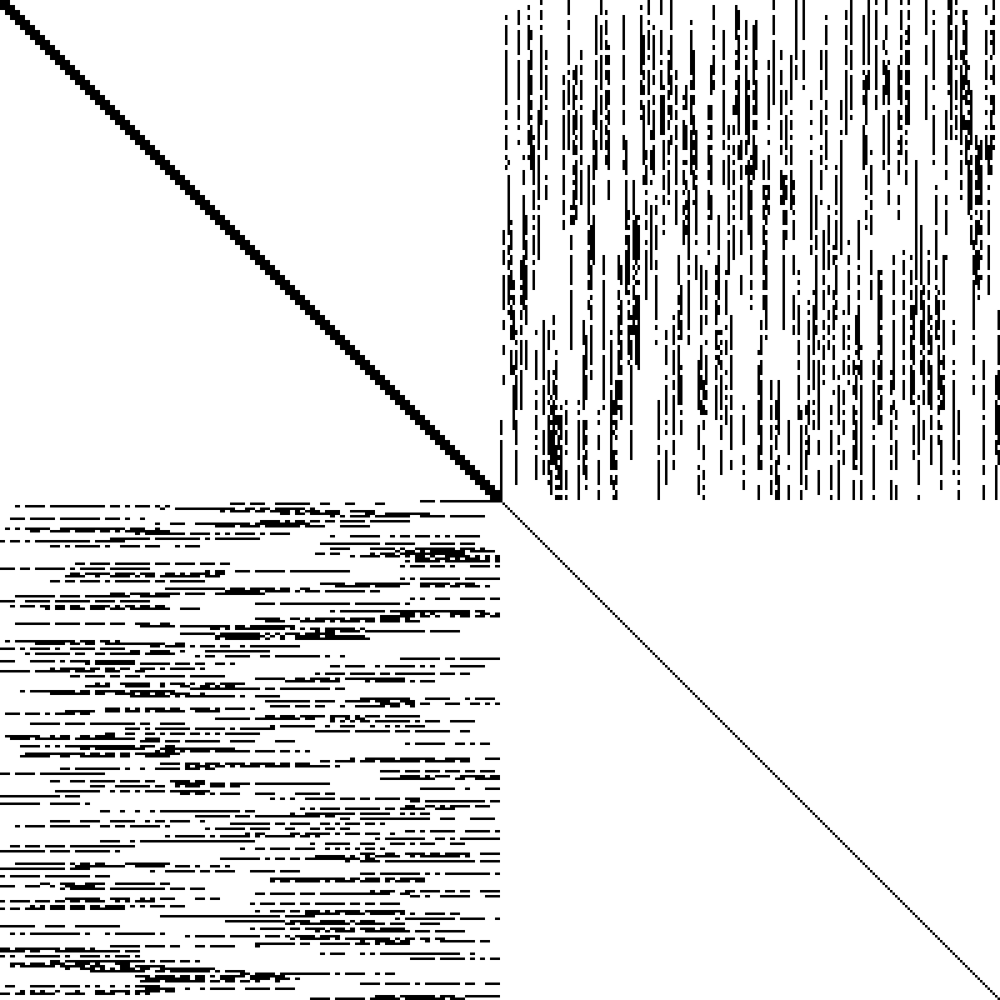

# ARAEL

**Algorithms for Robust Autonomy, Estimation, and Localization**

A Rust framework for nonlinear optimization with compile-time symbolic differentiation. Define your model and constraints declaratively -- the macro system symbolically differentiates, applies common subexpression elimination, and generates compiled cost, gradient, and Gauss-Newton hessian (J^T J approximation) code.

## Features

- **Symbolic math** -- expression trees with automatic differentiation, simplification, expansion, LaTeX/Rust code generation
- **Compile-time constraint code generation** -- write constraints symbolically, get compiled derivative code with CSE
- **Levenberg-Marquardt solver** -- with robust error suppression via the [Starship method (US12346118)](https://patents.google.com/patent/US12346118) `gamma * atan(r / gamma)` and switchable constraints (`guard = expr`)
- **Multiple solver backends** via `LmSolver` trait:
  - **Dense Cholesky** (nalgebra) -- fixed-size dispatch up to 9x9, dynamic for larger
  - **Band Cholesky** -- pure Rust O(n*kd^2) for block-tridiagonal systems (9.4x faster than dense at 500 poses)
  - **Sparse Cholesky** (faer, pure Rust) -- for general sparse hessians (66x faster than dense at 200 poses with 6% fill)
  - **Eigen SimplicialLLT** and **CHOLMOD** -- optional C++ backends via FFI (`--features eigen`, `--features cholmod`)
  - **LAPACK band** -- optional dpbsv/spbsv backend (`--features lapack`)
- **Indexed sparse assembly** -- precomputed position lists for zero-overhead hessian assembly after first iteration
- **f32 and f64 precision** -- `#[arael(root)]` for f64, `#[arael(root, f32)]` for f32 throughout
- **Model trait** -- hierarchical serialize/deserialize/update protocol for parameter optimization
- **Type-safe references** -- `Ref<T>`, `Vec<T>`, `Deque<T>`, `Arena<T>` for indexed collections with stable references
- **Runtime differentiation** -- parse equations from strings at runtime, auto-differentiate symbolically, and optimize via `ExtendedModel` + `TripletBlock` (used by the sketch editor for parametric expression dimensions)
- **Hessian blocks** -- `SelfBlock<A>` and `CrossBlock<A, B>` for 1- and 2-entity constraints (packed dense); `TripletBlock` for 3+ entities (COO sparse)
- **Gimbal-lock-free rotations** -- `EulerAngleParam` optimizes a small delta around a reference rotation matrix
- **WASM/browser support** -- the sketch editor compiles to WebAssembly and runs in the browser via eframe/egui

## Scope

Arael is a **nonlinear optimization framework**, not a complete SLAM or state estimation system. The SLAM and localization demos show how to use arael as the optimizer backend, but a production SLAM pipeline would additionally need:

- **Front-end perception**: feature detection, descriptor extraction
- **Data association**: matching observed features to existing landmarks, handling ambiguous or incorrect matches
- **Landmark management**: initializing new landmarks from observations, merging duplicates, pruning unreliable ones
- **Keyframe selection**: deciding when to add new poses vs. discard redundant frames
- **Loop closure**: detecting revisited places, verifying loop closure candidates, and injecting constraints
- **Outlier rejection logic**: deciding which observations to reject
- **Marginalization / sliding window**: limiting optimization scope for real-time operation, marginalizing old poses while preserving their information
- **Map management**: spatial indexing, map saving/loading, multi-session map merging

Arael provides the compile-time-differentiated solver that sits at the core of such a system. Everything above is application-level logic that builds on top of it.

## Quick Example: Symbolic Math

```rust
use arael::sym::*;

arael::sym! {
    let x = symbol("x");
    let f = sin(x) * x + 1.0;

    println!("f(x)   = {}", f);           // sin(x) * x + 1
    println!("f'(x)  = {}", f.diff("x")); // x * cos(x) + sin(x)

    let vars = std::collections::HashMap::from([("x", 2.0)]);
    println!("f(2.0) = {}", f.eval(&vars).unwrap()); // 2.8185...
}
```

The `arael::sym!` macro auto-inserts `.clone()` on variable reuse, so you write natural math without Rust's ownership boilerplate.

See [docs/SYM.md](docs/SYM.md) for the full symbolic math reference.

## Quick Example: Robust Linear Regression

Define a model with optimizable parameters and a residual expression. The `gamma * atan(plain_r / gamma)` formulation is the [Starship robust error suppression method](https://patents.google.com/patent/US12346118) -- residuals up to ~gamma pass linearly, beyond that they saturate, suppressing outlier influence while preserving smooth differentiability:

```rust
#[arael::model]
struct DataEntry { x: f32, y: f32 }

#[arael::model]
#[arael(fit(data, |e| {
    let plain_r = (a * e.x + b - e.y) / sigma;
    gamma * atan(plain_r / gamma)
}))]
struct LinearModel {
    a: Param<f32>,
    b: Param<f32>,
    data: Vec<DataEntry>,
    sigma: f32,
    gamma: f32,
}
```

The macro auto-generates `calc_cost()`, `calc_grad_hessian()`, and `fit()` methods with symbolically differentiated, CSE-optimized compiled code:

```rust
fn main() {
    let data = vec![
        DataEntry { x: -0.156, y: -0.094 },
        // ...
    ];

    let mut model = LinearModel::new(data, 0.01);

    // Initial values from ordinary least squares
    model.fit_linear_regression();
    println!("Linear regression: y = {}*x + {}", model.a.value, model.b.value);

    // Robust nonlinear fit -- suppresses outlier influence
    let result = model.fit_with(&LmConfig { verbose: true, ..Default::default() });
    println!("Robust fit: y = {}*x + {}", model.a.value, model.b.value);
}
```

The robust fit ignores outliers while tracking the inlier data:


See [docs/LINEAR.md](docs/LINEAR.md) for the full walkthrough. Full source: [examples/linear_demo.rs](examples/linear_demo.rs).

## Runtime Differentiation

Compile-time differentiation generates optimized Rust code with CSE at build time -- ideal when the model structure is fixed. But many applications need equations that are only known at runtime: user-typed formulas in a CAD parametric dimension, configuration-driven curve fitting, or symbolic constraints loaded from a file.

Arael supports this through **runtime differentiation**: parse an equation string with `arael_sym::parse`, symbolically differentiate once at setup with `E::diff`, then evaluate the expression tree numerically each solver iteration. The `ExtendedModel` trait and `TripletBlock` provide the integration point with the LM solver.

The sketch editor (`arael-sketch`) uses this extensively for parametric expression dimensions -- a user can type `d0 * 2 + 3` as a dimension value, and the solver constrains the geometry to satisfy the equation in real time, with full symbolic derivatives.

```rust
// Parse equation at runtime, differentiate symbolically
let expr = arael_sym::parse("a * x + b").unwrap();
let residual = expr - arael_sym::symbol("y");
let dr_da = residual.diff("a");  // symbolic derivative w.r.t. a
let dr_db = residual.diff("b");  // symbolic derivative w.r.t. b

// In ExtendedModel::extended_compute64 -- each solver iteration:
for &(x, y) in &data {
    vars.insert("x", x);
    vars.insert("y", y);
    let r = residual.eval(&vars)?;
    let dr = vec![dr_da.eval(&vars)?, dr_db.eval(&vars)?];
    hb.add_residual(r, &param_indices, &dr);
}
```

The demo accepts an arbitrary equation from the command line:

```bash
cargo run --example runtime_fit_demo                            # default: y = a * x + b
cargo run --example runtime_fit_demo -- "a * x^2 + b * x + c"  # quadratic
cargo run --example runtime_fit_demo -- "a * sin(x * b) + c"   # sinusoidal
```

Full source: [examples/runtime_fit_demo.rs](examples/runtime_fit_demo.rs).

## SLAM Path Optimization

For multi-body optimization (SLAM, bundle adjustment), define your model hierarchy with constraints. The macro system handles symbolic differentiation, reference resolution, and code generation automatically.

The demo ([examples/slam_demo.rs](examples/slam_demo.rs)) generates a synthetic S-curve trajectory with 60 poses and 240 landmarks observed by 5 cameras. It handles 50% outlier associations with 30x pixel noise via robust suppression and graduated optimization. The solver uses faer sparse Cholesky (pure Rust) to exploit the hessian's sparsity structure:



The sparsity pattern shows pose-pose blocks (upper-left), pose-landmark coupling (off-diagonal), and landmark self-blocks (lower-right diagonal). The faer sparse Cholesky solver exploits this, achieving 66x speedup over dense at 200 poses.

```rust
// Robot pose -- multiple constraints on the same hessian block
#[arael::model]
#[arael(constraint(hb_pose, guard = self.info.gps.is_some(), {
    // GPS constraint (guarded -- only when GPS data is present)
    let raw = pose.pos - pose.info.gps.pos;
    let whitened = pose.info.gps.cov_r.transpose() * raw;
    [gamma * atan(whitened.x * pose.info.gps.cov_isigma.x / gamma), ...]
}))]
#[arael(constraint(hb_pose, {
    // Drift regularizer -- prevents divergence during graduated optimization
    let pos_drift = pose.pos - pose.pos_value;
    [pos_drift.x * path.drift_pos_isigma, ...]
}))]
#[arael(constraint(hb_pose, {
    // Tilt sensor -- accelerometer constrains roll and pitch
    [(pose.ea.x - pose.info.tilt_roll) * path.tilt_isigma,
     (pose.ea.y - pose.info.tilt_pitch) * path.tilt_isigma]
}))]
struct Pose {
    pos: Param<vect3f>,
    ea: SimpleEulerAngleParam<f32>,  // precomputes sin/cos + rotation matrix
    info: PoseInfo,
    hb_pose: SelfBlock<Pose>,
}

// Observation linking a landmark to a pose
#[arael::model]
#[arael(constraint(hb, parent=lm, {
    let mr2w = pose.ea.rotation_matrix();
    let lm_r = mr2w.transpose() * (lm.pos - pose.pos);
    let r_f = feature.mf2r.transpose() * (lm_r - feature.camera_pos);
    let plain1 = atan2(r_f.y, r_f.x) * feature.isigma.x;
    let plain2 = atan2(r_f.z, r_f.x) * feature.isigma.y;
    [gamma * atan(plain1 / gamma), gamma * atan(plain2 / gamma)]
}))]
struct PointFrine {
    #[arael(ref = root.poses)]          // resolved from root collection
    pose: Ref<Pose>,
    #[arael(ref = pose.info.features)]  // chained resolution
    feature: Ref<PointFeature>,
    hb: CrossBlock<PointLandmark, Pose>,
}

// Odometry constraint between consecutive poses
#[arael::model]
#[arael(constraint(hb, {
    let mr2w_prev = prev.ea.rotation_matrix();
    let pos_diff = mr2w_prev.transpose() * (cur.pos - prev.pos);
    let pos_err = pos_diff - cur.info.delta_pos;
    let mr2w_cur = cur.ea.rotation_matrix();
    let expected = mr2w_prev * cur.info.delta_ea.rotation_matrix();
    let ea_err = (expected.transpose() * mr2w_cur).get_euler_angles();
    // ... whitened by decomposed covariance
}))]
struct PosePair {
    #[arael(ref = root.poses)]
    prev: Ref<Pose>,
    #[arael(ref = root.poses)]
    cur: Ref<Pose>,
    hb: CrossBlock<Pose, Pose>,
}

// Root model -- triggers code generation for all constraints
#[arael::model]
#[arael(root)]
struct Path {
    poses: refs::Deque<Pose>,
    landmarks: refs::Vec<PointLandmark>,
    pose_pairs: std::vec::Vec<PosePair>,
    gamma: f32,
    drift_pos_isigma: f32,
    drift_ea_isigma: f32,
    drift_lm_isigma: f32,
    tilt_isigma: f32,
}
```

The `#[arael(root)]` attribute generates `calc_cost()` and `calc_grad_hessian()` methods that traverse the entire hierarchy, resolve references, and evaluate all constraints with compiled, CSE-optimized derivative code.

See [docs/SLAM.md](docs/SLAM.md) for the full walkthrough.

## Localization Demo

Same model as SLAM but landmarks are fixed (known map). Since landmark positions are not optimized, there is no gauge freedom and absolute pose errors are meaningful. No GPS needed -- the known landmarks anchor the solution.

The frine constraint uses a **remote block** (`pose.hb_pose`) -- the hessian block lives on Pose, not on PointFrine, since only Pose has parameters. With only pose parameters, the hessian is block-tridiagonal (kd=11 for 6-param poses), so the band solver can be used for O(n) scaling instead of O(n^3) dense -- 9.4x faster at 500 poses.

See [examples/loc_demo.rs](examples/loc_demo.rs).

## 2D Sketch Editor

An interactive constraint-based 2D sketch editor built on the arael optimization framework. Draw geometry, apply constraints, and the solver keeps everything consistent in real time.

[](https://sketch.mare.ee/)

[Try it in the browser](https://sketch.mare.ee/)

The sketch solver combines both differentiation modes:

- **Geometric constraints** (horizontal, coincident, parallel, tangent, etc.) use **compile-time differentiation** -- the macro generates optimized Gauss-Newton code with CSE for each constraint type.
- **Parametric dimensions** use **runtime differentiation** -- the user types an expression like `d0 * 2 + 3` as a dimension value, and the solver parses it, differentiates symbolically, and constrains the geometry to satisfy the equation in real time. Dimensions can reference each other, entity properties (`L0.length`, `A0.radius`), and arithmetic expressions. Broken references (deleted entities) are detected and the dimension falls back to its last computed value.

This makes the sketch editor a fully parametric constraint solver where changing one dimension propagates through all dependent expressions.

### Running (native)

```bash
cargo run -r -p arael-sketch
```

### Running (browser)

The sketch editor compiles to WebAssembly and runs in the browser.
Requires [trunk](https://trunkrs.dev/) (`cargo install trunk`) and the
`wasm32-unknown-unknown` target (`rustup target add wasm32-unknown-unknown`):

```bash
cd arael-sketch
trunk build --release
python3 -m http.server -d dist 8080
# Open http://localhost:8080
```

### Tools

- **Line (L)**, **Circle (O)**, **Arc (A)**, **Point (P)** -- draw geometry with auto-snap to nearby points, endpoints, and curves
- **Dimension (D)** -- add length, distance, radius, angle, and point-to-line distance dimensions with draggable annotations. Supports numeric values and parametric expressions (`d0 * 2`, `L0.length + 3`).
- **Select (S)** -- click to select, drag to move entities, Backspace/Delete to remove
- **Dark/Light mode** toggle, **Save/Load** (JSON), **Undo/Redo** (Ctrl+Z/Ctrl+Shift+Z)

### Constraints

Horizontal (H), Vertical (V), Coincident (C), Parallel, Perpendicular, Equal length/radius, Tangent (T), Collinear, Midpoint (M), Symmetry (lines or points about a mirror line), Lock (K), Line style (X). Constraints are visualized as symbols on the geometry and can be selected and deleted.

### Example: Sketch Solver API

```rust
use arael::model::CrossBlock;
use arael::vect::vect2d;
use arael_sketch::*;

let mut sketch = Sketch::new();

// Create a rectangle from 4 lines
let bottom = sketch.add_line(vect2d::new(0.0, 0.0), vect2d::new(3.0, 0.1));
let right  = sketch.add_line(vect2d::new(3.1, 0.0), vect2d::new(3.0, 2.1));
let top    = sketch.add_line(vect2d::new(2.9, 2.0), vect2d::new(0.1, 1.9));
let left   = sketch.add_line(vect2d::new(0.0, 2.1), vect2d::new(0.1, 0.1));

// Horizontal/vertical constraints
sketch.lines[bottom].constraints.horizontal = true;
sketch.lines[top].constraints.horizontal = true;
sketch.lines[left].constraints.vertical = true;
sketch.lines[right].constraints.vertical = true;

// Connect corners (a.p2 == b.p1)
sketch.coincident_ll21.push(CoincidentLL21 { a: bottom, b: right, hb: CrossBlock::new() });
sketch.coincident_ll21.push(CoincidentLL21 { a: right, b: top, hb: CrossBlock::new() });
sketch.coincident_ll21.push(CoincidentLL21 { a: top, b: left, hb: CrossBlock::new() });
sketch.coincident_ll21.push(CoincidentLL21 { a: left, b: bottom, hb: CrossBlock::new() });

// Fix bottom-left corner and set dimensions
sketch.lines[bottom].p1 = arael::model::Param::fixed(vect2d::new(0.0, 0.0));
sketch.lines[bottom].constraints.has_length = true;
sketch.lines[bottom].constraints.length = 4.0;
sketch.lines[left].constraints.has_length = true;
sketch.lines[left].constraints.length = 2.0;

// Solve -- all constraints satisfied simultaneously
sketch.solve();
// bottom: (0,0)->(4,0), right: (4,0)->(4,2), top: (4,2)->(0,2), left: (0,2)->(0,0)
```

The sketch solver uses Levenberg-Marquardt optimization with drift regularization and robust drag constraints. Geometric constraints are differentiated at compile time; parametric expression dimensions use runtime differentiation via `ExtendedModel`.

### Command Panel & Scripting

Press `/` to open the command panel. Full scripting support with 40+ commands for geometry creation, constraints, dimensions, parameters, introspection, and view control. Commands support expressions, coordinate references (`L0.p2`, `@dx,dy`), geometric functions (`midpoint(L0)`, `intersect(L0,L1)`), and vector arithmetic (`L0.p2 + normal(L0) * 3`).

See [arael-sketch/docs/COMMANDS.md](arael-sketch/docs/COMMANDS.md) for the full command reference.

### AI Agent Integration (MCP)

The sketch editor embeds an MCP (Model Context Protocol) server, enabling AI agents like Claude Code to create and modify sketches programmatically. The AI sends sketch commands and reads state through the standard MCP tool interface.


*Dark mode with parameters panel, command history showing MCP agent connection, and geometry drawn by Claude Code.*

Start the editor with MCP enabled:
```bash
cargo run -r -p arael-sketch -- --mcp --mcp-allow-all
```

The `--mcp-allow-all` flag auto-approves OAuth connections from AI agents (recommended for local use). Without it, connections require manual approval in the GUI (not yet implemented).

Configure Claude Code (`~/.claude.json`):
```json
{
  "mcpServers": {
    "arael-sketch": {
      "type": "http",
      "url": "http://127.0.0.1:8585/mcp"
    }
  }
}
```

The MCP server exposes tools for executing sketch commands (`execute_command`, `execute_script`), querying state (`get_sketch_state`), and reading documentation (`get_help`). The `initialize` response includes a condensed command reference that the AI loads into context automatically. File operations (`save`, `load`) are blocked for security.

See [arael-sketch/](arael-sketch/) for the full implementation.

## Project Structure

```
arael/              Main library
  src/
    model.rs        Param<T>, Model trait, SelfBlock, CrossBlock, TripletBlock
    simple_lm.rs    LM solver, LmSolver trait, Dense/Band/Sparse backends, CooMatrix, CscMatrix
    refs.rs         Type-safe Vec<T>, Deque<T>, Arena<T>, Ref<T>
    vect.rs         vect2<T>, vect3<T>
    matrix.rs       matrix2<T>, matrix3<T>
    quatern.rs      quatern<T>
  cpp/
    eigen_sparse.cpp  Eigen SimplicialLLT + CHOLMOD FFI bridge (optional)

arael-sym/          Symbolic math library
  src/
    lib.rs          E type, constructors, operators
    diff.rs         Symbolic differentiation
    simplify.rs     Algebraic simplification
    cse.rs          Common subexpression elimination
    eval.rs         Evaluation, substitution, free variables
    fmt.rs          Display, LaTeX, Rust code generation
    geo.rs          Symbolic vectors/matrices (vect3sym, matrix3sym)
    linalg.rs       SymVec, SymMat, Jacobian
    parse.rs        Expression parser

arael-macros/       Procedural macros
  src/
    lib.rs          #[arael::model], sym!, field rewriting
    constraint.rs   Constraint code generation, CSE integration

arael-sketch-solver/ 2D constraint solver library
  src/
    lib.rs          Sketch root, solve(), entity management
    entities.rs     Point, Line, Arc types
    constraints.rs  40+ cross-constraint types
    dimensions.rs   Dimension annotations

arael-sketch/       Interactive sketch editor application
  src/
    main.rs         Entry points, EditorApp, core logic
    actions.rs      Action enum, undo-able operations
    history.rs      Undo/redo system
    tools.rs        Tool modes, selection, constraint types
    drawing.rs      Canvas rendering, grid, dimensions
    colors.rs       Color scheme (light/dark)
    geometry.rs     Coordinate transforms, snapping
```

## License

See [LICENSE.md](LICENSE.md).
