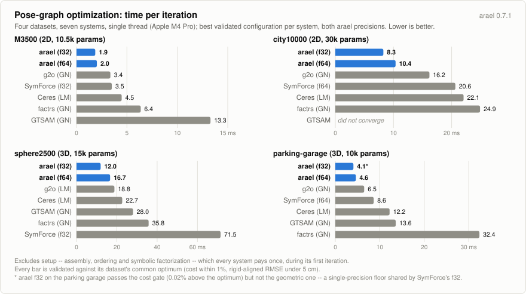
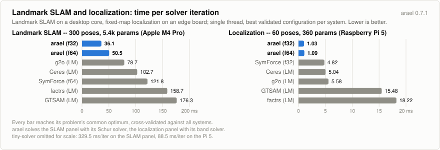
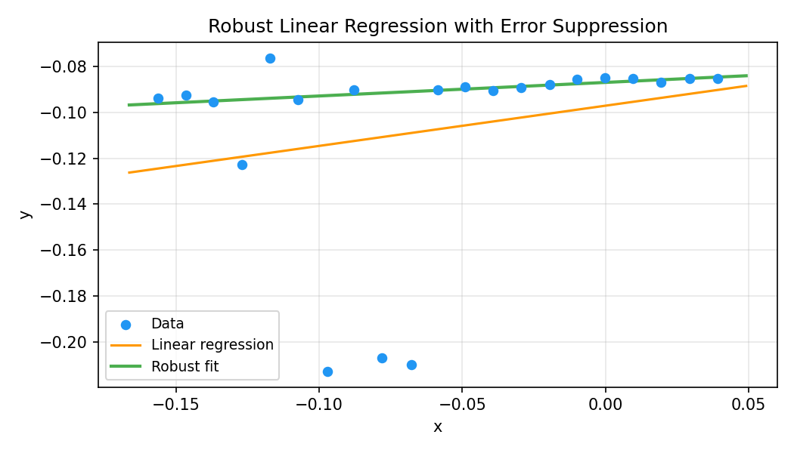
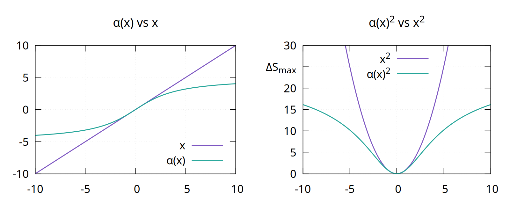
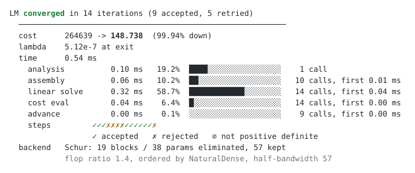
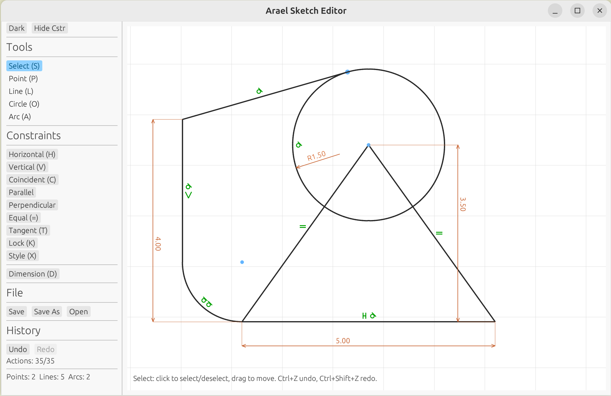
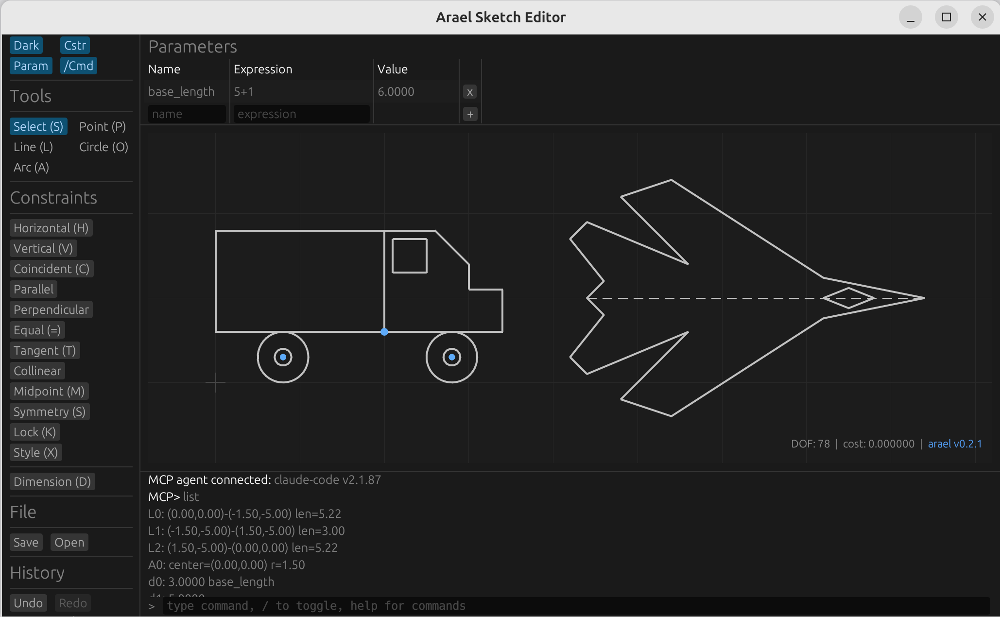

# ARAEL

**Algorithms for Robust Autonomy, Estimation, and Localization**

A Rust framework for nonlinear optimization with compile-time symbolic differentiation. Define your model and constraints declaratively -- the macro system symbolically differentiates, applies common subexpression elimination, and generates compiled cost, gradient, and Gauss-Newton hessian (J^T J approximation) code.

Solve problems like linear and nonlinear regression, sensor fusion, SLAM, bundle adjustment, pose-graph and geometric constraint optimization.

## Contents

- [Features](#features)
- [Benchmarks](#benchmarks)
- [Scope](#scope)
- [Quick Example: Symbolic Math](#quick-example-symbolic-math)
- [Quick Example: Robust Linear Regression](#quick-example-robust-linear-regression)
- [SLAM Path Optimization](#slam-path-optimization)
- [Starship robust error suppression](#starship-robust-error-suppression)
- [Localization Demo](#localization-demo)
- [Examples](#examples)
- [Solvers](#solvers)
- [Parameter Covariance](#parameter-covariance)
- [Runtime Differentiation](#runtime-differentiation)
- [Cross-Crate Models](#cross-crate-models)
- [Instrumentation and troubleshooting](#instrumentation-and-troubleshooting)
  - [My solve doesn't converge. What do I check?](#my-solve-doesnt-converge-what-do-i-check)
  - [Looking under the hood with `cargo expand`](#looking-under-the-hood-with-cargo-expand)
- [2D Sketch Editor](#2d-sketch-editor)
- [Project Structure](#project-structure)
- [License](#license)

## Features

- **Symbolic math** -- expression trees with automatic differentiation, simplification, expansion, LaTeX/Rust code generation
- **Compile-time constraint code generation** -- write constraints symbolically, get compiled derivative code with CSE
- **Levenberg-Marquardt solver** -- with robust error suppression via the [Starship method (US12346118)](https://patents.google.com/patent/US12346118) `gamma * atan(r / gamma)`, block-level robust loss (`loss = |s| loss_geman_mcclure(s, c2)`), and switchable constraints (`guard = expr`)
- **Multiple solver backends** via `LmSolver` trait:
  - **Dense Cholesky** (nalgebra) -- fixed-size dispatch up to 9x9, dynamic for larger
  - **Band Cholesky** -- pure Rust O(n*kd^2) for block-tridiagonal systems (9.4x faster than dense at 500 poses)
  - **Sparse Cholesky** (faer, pure Rust) -- for general sparse hessians (66x faster than dense at 200 poses with 6% fill)
  - **Eigen SimplicialLLT** and **CHOLMOD** -- optional C++ backends via FFI (`--features eigen`, `--features cholmod`)
  - **CHOLMOD supernodal** -- optional `--features cholmod-gpl`. **License warning:** CHOLMOD's Supernodal module is GPL (the `cholmod` feature binds only the LGPL Simplicial module), so the resulting binary is subject to the GPL
  - **LAPACK band** -- optional dpbsv/spbsv backend (`--features lapack`)
- **Schur marginalization** -- mutually uncoupled parameter blocks are eliminated before the factorization and recovered by back-substitution. The sparse backend detects them and applies it when it is faster; `SchurPolicy` overrides
- **Indexed sparse assembly** -- precomputed position lists for zero-overhead hessian assembly after first iteration
- **Warm re-solve** -- `LmSession` keeps what a solve learns about the problem's structure (pattern, ordering, symbolic factorization) so repeated solves of the same problem skip the analysis
- **f32 and f64 precision** -- `#[arael(root)]` for f64, `#[arael(root, f32)]` for f32 throughout
- **Model trait** -- hierarchical serialize/deserialize/update protocol for parameter optimization
- **Cross-crate models** -- `arael::export_models!()` bundles a crate's pub models; the importing crate registers them all with one `arael_import!()` and builds its own models and roots over them
- **C++ interface generator** -- `cargo arael export` generates a C ABI shim and C++ wrapper classes for a root model (build the problem from C++, solve, read results). See [docs/CXX.md](docs/CXX.md)
- **Type-safe references** -- `Ref<T>`, `Vec<T>`, `Deque<T>`, `Arena<T>` for indexed collections with stable references
- **Runtime differentiation** -- parse equations from strings at runtime, auto-differentiate symbolically, and optimize via `ExtendedModel` + `TripletBlock` (used by the sketch editor for parametric expression dimensions)
- **User-defined functions** -- plug custom symbolic or native-eval operators into constraint bodies with `#[arael::function]`.
- **Hessian blocks** -- `SelfBlock<A>` and `CrossBlock<A, B>` for 1- and 2-entity constraints (packed dense); `TripletBlock` for 3+ entities (COO sparse). Heap-backed `BoxedSelfBlock`/`BoxedCrossBlock` variants allocate only the active blocks and can be freed between solves -- lighter when optimizing part of a large model tree
- **Jacobian computation** -- `#[arael(root, jacobian)]` generates `calc_jacobian()` returning a sparse Jacobian matrix for DOF analysis and constraint diagnostics (see `examples/jacobian_demo.rs`)
- **Parameter covariance** -- `assemble_covariance` recovers `Sigma = 2 H^-1` at the solution without forming the dense inverse; per-entity marginal / conditional / cross blocks and std devs, with a `PerQuery` / `AllMarginals` (selected inverse) / `TriDiagonal` (band, no factorization) mode per workload
- **Gimbal-lock-free rotations** -- `EulerAngleParam` (euler-angle delta) and `QuaternionParam` (rotation-vector delta) optimize a small delta around a re-centered reference rotation
- **Rigid transforms** -- `TransformParam` optimizes a translation and a rotation as one 6-DOF parameter. The optimized delta is represented as a twist (se(3)), so a rotation correction carries the translation with it
- **Unit directions** -- `UnitVecParam` optimizes a direction with 2 degrees of freedom
- **Fast approximate atan** -- `#[arael(root, fast_atan)]` swaps every atan/atan2 in the generated code for polynomial approximations (max error < 1e-6 rad); or call `fast_atan`/`fast_atan2` per site. Derivatives stay the exact rational forms
- **.g2o file I/O** -- `arael::g2o` reads and writes the standard pose-graph interchange format (2D and 3D), with information matrices kept as read and sqrt-info helpers
- **Model validation** -- `model.validate()` reports every formulation problem in one pass (non-finite parameters, stale refs, unconstrained parameters, derivative mismatches); `check_gradients()` compares assembled gradients against finite differences
- **WASM/browser support** -- the sketch editor compiles to WebAssembly and runs in the browser via eframe/egui

## Benchmarks

<picture>
  <source media="(prefers-color-scheme: dark)" srcset="https://raw.githubusercontent.com/harakas/arael/master/benchmarks/charts/v0.7.1/pgo-dark.svg">
  
</picture>

Time per iteration on the four canonical pose-graph datasets, 2D and
3D. One iteration is one linearize + assemble + factorize + solve over
the identical validated cost function -- the same work in every system,
independent of each solver's damping schedule -- measured as the
difference between a two-iteration and a one-iteration solve, so the
one-time setup cancels out.

Full methodology, the initial-damping policy, and the cross-system
validation harness: [benchmarks/pgo](benchmarks/pgo/README.md). A
bundle-adjustment benchmark on the BAL Ladybug problems (arael vs Ceres
and g2o): [benchmarks/bal](benchmarks/bal/README.md). A heterogeneous
monocular SLAM benchmark (six factor types, seven systems),
including a Raspberry Pi edge run: [benchmarks/slam](benchmarks/slam/README.md).
A plane-landmark SLAM benchmark, where six systems each parameterize the
plane normal differently: [benchmarks/plane](benchmarks/plane/README.md).

<picture>
  <source media="(prefers-color-scheme: dark)" srcset="https://raw.githubusercontent.com/harakas/arael/master/benchmarks/charts/v0.7.1/slam-loc-dark.svg">
  
</picture>

The same per-iteration metric on the landmark-SLAM benchmark and on
fixed-map localization running on a Raspberry Pi 5
([benchmarks/loc](benchmarks/loc/README.md)): with the landmarks fixed
the localization Hessian is block-tridiagonal, and arael solves it with
its band Cholesky.

## Scope

Arael is a **nonlinear optimization framework**, not a complete SLAM or state estimation system. The SLAM and localization demos show how to use arael as the optimizer backend, but a production SLAM pipeline would additionally need:

- **Front-end perception**: feature detection, descriptor extraction
- **Data association**: matching observed features to existing landmarks, handling ambiguous or incorrect matches
- **Landmark management**: initializing new landmarks from observations, merging duplicates, pruning unreliable ones
- **Keyframe selection**: deciding when to add new poses vs. discard redundant frames
- **Loop closure**: detecting revisited places, verifying loop closure candidates, and injecting constraints
- **Outlier rejection logic**: deciding which observations to reject
- **Marginalization / sliding window**: limiting optimization scope for real-time operation, marginalizing old poses while preserving their information
- **Map management**: spatial indexing, map saving/loading, multi-session map merging

Arael provides the compile-time-differentiated solver that sits at the core of such a system. Everything above is application-level logic that builds on top of it.

## Quick Example: Symbolic Math

```rust
use arael::sym::*;
use arael::sym;
use std::collections::HashMap;

sym! {
    let (x, y) = symbols!(x, y);
    let f = sin(x) * y + pow(x, 2.0);

    println!("f(x, y)    = {}", f);           // x^2 + y * sin(x)
    println!("df/dx      = {}", f.diff(x));   // y * cos(x) + 2 * x
    println!("df/dy      = {}", f.diff(y));   // sin(x)

    let vars = HashMap::from([("x", 2.0), ("y", 3.0)]);
    println!("f(2, 3)    = {}", f.eval(&vars).unwrap()); // 6.7278...
}
```

The `sym!` macro auto-inserts `.clone()` on variable reuse, so you write natural math without Rust's ownership boilerplate.

See [docs/SYM.md](docs/SYM.md) for the full symbolic math reference.

## Quick Example: Robust Linear Regression

You describe the model as a Rust struct and the residual as an arael-sym expression; the macros do the rest.

- `#[arael::model]` auto-implements the `Model` trait for the struct: serialize / deserialize / update of every optimizable parameter, flat indexing into the residual vector, and all the hooks the solver needs.
- Every `Param<T>` field is an optimization variable. Plain fields (`data`, `sigma`, `gamma` here) are constants.
- `#[arael(fit(data, |e| ...))]` declares a least-squares fit: one residual per element of `data`, body written as a symbolic expression referencing model fields and the current data entry. The macro compiles the body into residual + gradient + Hessian code with symbolic differentiation and CSE. A trailing `loss = |s| rho(s)` (e.g. `loss_geman_mcclure(s, c2)`) applies a robust M-estimator over each point's squared residual.

The `gamma * atan(plain_r / gamma)` wrapper is the [Starship robust error-suppression method](https://patents.google.com/patent/US12346118) -- residuals up to ~gamma pass through linearly, beyond that they saturate, suppressing outlier influence while staying smoothly differentiable.

```rust
#[arael::model]
struct DataEntry { x: f32, y: f32 }

#[arael::model]
#[arael(fit(data, |e| {
    let plain_r = (a * e.x + b - e.y) / sigma;
    gamma * atan(plain_r / gamma)
}))]
struct LinearModel {
    a: Param<f32>,
    b: Param<f32>,
    data: Vec<DataEntry>,
    sigma: f32,
    gamma: f32,
}
```

The macro auto-generates `calc_cost()`, the `calc_grad_hessian_*` backend family, and `fit()`/`fit_with()` methods with symbolically differentiated, CSE-optimized compiled code:

```rust
fn main() {
    let data = vec![
        DataEntry { x: -0.156, y: -0.094 },
        // ...
    ];

    let mut model = LinearModel::new(data, 0.01);

    // Initial values from ordinary least squares
    model.fit_linear_regression();
    println!("Linear regression: y = {}*x + {}", model.a.value, model.b.value);

    // Robust nonlinear fit -- suppresses outlier influence
    let result = model.fit_with(&LmConfig::well_conditioned().with_verbose(true)).unwrap();
    println!("Robust fit: y = {}*x + {}", model.a.value, model.b.value);
}
```

The robust fit ignores outliers while tracking the inlier data:



See [docs/LINEAR.md](docs/LINEAR.md) for the full walkthrough. Full source: [examples/linear_demo.rs](examples/linear_demo.rs).

## SLAM Path Optimization

A 2D SLAM problem: find the most likely robot path and landmark positions
from the sensor readings. Each pose is a position `(x, y)` and a heading
`gamma`; each landmark is a point `(x, y)`. The sensors give the angle
(bearing) to a landmark from the poses that saw it, and how far the robot
moved between consecutive poses -- never the distance to a landmark, only its
direction.

```rust
// A robot pose, plus the movement measured since the previous pose.
#[arael::model]
struct Pose {
    pos: Param<vect2f>,            // solved for: position (x, y)
    gamma: Param<f32>,             // solved for: heading (0 = east)
    delta_pos: vect2f,             // measured: movement since prev pose
    delta_gamma: f32,              // measured: heading change since prev pose
    delta_pos_isigma: f32,         // 1/sigma; sigma = sensor uncertainty (std dev)
    delta_gamma_isigma: f32,
    hb_pose: SelfBlock<Pose, f32>, // solver storage for this pose's parameters
}

// Two consecutive poses: their actual relative motion must match the
// measured movement (delta_pos, delta_gamma).
#[arael::model]
#[arael(constraint(hb, {
    let local = matrix2sym::rotation(prev.gamma).transpose() * (cur.pos - prev.pos);
    [(local.x - cur.delta_pos.x) * cur.delta_pos_isigma,
     (local.y - cur.delta_pos.y) * cur.delta_pos_isigma,
     rad_diff(cur.gamma - prev.gamma, cur.delta_gamma) * cur.delta_gamma_isigma]
}))]
struct PosePair {
    #[arael(ref = root.poses)] prev: Ref<Pose>,  // Ref = a root-collection index
    #[arael(ref = root.poses)] cur: Ref<Pose>,
    hb: CrossBlock<Pose, Pose, f32>,  // storage for the two poses it couples
}

// A landmark and the bearing sightings that observed it.
#[arael::model]
struct Landmark {
    pos: Param<vect2f>,
    frines: std::vec::Vec<Frine>,
    hb: SelfBlock<Landmark, f32>,
}

// One bearing sighting of `lm` from `pose`: the residual is the angle
// difference between the landmark's actual direction and the measured
// bearing (zero when they agree).
#[arael::model]
#[arael(constraint(hb, parent = lm, {
    let world_angle = pose.gamma + frine.bearing;
    let aligned = matrix2sym::rotation(world_angle).transpose() * (lm.pos - pose.pos);
    [atan2(aligned.y, aligned.x) * frine.isigma]
}))]
struct Frine {
    #[arael(ref = root.poses)] pose: Ref<Pose>,
    bearing: f32,
    isigma: f32,
    hb: CrossBlock<Landmark, Pose, f32>,
}

// The root. #[arael(root, f32)] triggers codegen over everything reachable.
#[arael::model]
#[arael(root, f32)]
struct Path {
    poses: refs::Deque<Pose>,
    pose_pairs: std::vec::Vec<PosePair>,
    landmarks: refs::Arena<Landmark>,
}
```

Each constraint body computes one or more **residuals** -- the differences
between what the model predicts and what the sensor measured. Driving them
toward zero pulls the estimate into agreement with the data, a soft constraint
on the poses and landmarks involved; the same per-measurement term is what
factor-graph frameworks call a *factor* (GTSAM) or an *edge* (g2o).

There is no factor graph to build here, though: the model *is* plain Rust data
structures, and each residual lives as code inside an
`#[arael(constraint(...))]` attribute right next to the data it reads.

Building the synthetic problem and solving it is two calls -- `solve_sparse`
runs Levenberg-Marquardt on the faer sparse backend and writes the optimized
values back into the structs:

```rust
let (mut path, ..) = build_path(&Cfg::default());  // synthetic arc + noisy bearings
let cfg = LmConfig::well_conditioned().with_verbose(true);
let result = path.solve_sparse(&cfg).unwrap();
println!("{} iterations, cost {:.1} -> {:.1}",
    result.iterations, result.start_cost, result.end_cost);
```

Full runnable demo: [examples/slam2d_simple_demo.rs](examples/slam2d_simple_demo.rs).
For the 3D version -- full position and orientation per pose, camera bearings,
and rejection of wrong measurements -- see
[examples/slam_demo.rs](examples/slam_demo.rs) and the full walkthrough in
[docs/SLAM.md](docs/SLAM.md).

## Starship robust error suppression

Wrapping a residual $r$ in $\gamma \arctan(r / \gamma)$ is the **Starship method** ([US Patent 12,346,118](https://patents.google.com/patent/US12346118)) -- a way to cap how much a single outlier can move the optimum without losing smooth differentiability. This section explains what it does and why.

### Setup

Given sensor readings stacked into a vector $L$, model parameters $M$ (poses, landmarks, etc.), and a prediction $\mu(M)$ of what the sensors should report given $M$, Bayesian inference with $L \mid M \sim \mathcal{N}(\mu(M), K_L)$ -- where $K_L$ is the sensor covariance matrix -- leads to minimising the sum

$$
S(M) = (L - \mu(M))^T K_L^{-1} (L - \mu(M)).
$$

**Whitening.** Diagonalising $K_L = R D R^T$ and substituting $L^D = R^T L$, $G(M) = R^T \mu(M)$ turns the quadratic form into a plain sum of squares in units of standard deviations:

$$
S(M) = \sum_i r_i^2, \qquad r_i = \frac{L_i^D - G_i(M)}{\sigma_i}.
$$

The solver minimises $S(M)$ (the Gauss-Newton / LM step), and every inner term $r_i$ is dimensionless -- a pure sigma count.

### The outlier problem

Each $r_i^2$ grows as the *square* of the measurement error. With proper covariances and no outliers a typical $|r_i|$ sits around $1$ (the whitening divides by the noise scale, so inliers cluster near unity), and $\mathbb{E}[r_i^2] = 1$ per residual. A single bad association at $10\sigma$ already contributes $100$ to the sum; at $30\sigma$ it contributes $900$. A handful of bad measurements drown out the signal from hundreds of good ones and pull the optimum off.

The usual robust-loss fixes -- L1 ($|r|$) and Huber (quadratic near zero, linear past a threshold) -- replace $r^2$ with something that grows slower than quadratically, which limits but does not cap each residual's contribution; a single very bad outlier can still pull the solution. Their derivatives are also awkward: L1 has a kink at $r = 0$ (undefined derivative there), Huber has a kink at the quadratic-to-linear transition (continuous but not smooth), and Gauss-Newton wants a smooth Jacobian. We want a loss that is both fully bounded and smooth everywhere.

### The cap

We look for a function $\alpha(x)$ that behaves like $x$ in the normal range but saturates for large inputs, so that $\alpha(x)^2$ contributes a bounded amount $\Delta S_{\max}$ to the sum instead of an unbounded $x^2$.

A clean choice is

$$
\alpha(x) = \gamma \arctan\frac{x}{\gamma}, \qquad \gamma = \frac{2 \sqrt{\Delta S_{\max}}}{\pi}.
$$

The $\gamma$ value follows from the saturation requirement: as $|x| \to \infty$, $\arctan(x/\gamma) \to \pm \pi/2$, so $\alpha(x)^2 \to (\gamma \pi / 2)^2$; setting that equal to $\Delta S_{\max}$ and solving gives the $\gamma$ above. Three further properties fall out:

- $\alpha(x) \approx x$ for $|x| \sim 1$ -- small residuals pass through unchanged.
- $\alpha'(0) = 1$, so near the optimum the loss is indistinguishable from plain $r^2$.
- $\alpha(x)^2 \to \Delta S_{\max}$ as $|x| \to \infty$ -- no single residual can push the sum by more than $\Delta S_{\max}$.



Left: $\alpha(x)$ (green) bends away from the identity $x$ (purple) once $|x|$ moves past a few sigmas. Right: the *squared* contribution -- the unbounded $x^2$ parabola vs the saturating $\alpha(x)^2$, capped at $\Delta S_{\max}$. The cap is also smooth; Gauss-Newton still sees a well-defined Jacobian everywhere.

### Using it

Replace each $r_i$ in the sum with $\alpha(r_i)$:

$$
\hat{S}(M) = \sum_i \alpha(r_i)^2 = \sum_i \left[ \gamma \arctan\frac{L_i^D - G_i(M)}{\gamma \sigma_i} \right]^2.
$$

In practice $\Delta S_{\max}$ in the range $[10, 25]$ (so $\gamma$ between roughly $2$ and $3$) suppresses genuine outliers hard without biasing inlier-dominated regions. Since residuals are already sigma-scaled, this corresponds roughly to saying "residuals past $3$ to $5\sigma$ stop mattering".

In arael this is exactly what you see in the demo constraint bodies:

```rust
let plain_r = (a * e.x + b - e.y) / sigma;
gamma * atan(plain_r / gamma)
```

The symbolic-differentiation pipeline handles `atan`'s derivative automatically; from the macro's point of view the residual is just another expression. No special-case code, no outlier bookkeeping.

### Initialisation matters

Gauss-Newton (and Levenberg-Marquardt) is a local method: each step linearises the cost around the current $M$ and moves in the direction that linearisation suggests. For any loss, you need a starting $M_0$ close enough to the optimum that the linearisation is informative.

Starship makes this requirement stricter. The gradient falls off as $\alpha'(r) = 1 / (1 + \pi^2 r^2 / (4 \Delta S_{\max}))$, so at the recommended $\Delta S_{\max} = 25$ a residual at $5\sigma$ still carries about 29% of its least-squares pull and a $10\sigma$ residual about 9% -- still usable. Once you get out to $20\sigma$ and beyond it drops under 3% and those residuals are effectively frozen. If $M_0$ puts many residuals that far out, the solver has nothing to work with and stalls. The usual remedy is **graduated optimisation**: start with a large $\Delta S_{\max}$ (loose cap, everything in the informative regime), solve, then shrink it across passes down to the target value. The SLAM demo does this via a `frine_isigma_scale` field stepped per pass.

### Block-level loss

The Starship wrapper above is applied to each residual *element* by hand. A `loss` modifier on the constraint instead robustifies the whole residual block at once: it takes the squared norm $s = \lVert r \rVert^2$ and replaces it with $\rho(s)$, scaling the block's gradient and Hessian by the weight $\rho'(s)$.

```rust
#[arael(constraint(hb, loss = |s| loss_geman_mcclure(s, self.c2), {
    [(obs.u - proj.u) * obs.iw, (obs.v - proj.v) * obs.iw]
}))]
```

The closure argument is the block squared norm; the scale (`k2`, `c2`) is squared, in the same chi-square units as `s` -- an inlier threshold like the chi-square quantile 7.815 goes in unchanged. Four kernels ship (`loss_geman_mcclure`, `loss_cauchy`, `loss_huber`, `loss_tukey`), or write any differentiable expression -- `|s| s` is plain least squares. Unlike the per-element wrapper this is a standard M-estimator: the down-weighting depends only on the block norm, so it is invariant to how the residual axes are oriented. Scaling by $\rho'(s)$ keeps the Hessian positive semidefinite. See [docs/SYM.md](docs/SYM.md#robust-loss-kernels) for the kernel formulas.

## Localization Demo

Same model as SLAM but landmarks are fixed (known map). Since landmark positions are not optimized, there is no gauge freedom and absolute pose errors are meaningful. No GPS needed -- the known landmarks anchor the solution.

The frine constraint uses a **remote block** (`pose.hb_pose`) -- the hessian block lives on Pose, not on PointFrine, since only Pose has parameters. With only pose parameters, the hessian is block-tridiagonal (kd=11 for 6-param poses), so the band solver can be used for O(n) scaling instead of O(n^3) dense -- 9.4x faster at 500 poses.

See [examples/loc_demo.rs](examples/loc_demo.rs).

## Examples

The `examples/` directory is the primary place to see the API in use. Each file is a runnable `cargo run --release --example <name>`.

- **[linear_demo](examples/linear_demo.rs)** -- robust linear regression on noisy 2D data. Residual wrapped in `gamma * atan(r / gamma)` -- the [Starship method (US12346118)](https://patents.google.com/patent/US12346118), same robustifier used by the feature constraints in loc/SLAM. Minimal single-struct model + LM fit, compared against plain closed-form least squares.
- **[robust_curve_fitting](examples/robust_curve_fitting.rs)** -- fit `y = exp(m*x + c)` to data with two gross outliers: a plain fit against a block Cauchy loss (`loss = |s| loss_cauchy(s, 0.25)`, matching Ceres `CauchyLoss(0.5)` -- the scale is squared) and the per-element starship wrapper. The robust fits recover the true parameters; the plain fit is dragged off. Ports Ceres's robust_curve_fitting example.
- **[slam2d_simple_demo](examples/slam2d_simple_demo.rs)** -- minimal pedagogical 2D SLAM: bearing-only landmark observations, pose `(x, y, gamma)`, first pose fixed as the gauge. Writes `slam2d_simple.eps` with per-landmark 95% covariance ellipses -- elongated radially, showing depth is the unobservable dimension of bearing-only SLAM.
- **[slam2d_multi_demo](examples/slam2d_multi_demo.rs)** -- multi-run merge on a nested model tree (`Map { paths: Vec<Path>, landmarks }`): three GPS-anchored runs fused in one solve via bearings onto shared root-level landmarks (`ref = root.landmarks`, run-local odometry via `ref = parent.poses`). Writes `slam2d_multi.eps` with 95% ellipses.
- **[slam2d_align_demo](examples/slam2d_align_demo.rs)** -- builds one map from three runs the cheap, two-step way: each run is solved on its own, then a small second step lines the runs up with each other. Same scene as `slam2d_multi_demo` (which solves everything at once), so the two results can be compared; writes `slam2d_align.eps`.
- **[slam_demo](examples/slam_demo.rs)** -- full 3D monocular SLAM: S-curve trajectory, 60 poses, 240 landmarks, odometry + tilt + GPS + feature observations. Full verbose-LM trace across graduated isigma passes -- the reference for what a healthy solver run looks like.
- **[slam_demo_gm](examples/slam_demo_gm.rs)** -- the same scene on newer machinery: selectable Geman-McClure / Cauchy block loss (`--loss gm|cauchy`) instead of the per-element starship wrap, a `TransformParam` pose, anchored inverse-depth landmarks (`UnitVecParam` direction + inverse range, re-anchored between ramp passes), trig-free chord residuals, and the graduated ramp through one `LmSession`.
- **[loc_demo](examples/loc_demo.rs)** -- localisation with fixed known landmarks (no gauge freedom). Block-tridiagonal Hessian + band solver. Graduated-isigma optimisation via a root `frine_isigma_scale` field.
- **[loc_global_demo](examples/loc_global_demo.rs)** -- root-level `Param` fields consumed by constraints: a global rigid transform (translation + rotation) applied to every pose. Shows the two pose<->root cross-Hessian wirings (`CrossBlock<Pose, Path>` vs a root-owned `TripletBlock`) and a staged pass that optimises only the globals first.
- **[plane_slam_demo](examples/plane_slam_demo.rs)** -- plane SLAM with a user-defined component: `UnitVec<T>`, a 2-DOF unit direction on the sphere, demonstrating `#[arael(component)]`.
- **[m3500_demo](examples/m3500_demo.rs)** -- the classic M3500 Manhattan-world pose-graph benchmark (Olson 2006): 3500 SE2 poses and 5453 relative-pose constraints from a g2o file, the between-factor written symbolically, solved with sparse faer LM. The same model backs [benchmarks/pgo](benchmarks/pgo/README.md).
- **[bal_demo](examples/bal_demo.rs)** -- bundle adjustment on a real Bundle-Adjustment-in-the-Large Ladybug problem (49 cameras, 7776 points, 31843 observations, from the vendored file). The Snavely reprojection residual written symbolically; verbose LM with the Nielsen driver drives the cost 1.70M -> 26.7k and the reprojection RMS 7.3 px -> 0.92 px in 22 steps, reaching the same optimum as Ceres. Same model as [benchmarks/bal](benchmarks/bal/README.md).
- **[model_demo](examples/model_demo.rs)** -- minimal `#[arael::model]` walk-through showing how `Param`, `SimpleEulerAngleParam`, and the update cycle fit together.
- **[single_root_demo](examples/single_root_demo.rs)** -- single-struct model-and-root + a direct-composed sub-model, each carrying its own `SelfBlock<Self>`. The smallest example that exercises the "root has its own params" path.
- **[refs_demo](examples/refs_demo.rs)** -- `Ref<T>`, `refs::Vec`, `refs::Deque`, and `refs::Arena` behaviour: insertion, iteration, stable handles.
- **[jacobian_demo](examples/jacobian_demo.rs)** -- `#[arael(root, jacobian)]`, `#[arael(constraint_index)]`, and `calc_jacobian` / `calc_cost_table` walk-through. End-to-end reference for the instrumentation features used in convergence debugging.
- **[runtime_fit_demo](examples/runtime_fit_demo.rs)** -- curve fitting where the residual equation is a string parsed at runtime. Demonstrates `ExtendedModel` + robust loss on top of the symbolic front end.
- **[user_function_demo](examples/user_function_demo.rs)** -- `#[arael::function]` for user-defined operators in constraint bodies, in its two forms: a purely symbolic `sigmoid(x) = 1 / (1 + exp(-x))` (arael differentiates it automatically) and an opaque numerical `my_safe_asin` that carries a hand-written closed-form derivative. Both are used in a single two-residual LM fit.
- **[sym_demo](examples/sym_demo.rs)** -- symbolic-math tour: expression building, automatic differentiation, CSE, pretty printing, parsing. No solver involvement; pure `arael-sym`.
- **[calc_demo](examples/calc_demo.rs)** -- `bc`-style REPL calculator built on `arael-sym`. Shows `parse_with_functions` + `FunctionBag` for user-defined functions, persistent history via rustyline.
- **[bench_band](examples/bench_band.rs)** -- benchmarks the band Cholesky backend against dense on the localisation model at increasing pose counts. Prints timing + speedup.
- **[bench_sparse](examples/bench_sparse.rs)** -- sparse Cholesky backends (faer) vs dense on SLAM.
- **[bench_investigate](examples/bench_investigate.rs)** -- deeper comparison of sparse backends on SLAM, with assembly vs solve breakdown and numeric cross-check of the solutions.

## Solvers

Levenberg-Marquardt with pluggable linear-algebra backends behind one
trait (`LmSolver`) and one config (`LmConfig`). Full reference:
[docs/SOLVERS.md](docs/SOLVERS.md).

**The main entry point is `solve_with` on `LmProblem`** -- it wraps
the serialize -> optimize -> deserialize round trip (parameters are
read from the model and written back) and takes any backend instance.
Every `#[arael(root)]` model gets it: the macro implements `RootProblem`
(the parameter round trip), which unlocks the solve methods LmProblem
provides. `solve_sparse` and `solve_dense` are conveniences over
`solve_with`, and the `simple_lm::solve_*` free functions run the same
solves over a raw parameter vector you manage yourself:

```rust,ignore
use arael::simple_lm::LmProblem; // or `use arael::prelude::*;`
let result = model.solve_with(&mut Band::new(11), &cfg)?; // any LmSolver backend
let result = model.solve_sparse(&cfg)?; // = solve_with(SparseFaer): the default backend
let result = model.solve_dense(&cfg)?;  // = solve_with(Dense)
```

Every solve returns `Result<LmResult, SolveFailure>`: `Ok` when the solve
terminated by a stopping rule (including `MaxIterations` and `TimeLimit`),
`Err` when the system could not be built or factored or a Hessian diagonal
went bad -- with the best accepted state carried in the error when one
exists. See [docs/SOLVERS.md](docs/SOLVERS.md#solve-failures).

`solve_sparse` (indexed sparse faer) is the right default: for most
real problems the Hessian is sparse enough for sparse Cholesky, and
faer is pure Rust with no external dependency. The generated methods
match the root's precision: on an `#[arael(root, f32)]` model they take
`f32` configs and `solve_sparse` uses `SparseFaer<f32>`.

| Backend (`solve_with(&mut ..., &cfg)`) | Free function | What it is |
|---|---|---|
| **`SparseFaer::<T>::new()`** (`T` = `f64`/`f32`) | **`solve_sparse[_f32]`** | **default** (= `solve_sparse`): sparse Cholesky via faer, pure Rust. Marginalizes the model's landmark-like blocks (a Schur complement) when that is faster than factorizing the whole system, and decides which by itself; `SchurPolicy` / `FaerOrdering` override it |
| `Dense` | `solve[_f32]` | dense nalgebra Cholesky (= `solve_dense`): low parameter counts or genuinely dense problems |
| `Band::new(kd)` | `solve_band[_f32]` | pure-Rust band Cholesky for block-tridiagonal Hessians (localization-like); hard-errors on off-band elements |
| `BandLapack::new(kd)` | `solve_band_lapack[_f32]` | the same band solve through LAPACK `dpbsv`/`spbsv` (feature `lapack`) |
| `SparseEigen::<T>::new()` | `solve_sparse_eigen[_f32]` | Eigen `SimplicialLLT` (feature `eigen`) |
| `SparseCholmod::new()` | `solve_sparse_cholmod` | CHOLMOD simplicial Cholesky, LGPL (feature `cholmod`; f64 only) |
| `SparseCholmodSupernodal::new()` | `solve_sparse_cholmod_supernodal` | CHOLMOD supernodal Cholesky, **GPL-licensed module** (feature `cholmod-gpl`; f64 only) |
| `SparseCoo::new()` / `SparseDirectCsc::new()` | `solve_sparse_coo` / `solve_sparse_direct_csc` | COO / direct-CSC assembly over a dense solve -- validation baselines, deprecated in favour of `SparseFaer` (the root's `.solve_sparse()`) |

### Damping-schedule drivers

Levenberg-Marquardt is an iterative algorithm with a damping parameter,
lambda, that modulates each step between Gauss-Newton (small lambda) and
gradient descent (large lambda). The initial value of lambda, how it evolves
per step, and when to stop all depend on the problem's state along the solve
-- there is no single schedule that is perfect for every problem, or even for
one problem from start to finish. And it pays to get them right: every LM iteration is a
full linearize + factorize + solve, so the iteration count is essentially the
run time. Leaving damping and tolerances at their defaults therefore leaves
considerable performance on the table, whatever the problem -- they are worth
tuning to the one at hand, and a production system chasing every last bit of
throughput writes a dedicated damping driver matched to its own problem.

The lambda schedule is pluggable: the LM loop consults a
`LambdaDriver` for every damping decision, feeding it each attempted
step's outcome (costs, gradient, Hessian diagonal, attempted step).
`DefaultLambdaDriver` is the classic fixed-multiplier schedule (the
default on every `LmConfig`); **`NielsenLambdaDriver`** is the gain-ratio
adaptive schedule: it scales lambda by how well the
quadratic model predicted the actual cost change, escalating
geometrically on rejections, which removes the fixed schedule's
accept/reject sawtooth on strongly nonlinear problems such as bundle
adjustment. The driver lives on the config -- select one with
`LmConfig::with_driver(NielsenLambdaDriver::default())`; every solve
entry point uses `config.driver`.

A driver can also stop the solve: its step hooks return `Option`, and `None`
means stop -- for a rule the config cannot express, such as a step-norm test
or an external deadline. From `accepted` the step is kept
(`LmStatus::DriverTerminated`); from `rejected` or `factorization_failed` the
last accepted one comes back (`LmStatus::LambdaCeiling`).

To watch a solve without touching the schedule, attach an `LmObserver`
with `LmConfig::with_observer` (closures qualify): it is called once per
damped attempt with the iteration state and the current best parameters,
and can stop the solve (`LmStatus::ObserverTerminated`) -- progress
reporting, cancellation flags, good-enough checks. See
[docs/SOLVERS.md](docs/SOLVERS.md#iteration-observer).

`LmConfig` controls the solve -- convergence tolerances, iteration
caps, initial lambda, `time_limit` (an optional wall-clock budget; it
overrides `min_iters`, because a budget is a budget), and `verbose` (turn
it on first when
debugging). Defaults are a safe middle ground; production solves
usually want `max_iters` and `rel_precision` tuned for the
performance/quality trade-off that actually matters for the
problem. See [docs/SOLVERS.md](docs/SOLVERS.md) for the full field
reference and a recipe for picking them.

Arael is single-threaded. The sparse factorization and triangular solve can
optionally run on rayon's thread pool -- enable the `rayon` feature and set
`LmConfig::num_threads` (1 = sequential, the default; `n` = n threads; 0 = every
core).

Threading has overhead: whether it helps, and by how much, depends on the model
and its number of parameters. Only the sparse factorization and triangular solve
are threaded. See [docs/SOLVERS.md](docs/SOLVERS.md#threads).

## Parameter Covariance

Recover the covariance of the solved parameters, `Sigma = 2 H^-1`, without ever
forming the dense inverse. Full reference:
[docs/COVARIANCE.md](docs/COVARIANCE.md).

**The entry point is `assemble_covariance` on the `Covariance` trait** -- it
re-assembles `H` at the current solution and prepares it for querying. Read
per-entity blocks through the entity itself: any `Model` reports its parameter
span, so a pose, a landmark, or a whole collection is a valid query.

```rust,ignore
use arael::covariance::{Covariance, CovMode};
model.solve_sparse(&cfg)?;                        // solution written back into the model
let cov = model.assemble_covariance(CovMode::AllMarginals)?;
let sd  = cov.std_dev(&model.poses[0])?;           // one entity's 1-sigma (tangent coords)
let s   = cov.marginal_cov(&model.landmarks[3])?;  // its full covariance block
let x   = cov.cross_cov(&model.poses[0], &model.landmarks[3]); // joint off-diagonal block
```

Covariances are in local tangent coordinates -- rotation deltas are minimal 3-DOF
retractions, so no manifold projection is needed. `H` must be non-singular: an
unfixed gauge (free-gauge SLAM, a similarity-free bundle problem) returns
`NotPositiveDefinite`, so anchor a pose or add a prior first.

`CovMode`, chosen at assembly, picks the strategy:

| `CovMode` | What it does | When |
|---|---|---|
| **`PerQuery`** | factors `H`, solves for each queried entity's columns on demand | a few entities |
| **`AllMarginals`** | also runs a selected inverse up front (block Takahashi over a supernodal factor), so every marginal and cross block is a lookup | many / all marginals |
| **`TriDiagonal`** | forward/backward Schur pass over a block-tridiagonal `H` (localization: a pose chain, fixed map, no loop closures) -- no factorization; the last pose is free | band-structured localization |

`marginal_cov` folds in the uncertainty of the variables an entity couples to;
`conditional_cov` holds every other parameter fixed (`2 H_ee^-1`, never larger);
`std_dev` is the marginal diagonal's square root. The `slam`, `loc` and `bal`
benchmarks time covariance recovery against Ceres, GTSAM and g2o -- see the
covariance section in each of their READMEs.

## Runtime Differentiation

Compile-time differentiation generates optimized Rust code with CSE at build time -- ideal when the model structure is fixed. But many applications need equations that are only known at runtime: user-typed formulas in a CAD parametric dimension, configuration-driven curve fitting, or symbolic constraints loaded from a file.

Arael supports this through **runtime differentiation**: parse an equation string with `arael_sym::parse`, symbolically differentiate once at setup with `E::diff`, then evaluate the expression tree numerically each solver iteration. The `ExtendedModel` trait and `TripletBlock` provide the integration point with the LM solver.

The sketch editor (`arael-sketch`) uses this extensively for parametric expression dimensions -- a user can type `d0 * 2 + 3` as a dimension value, and the solver constrains the geometry to satisfy the equation in real time, with full symbolic derivatives.

```rust
// Parse equation at runtime, differentiate symbolically
let expr = arael_sym::parse("a * x + b").unwrap();
let residual = expr - arael_sym::symbol("y");
let dr_da = residual.diff("a");  // symbolic derivative w.r.t. a
let dr_db = residual.diff("b");  // symbolic derivative w.r.t. b

// In ExtendedModel::extended_compute64(params, grad) -- each solver iteration:
for &(x, y) in &data {
    vars.insert("x", x);
    vars.insert("y", y);
    let r = residual.eval(&vars)?;
    let dr = vec![dr_da.eval(&vars)?, dr_db.eval(&vars)?];
    // writes 2*r*dr into `grad` AND pushes upper-triangle Hessian
    // into the TripletBlock -- one call, both done
    hb.add_residual(r, &param_indices, &dr, grad);
}
```

The demo accepts an arbitrary equation from the command line:

```bash
cargo run --example runtime_fit_demo                            # default: y = a * x + b
cargo run --example runtime_fit_demo -- "a * x^2 + b * x + c"  # quadratic
cargo run --example runtime_fit_demo -- "a * sin(x * b) + c"   # sinusoidal
```

Full source: [examples/runtime_fit_demo.rs](examples/runtime_fit_demo.rs).

## Cross-Crate Models

A crate can share its models. After all `#[arael::model]` definitions
(macro expansion is top-down -- the bottom of lib.rs is the natural
place), emit the crate's import macro:

```rust,ignore
arael::export_models!();
```

Every `pub` model struct and enum defined above the invocation joins the
bundle. An importing crate registers all of them in one line, before
defining its own models over them:

```rust,ignore
use model_crate::{Pose, Frine};
model_crate::arael_import!();
```

After that the imported types work like local ones: component fields,
`Ref<Pose>` on local constraint structs, `CrossBlock<Pose, Local>`,
local roots over imported entities, at either precision. Importing the
same bundle twice (diamond dependencies) is harmless, and a model crate
that imports another and calls `export_models!()` re-exports what it
imported.

Rules:

- Exported structs need `pub` fields -- generated code in the importing
  crate reads them directly. A `pub` struct with a non-pub field still
  compiles but is excluded from the bundle; an importer that reaches for
  it gets an error naming the field. `#[arael(skip)]` fields may stay
  private.
- Roots and `fit(...)` structs are not importable: their generated
  solvers are already ordinary pub API.
- An imported constraint struct keeps its `root.<field>` resolution
  paths: the importing root must name its collections as the model
  crate's constraints expect.
- The bundle records each struct's param count; the importer recomputes
  it from the same tokens and fails the build on mismatch (incompatible
  arael-macros versions between the two crates).

## Instrumentation and troubleshooting

### My solve doesn't converge. What do I check?

0. **Run `model.validate()` and turn on solver verbose mode first.** `validate()` reports non-finite parameters, stale refs, unconstrained parameters, and derivative mismatches in one pass (see [docs/SOLVERS.md](docs/SOLVERS.md#validation----modelvalidate)). Then set `verbose: true` on `LmConfig` and every LM step prints one line: iteration / retry, cost before -> after, the improvement, the damping lambda, and the microseconds it took.

    ```rust,ignore
    let cfg = LmConfig::conservative().with_verbose(true).with_gather_timing(true);
    let result = model.solve_sparse(&cfg).unwrap();
    result.pretty_print();
    ```

    ```text
    [arael INFO] 1/0: 264639->131839 / 132800, lambda=1e-4 (step=197)
    [arael INFO] 2/0: 131839->26411.6 / 105428, lambda=2e-5 (step=53)
    [arael INFO] 3/0: 26411.6->4182.65 / 22229, lambda=4e-6 (step=49)
    [arael INFO] 4/0: 4182.65->188975 / -184793, lambda=8e-7 (step=43)   <- worse: rejected
    [arael INFO] 5/1: 4182.65->186852 / -182669, lambda=8e-6 (step=39)   <- retry, lambda climbs
    ```

    The pair is `iteration/retry`. A negative improvement is a rejected step: the parameters stay put, lambda goes up, and the next line retries from the same linearization.

    On a Cholesky rejection the line also reports non-finite counts for grad / diagonal / cur_x / matrix -- four quick signals that narrow the problem before any deeper digging. (A non-positive diagonal is caught before the inner loop and fails the solve with `SolveFailureKind::DegenerateDiagonal`, naming the parameter.)

    `gather_timing` also makes the result print itself -- status, cost, where the time went, and every attempt in order:

    <picture>
      <source media="(prefers-color-scheme: dark)" srcset="https://raw.githubusercontent.com/harakas/arael/master/docs/report-dark.svg">
      
    </picture>

    That is `pretty_print()`, straight from [examples/slam2d_simple_demo.rs](examples/slam2d_simple_demo.rs). `print()` writes the same thing in plain ASCII -- safe in a log or a file -- and `report()` / `pretty_report()` hand it back as a `String` instead of writing it.

    A healthy pass is steady cost drops with no Cholesky rejections. A run of rejections in the timeline means the step size is being fought over -- try the gain-ratio `NielsenLambdaDriver`. If verbose reports NaN / Inf, or the solve fails with `SolveFailureKind::DegenerateDiagonal`, skip to steps 2 / 3 below; otherwise continue to the cost-by-label breakdown.

1. **Cost breakdown by label.** Name your constraint attributes with `#[arael(constraint(hb, name = "drift", { ... }))]` so each group shows up under its own label in the sum-of-squares. Call `model.calc_cost_table(&params)` for a `HashMap<&'static str, T>` and log it. A single label dominating the total is usually the culprit -- either an overly tight sigma, bad initial values for its inputs, or a constraint that's mathematically unsatisfiable.

2. **NaN or Inf residuals / derivatives.** The verbose-mode output from step 0 already tells you whether grad / matrix / params contain non-finite values at the failing step. If they do, walk `model.calc_jacobian(&params).rows` to find the specific row. A NaN residual or partial derivative usually means a `sqrt`, `acos`, `asin`, or `atan2` saw a degenerate input (zero-length vector, both-zero arguments, `|x| > 1` for asin/acos). `arael-sym` ships `safe_sqrt`, `safe_asin`, `safe_acos`, `safe_atan2` that clamp / regularise at the singular point and produce non-diverging derivatives. **Before reaching for them, prefer to redesign the constraint so the singularity can't be hit.** A `safe_*` wrapper hides the degeneracy from the solver and may leave the residual insensitive to the parameters that should drive it out of the singular region; an equivalent constraint formulated on the right geometric quantity avoids the singularity entirely. E.g. match 3D landmarks to features in 3D space (compare world-frame directions or positions) instead of projecting through a camera model and computing 2D image-plane residuals -- the 3D formulation is simpler, better conditioned, and has no pixel-wraparound / behind-camera pathology.

3. **Non-positive diagonal.** A solve that fails with `SolveFailureKind::DegenerateDiagonal { param, fault }` names the offending parameter and is the loudest possible signal that some parameter is untouched by every constraint (indices left at `u32::MAX`) or is receiving a negative contribution. Either outcome is a bug distinct from f32 accumulation noise.

4. **Gradient magnitude.** After `calc_grad_hessian_dense`, the maximum absolute gradient component should be small relative to the cost scale at a local minimum. A huge gradient with tiny cost means the parameter scaling is off -- one parameter moves cost several orders of magnitude more than another, which destabilises Levenberg-Marquardt.

5. **Hessian health.** The same `hessian` array should be finite and positive-semi-definite at a minimum (smallest eigenvalue ≥ 0 modulo roundoff). A significantly-negative smallest eigenvalue means the Gauss-Newton approximation `J^T J` is a poor local fit -- often because constraints are ill-conditioned or cancel.

6. **Stiffness.** Ratios between the smallest and largest sigmas (or between the smallest and largest eigenvalues of `J^T J`) that span many orders of magnitude make the problem numerically stiff. LM damping has to pick a lambda that suits both ends, which is hard at f32 precision. Keep isigmas comparable where you can; if a tight constraint dominates one direction, a gauge direction orthogonal to it will starve for signal. Starting with a loose scale and ramping up (graduated optimisation -- see `loc_demo` / `slam_demo` for the `frine_isigma_scale` pattern) helps LM climb a stiff problem without rejecting early steps.

7. **Simpler math beats clever math.** Reformulate residuals on the most natural geometric quantity. 3D direction / position errors are cheaper and better-conditioned than 2D reprojection errors; relative rotations compared as matrices or unit quaternions avoid Euler-angle gimbal lock; distances compared in squared form avoid `sqrt` derivatives near zero. Every nonlinear operation you remove is one less place for the residual / derivative to misbehave and one less source of stiffness.

8. **Inspect the generated code.** Use [`cargo expand`](https://github.com/dtolnay/cargo-expand) to see what the macro emitted for your constraint body -- see [Looking under the hood](#looking-under-the-hood-with-cargo-expand) below.

9. **Rank / DOF.** Call `Jacobian::singular_values` (or the full `Jacobian::svd` for directions). Near-zero singular values count the degrees of freedom. If this is higher than you expect, the model is under-constrained. The right singular vectors (columns of `SvdResult::v`) corresponding to σ ≈ 0 name the unconstrained parameter directions -- useful for identifying *which* parameters are free. SVD is always performed in f64 regardless of the model's element type, so rank detection stays reliable even for f32 models.

### Looking under the hood with `cargo expand`

Mastering arael means being able to read what the macros actually generated for your equations. `#[arael::model]` does a lot: it interprets the constraint body symbolically, differentiates it against every reachable parameter, runs common-subexpression elimination, and emits Rust code for three call paths (`__compute_blocks`, `__set_block_indices`, `calc_jacobian`). [`cargo expand`](https://github.com/dtolnay/cargo-expand) (`cargo install cargo-expand`) prints the expansion exactly as the compiler sees it.

```bash
cargo expand --example single_root_demo
# or, for your own crate:
cargo expand --lib              # library
cargo expand --bin my_bin       # binary
cargo expand my_mod::MyModel    # a specific path
```

### Example: a one-line fix constraint

The single-root demo declares

```rust,ignore
#[arael(constraint(hb, name = "fix_x", {
    [(singleroot.x - 3.0) * singleroot.isigma]
}))]
struct SingleRoot {
    x: Param<f64>,
    y: Param<f64>,
    isigma: f64,
    /* ... */
}
```

`cargo expand --example single_root_demo` shows the macro emits a `__compute_blocks` method with a block like:

```rust,ignore
/// arael: SingleRoot[fix_x] @ examples/single_root_demo.rs:28
let __r_0       = singleroot.isigma * (singleroot.x.work() - 3.0);
let __dr_0_0    = singleroot.isigma;      // d/d x
let __dr_0_1    = 0.0;                    // d/d y
__item.hb.add_residual(
    __r_0 as f64,
    &[__dr_0_0 as f64, __dr_0_1 as f64],
    grad,
);
```

Things to notice:

- `singleroot.x.work()` -- each param access is rewritten to `work()` so the LM trial step is used in place of the stored value without mutating it.
- Derivatives for every param the constraint touches appear individually (`__dr_0_0`, `__dr_0_1`). The `0.0` entry for `y` is not elided because the index into `hb` is positional; dead rows fold out at optimisation time.
- The residual and the partials flow into the entity's Hessian block via `hb.add_residual(r, dr, grad)` -- one call per residual, accumulating `2*r*dr` into `grad` and `2*dr_i*dr_j` into the block's packed upper triangle.
- The `/// arael: ...` doc comment is a source marker pointing at the constraint attribute the block came from -- invaluable when the expansion runs to thousands of lines.

### Example: shared subexpressions

In a larger body -- say a landmark observation that builds a rotation matrix and reuses it across x/y/z residuals -- the macro runs CSE before emitting code, so you see lines like

```rust,ignore
let __cse_0 = cos(pose.ea.z.work());
let __cse_1 = sin(pose.ea.z.work());
let __cse_2 = __cse_0 * (lm.pos.x - pose.pos.x.work())
            + __cse_1 * (lm.pos.y - pose.pos.y.work());
// __cse_2 reused in __r_0, __r_1, and every __dr_* that needs it
```

Reading these tells you what the compiler *actually* has to evaluate -- useful for understanding the cost of a constraint, spotting accidental non-shared work, and sanity-checking that symbolic simplification collapsed things you expected it to.

### What to look for

- **`__set_block_indices`** -- where each `SelfBlock` / `CrossBlock` / `TripletBlock` gets its global parameter indices written into place. A block that isn't touched here is invisible to the solver (its `u32::MAX` sentinel causes every `add_residual` to silently skip) -- a common failure mode.
- **`__compute_blocks`** -- the grad + block-Hessian accumulation path. Each constraint is a nested block with its own CSE'd body.
- **`calc_jacobian`** -- same body structure but builds a `JacobianRow` per residual instead of accumulating into the blocks. Generated only when you declare `#[arael(root, jacobian)]`.
- **source markers** -- doc comments like `/// arael: PointFrine[<name>] @ path/to/file.rs:NNN` pinpoint the constraint attribute each block came from.

Expansion grows quickly (the single-root demo is ~800 lines; a full SLAM model is several thousand). Use `sed -n` or a pager scoped to the method you care about:

```bash
cargo expand --example slam_demo | sed -n '/fn __compute_blocks/,/^    fn /p'
```

### Builds are slow

Model code generation runs inside the `arael` proc-macros at compile time, and a
dev build compiles those macros unoptimized -- so a large model can spend a long
time expanding. Run just the macro crates in release mode, without optimizing
your own debug build, by adding to your `Cargo.toml`:

```toml
[profile.dev.package.arael-macros]
opt-level = 3
[profile.dev.package.arael-sym]
opt-level = 3
```

## 2D Sketch Editor

An interactive constraint-based 2D sketch editor built on the arael optimization framework. Draw geometry, apply constraints, and the solver keeps everything consistent in real time.

[](https://sketch.mare.ee/)

[Try it in the browser](https://sketch.mare.ee/)

The sketch solver combines both differentiation modes:

- **Geometric constraints** (horizontal, coincident, parallel, tangent, etc.) use **compile-time differentiation** -- the macro generates optimized Gauss-Newton code with CSE for each constraint type.
- **Parametric dimensions** use **runtime differentiation** -- the user types an expression like `d0 * 2 + 3` as a dimension value, and the solver parses it, differentiates symbolically, and constrains the geometry to satisfy the equation in real time. Dimensions can reference each other, entity properties (`L0.length`, `A0.radius`), and arithmetic expressions. Broken references (deleted entities) are detected and the dimension falls back to its last computed value.

This makes the sketch editor a fully parametric constraint solver where changing one dimension propagates through all dependent expressions.

### Running (native)

```bash
cargo run -r -p arael-sketch
```

### Running (browser)

The sketch editor compiles to WebAssembly and runs in the browser.
Requires [trunk](https://trunkrs.dev/) (`cargo install trunk`) and the
`wasm32-unknown-unknown` target (`rustup target add wasm32-unknown-unknown`):

```bash
cd arael-sketch
trunk build --release
python3 -m http.server -d dist 8080
# Open http://localhost:8080
```

### Tools

- **Line (L)**, **Circle (O)**, **Arc (A)**, **Point (P)** -- draw geometry with auto-snap to nearby points, endpoints, and curves
- **Dimension (D)** -- add length, distance, radius, angle, and point-to-line distance dimensions with draggable annotations. Supports numeric values and parametric expressions (`d0 * 2`, `L0.length + 3`).
- **Select (S)** -- click to select, drag to move entities, Backspace/Delete to remove
- **Dark/Light mode** toggle, **Save/Load** (JSON), **Undo/Redo** (Ctrl+Z/Ctrl+Shift+Z)

### Constraints

Horizontal (H), Vertical (V), Coincident (C), Parallel, Perpendicular, Equal length/radius, Tangent (T), Collinear, Midpoint (M), Symmetry (lines or points about a mirror line), Lock (K), Line style (X). Constraints are visualized as symbols on the geometry and can be selected and deleted.

### Example: Sketch Solver API

```rust
use arael::model::CrossBlock;
use arael::vect::vect2d;
use arael_sketch::*;

let mut sketch = Sketch::new();

// Create a rectangle from 4 lines
let bottom = sketch.add_line(vect2d::new(0.0, 0.0), vect2d::new(3.0, 0.1));
let right  = sketch.add_line(vect2d::new(3.1, 0.0), vect2d::new(3.0, 2.1));
let top    = sketch.add_line(vect2d::new(2.9, 2.0), vect2d::new(0.1, 1.9));
let left   = sketch.add_line(vect2d::new(0.0, 2.1), vect2d::new(0.1, 0.1));

// Horizontal/vertical constraints
sketch.lines[bottom].constraints.horizontal = true;
sketch.lines[top].constraints.horizontal = true;
sketch.lines[left].constraints.vertical = true;
sketch.lines[right].constraints.vertical = true;

// Connect corners (a.p2 == b.p1)
sketch.coincident_ll21.push(CoincidentLL21 { a: bottom, b: right, hb: CrossBlock::new() });
sketch.coincident_ll21.push(CoincidentLL21 { a: right, b: top, hb: CrossBlock::new() });
sketch.coincident_ll21.push(CoincidentLL21 { a: top, b: left, hb: CrossBlock::new() });
sketch.coincident_ll21.push(CoincidentLL21 { a: left, b: bottom, hb: CrossBlock::new() });

// Fix bottom-left corner and set dimensions
sketch.lines[bottom].p1 = arael::model::Param::fixed(vect2d::new(0.0, 0.0));
sketch.lines[bottom].constraints.has_length = true;
sketch.lines[bottom].constraints.length = 4.0;
sketch.lines[left].constraints.has_length = true;
sketch.lines[left].constraints.length = 2.0;

// Solve -- all constraints satisfied simultaneously
sketch.solve();
// bottom: (0,0)->(4,0), right: (4,0)->(4,2), top: (4,2)->(0,2), left: (0,2)->(0,0)
```

The sketch solver uses Levenberg-Marquardt optimization with drift regularization and robust drag constraints. Geometric constraints are differentiated at compile time; parametric expression dimensions use runtime differentiation via `ExtendedModel`.

### Command Panel & Scripting

Press `/` to open the command panel. Full scripting support with 40+ commands for geometry creation, constraints, dimensions, parameters, introspection, and view control. Commands support expressions, coordinate references (`L0.p2`, `@dx,dy`), geometric functions (`midpoint(L0)`, `intersect(L0,L1)`), and vector arithmetic (`L0.p2 + normal(L0) * 3`).

See [arael-sketch-backend/docs/COMMANDS.md](arael-sketch-backend/docs/COMMANDS.md) for the full command reference.

### AI Agent Integration (MCP)

The sketch editor embeds an MCP (Model Context Protocol) server, enabling AI agents like Claude Code to create and modify sketches programmatically. The AI sends sketch commands and reads state through the standard MCP tool interface.



*Dark mode with parameters panel, command history showing MCP agent connection, and geometry drawn by Claude Code.*

Start the editor with MCP enabled:
```bash
cargo run -r -p arael-sketch -- --mcp --mcp-allow-all
```

The `--mcp-allow-all` flag auto-approves OAuth connections from AI agents (recommended for local use). Without it, connections require manual approval in the GUI (not yet implemented).

Configure Claude Code (`~/.claude.json`):
```json
{
  "mcpServers": {
    "arael-sketch": {
      "type": "http",
      "url": "http://127.0.0.1:8585/mcp"
    }
  }
}
```

The MCP server exposes tools for executing sketch commands (`execute_command`, `execute_script`), querying state (`get_sketch_state`), and reading documentation (`get_help`). The `initialize` response includes a condensed command reference that the AI loads into context automatically. File operations (`save`, `load`) are blocked for security.

See [arael-sketch/](arael-sketch/) for the full implementation.

## Project Structure

```
arael/              Main library (Levenberg-Marquardt solver + codegen)
  src/
    lib.rs          Crate documentation, arael::prelude
    model.rs        Param<T>, rotation params, Model trait, SelfBlock, CrossBlock, TripletBlock
    simple_lm.rs    LM solver, LmProblem/RootProblem/FitProblem, Dense/Band/Sparse backends
                    (SparseFaer: sparse Cholesky + Schur marginalization)
    geometry.rs     Camera models and projections (pinhole intrinsics/extrinsics)
    user_fn.rs      Runtime registry for #[arael::function] user-defined functions
    utils.rs        Float f32/f64 trait, angle utilities, fast atan
    refs.rs         Type-safe Vec<T>, Deque<T>, Arena<T>, Ref<T>
    vect.rs         vect2<T>, vect3<T>
    matrix.rs       matrix2<T>, matrix3<T>
    quatern.rs      quatern<T>
    log.rs          info!/warn!/error! logging macros
  cpp/
    eigen_sparse.cpp  Eigen SimplicialLLT + CHOLMOD FFI bridge (optional)
cargo-arael/        `cargo arael` subcommand: C ABI + C++ interface generator (docs/CXX.md)
cxx-tests/          Generated-interface proof: fixture model, parity + CMake consumer tests

arael-faer/         faer extensions (block CSC + Schur complement), staged for upstreaming
  src/
    lib.rs          Crate documentation
    bsc.rs          Sparse matrix over a variable block partition (block CSC)
    schur.rs        Schur-complement reduction and back-substitution

arael-sym/          Symbolic math library
  src/
    lib.rs          E type, constructors, operators
    diff.rs         Symbolic differentiation
    simplify.rs     Algebraic simplification
    cse.rs          Common subexpression elimination
    eval.rs         Evaluation, substitution, free variables
    fmt.rs          Display, LaTeX, Rust code generation
    geo.rs          Symbolic vectors/matrices (vect3sym, matrix3sym)
    linalg.rs       SymVec, SymMat, Jacobian
    parse.rs        Expression parser

arael-sym-macros/   Proc macro for arael-sym: sym! (auto-clone insertion)

arael-macros/       Procedural macros
  src/
    lib.rs          #[arael::model], sym!, field rewriting
    constraint.rs   Constraint code generation, CSE integration
    function.rs     #[arael::function] user-defined function codegen

arael-sketch-solver/ 2D constraint solver library
  src/
    lib.rs          Sketch root, solve(), entity management
    entities.rs     Point, Line, Arc types
    constraints.rs  40+ cross-constraint types
    expr_constraint.rs  Expression-based constraints for parametric dimensions
    dimensions.rs   Dimension annotations
    blocker.rs      Blocker analysis for DOF-rejected constraints
    symbol_bag.rs   Named parameters -> indices/expressions for parametric equations

arael-sketch-backend/ Headless sketch backend: command interface + MCP server
  src/
    lib.rs          Backend entry, module wiring
    commands.rs     Text command parser/executor (GUI-decoupled)
    actions.rs      Action enum, undo-able operations
    history.rs      Undo/redo system
    conflicts.rs    Constraint-conflict detection
    earc_fit.rs     Elliptic arc fitting (endpoint + tangent + bulge)
    geometry.rs     Coordinate transforms, snapping
    ids.rs          Constraint/selection identification types
    mcp_server.rs   MCP server for outside-agent access
  docs/
    COMMANDS.md     Command interface reference

arael-sketch/       Interactive sketch editor GUI (egui/eframe)
  src/
    main.rs         Entry point, EditorApp
    app_update.rs   eframe::App update loop
    tools.rs        Tool modes, selection, constraint types
    drawing.rs      Canvas rendering, grid, dimensions
    colors.rs       Color scheme (light/dark)

examples/           Runnable demos (see Examples section above)

docs/               Extended documentation
  MODEL.md          #[arael::model] macro reference
  SOLVERS.md        Solver backends and entry points
  SYM.md            arael-sym symbolic math reference
  LINEAR.md         Robust linear regression walkthrough
  SLAM.md           SLAM example walkthrough
  ARAEL_SKETCH.md   Sketch editor overview

benchmarks/         Solver benchmarks vs Ceres / g2o / GTSAM / SymForce / factrs / tiny-solver
  bal/              Bundle Adjustment in the Large
  pgo/              Pose-graph optimization
  slam/             Heterogeneous monocular SLAM (+ Raspberry Pi edge run)
  loc/              Localization against a known landmark map (+ Raspberry Pi edge run)
  aerobatics/       Rotation-parameterization conditioning (arael-only)
  make_slam_loc_chart.py  Generates the README SLAM/localization chart SVGs
```

## License

See [LICENSE.md](LICENSE.md).
