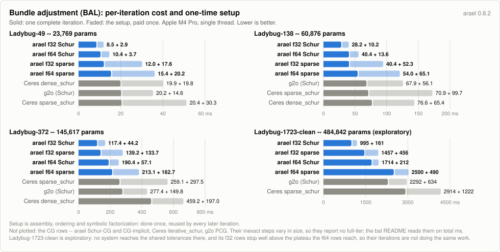

# Bundle-adjustment benchmark: arael vs Ceres vs g2o (BAL)

Bundle adjustment on the [BAL](https://grail.cs.washington.edu/projects/bal/)
(Bundle Adjustment in the Large) datasets -- the standard BA solver
benchmark -- comparing arael against [Ceres](http://ceres-solver.org)
on Ceres's home turf (BAL is the problem family Ceres's examples,
defaults, and Schur solvers were built around) and
[g2o](https://github.com/RainerKuemmerle/g2o) in its own bal_example
configuration: flat 9-parameter camera vertices, point vertices
marginalized so g2o performs its Schur elimination (its sparse-BA
heritage), CHOLMOD on the reduced camera system, the residual
autodiffed with g2o's bundled AD. With unit information g2o's chi2 IS
the reference cost, asserted at the initial estimate like the others.
A second g2o row solves that reduced system with block-Jacobi
preconditioned conjugate gradient instead of factorizing it -- the
configuration Ceres calls `iterative_schur`. `BAL_PCG_ITERS` and
`BAL_PCG_TOLS` make one row per inner-solve setting.

It runs on the shared [benchmarks/harness](../harness) -- the same probes,
timing rules, table and core pin as [pgo](../pgo/README.md),
[slam](../slam/README.md) and [loc](../loc/README.md). What is local to this
benchmark is its problem: the BAL loader, the one reference cost function every
system's final parameters are scored by, the initial cost ASSERTED against it on
every run, and a validation gate that has to cope with a 7-DOF gauge.

## Problem

BAL problems are the post-front-end refinement step of
structure-from-motion: given an initial reconstruction (3D points,
camera poses, per-camera intrinsics -- internet photos, so `f, k1, k2`
are per-image unknowns), minimize total squared reprojection error.
The residual is the Snavely convention: `X_cam = R X + t`, perspective
divide with negative z, radial distortion `1 + k1 r^2 + k2 r^4`, scale
by `f`; unit pixel weights, no robust loss, no gauge prior (the 7-DOF
gauge is left to LM damping, as Ceres runs these problems).

- Camera: 9 parameters. arael parameterizes the rotation with
  `EulerAngleParam` (delta composed with a re-centered reference,
  initialized from the file's Rodrigues vector); Ceres runs its own
  example's plain axis-angle block. The parameterization is
  solver-internal; the cost is defined on the rotation itself, and a
  unit test pins arael's symbolic residual to the reference cost on the
  real dataset to 1e-9 relative.
- Point: 3 parameters, `CrossBlock<Camera, Point>` per observation.

## Validation

A row converges when BOTH its reference cost is within 1% of the best
AND its similarity-aligned (rotation + translation + scale: the BA
gauge) camera-center RMSE is under 5e-3 of the scene extent. Landmark
positions are deliberately NOT the geometric gate: BAL scenes contain
weakly-observed points (two rays at tiny parallax) that slide along
their rays almost cost-free -- converged solutions with costs within
0.004% of each other differ by 3-8% in all-points RMSE. Camera centers
are constrained by hundreds of residuals each; the 5e-3 threshold sits
above the measured scatter of genuinely converged solutions (up to
~1.3e-3 between stops agreeing in cost to 0.13% -- the valley is that
flat) and below measured non-converged plateaus (5.8e-3 and beyond,
which fail the cost gate too).

## Damping

arael runs the gain-ratio `NielsenLambdaDriver` here, not the fixed-multiplier
ladder the pose-graph benchmarks use (`DRIVER=fixed` selects that one).

The initial damping is per dataset, and per system: each is tuned so that the
system's first two iterations are single accepted steps. That is what the
per-iteration measurement needs -- full-iter is t(2 iterations) - t(1 iteration),
and a rejected step in either of them makes it unreportable. `BAL_LAMBDAS` sweeps
the values (see Running).

| dataset | arael `ARAEL_LAMBDA0` | Ceres `CERES_RADIUS0` |
|---|---|---|
| Ladybug-49 | 5e-5 | 1e4 (Ceres's own default) |
| Ladybug-138 | 1e-3 | 1e2 |
| Ladybug-372 | 1e-4 | 1e4, `iterative_schur` 1e2 |
| Ladybug-1723, -1723-clean | 1e-1 | 1e1 |

g2o runs its auto lambda heuristic, which scales the initial damping to each
problem and already lands both steps (`G2O_LAMBDA_INIT` overrides it).

## What is measured

**One iteration.** Linearize, assemble, factorize, solve -- the pipeline every
system runs on every step, over the identical validated cost function. It is
measured as t(2 iterations) - t(1 iteration), so the one-time setup (first
assembly, ordering, symbolic factorization) cancels out, and it is reported only
when the first iteration was one accepted step, so a rejected step's wasted
factorization cannot leak into it.

This is the number that compares across systems.\* **Total time and iteration count
do not**, and reading them as a ranking will mislead you: they are set by each
system's damping schedule and its termination rule. The tables report them
because they are facts about the run, not because they are comparable.

\* The starred rows solve the step equation with a conjugate-gradient method
rather than by factorization, so their iterations cannot be compared one on one
with the others': the work per iteration moves with the damping and with how
many CG steps the tolerance needs. Ceres's `iterative_schur`, arael's
`schur-cg-implicit` and g2o's `pcg` never form the reduced camera system at all,
only multiply by it, which is what makes their memory the lowest in the field.

The four arael routes are the full-system sparse solve (`sparse`), the
Schur-complement solve (`schur`: points marginalized on every damped solve, only
the camera system factorized), and two that reduce the same way but solve the
camera system by conjugate gradients instead of factorizing it -- `schur-cg`
forming the reduced system, `schur-cg-implicit` never forming it. The two direct
routes reach the same optimum by construction, so the rows compare linear solvers
directly; the CG routes stop when their tolerance says so, which is why they can
land on a slightly different cost.

## Results (2026-08-05, Apple M4 Pro, single core enforced by the harness; min of 32 interleaved rounds at Ladybug-49, 8 at 138, 4 at 372)

What each column means:

| column | meaning |
|--------|---------|
| **total ms** | the whole solve: setup plus every iteration, retries included. |
| **iters** | `accepted(attempts)`. An attempt is one linear solve; a rejected step raises the damping and costs a factorization. |
| **ms/iter** | total ms divided by attempts -- an average, and it carries the one-time setup amortized over however many iterations the solver took. |
| **full-iter** | one complete iteration. Measured as t(2 iterations) - t(1 iteration), so the setup cancels. The durable cross-system number. |
| **full-norm** | the same full-iter normalized to `arael LM f64 schur` on that dataset (= 1.000) -- the row's per-iteration cost in units of an arael-f64 Schur iteration, which is the route arael's policy picks here. |
| **1st-iter ms** | one iteration plus the setup the others do not pay again. |
| **peak MB** | process high-water mark (`VmHWM`), each solver measured in a process of its own. |
| **final cost** | evaluated by the one reference cost function for every system. |

full-iter, full-norm and 1st-iter are dropped ("-") for any system whose first
iteration was not a single accepted step: such an iteration is mostly wasted
factorizations, and every number derived from it inherits that.

full-iter and full-norm are dropped for the inexact rows as well -- the two
`schur-cg` routes, Ceres's `iterative_schur` and g2o's `pcg`. Conjugate
gradients does a variable amount of work per outer step, because the inner
solve gets harder as the outer one converges, so one iteration does not stand
for the rest and differencing two of them measures neither. Those rows are read
on total ms and ms/iter.

t(1) and t(2) are each minimized over rounds before being subtracted, so a row
whose t(1) happened to sample unusually well reads a full-iter below what its
own iterations cost. For the same reason 1st-iter minus full-iter is not the
setup: it is the setup plus the difference between the first iteration and the
second.

### Ladybug-49 (23769 parameters)

| system                           | total ms |   iters | ms/iter | full-iter | full-norm | 1st-iter ms | peak MB |  final cost |
|----------------------------------|---------:|--------:|--------:|----------:|----------:|------------:|--------:|------------:|
| arael LM f64 sparse              |   341.69 |  21(21) |   16.27 |     15.42 |     1.480 |       35.63 |    35.6 |  26689.2948 |
| arael LM f32 sparse              |   272.26 |  19(22) |   12.38 |     12.00 |     1.151 |       29.62 |    23.2 |  26690.4887 |
| arael LM f64 schur               |   228.45 |  21(21) |   10.88 |     10.42 |     1.000 |       14.13 |    29.1 |  26689.2948 |
| arael LM f32 schur               |   177.67 |  18(22) |    8.08 |      8.48 |     0.814 |       11.39 |    19.3 |  26690.8931 |
| arael LM f64 schur-cg\*          |   239.95 |  22(22) |   10.91 |         - |         - |       13.30 |    26.8 |  26689.2782 |
| arael LM f32 schur-cg\*          |   187.48 |  21(21) |    8.93 |         - |         - |       11.04 |    18.1 |  26689.6291 |
| arael LM f64 schur-cg-implicit\* |   559.97 |  22(22) |   25.45 |         - |         - |       17.15 |    26.1 |  26689.2782 |
| arael LM f32 schur-cg-implicit\* |   453.49 |  21(22) |   20.61 |         - |         - |       14.79 |    18.1 |  26689.4655 |
| ceres dense_schur                |   445.95 |  22(22) |   20.27 |     19.88 |     1.908 |       39.65 |    38.4 |  26689.7174 |
| ceres sparse_schur               |   471.09 |  22(22) |   21.41 |     20.42 |     1.960 |       50.70 |    41.7 |  26689.7174 |
| ceres iterative_schur\*          |   678.14 |  24(24) |   28.26 |         - |         - |       36.12 |    37.0 |  26689.5841 |
| g2o LM (schur)                   |  1007.67 |  42(58) |   17.37 |     20.22 |     1.940 |       34.87 |    45.5 |  26714.5561 |
| g2o LM (pcg)\*                   |  1363.44 |  46(70) |   19.48 |         - |         - |       33.13 |    40.2 |  26735.3208 |

### Ladybug-138 (60876 parameters)

| system                           | total ms |   iters | ms/iter | full-iter | full-norm | 1st-iter ms | peak MB |  final cost |
|----------------------------------|---------:|--------:|--------:|----------:|----------:|------------:|--------:|------------:|
| arael LM f64 sparse              |  1400.78 |  21(24) |   58.37 |     54.05 |     1.339 |      119.12 |    93.8 | 119055.9244 |
| arael LM f32 sparse              |  1005.29 |  21(24) |   41.89 |     40.43 |     1.001 |       92.76 |    57.4 | 119054.6977 |
| arael LM f64 schur               |   954.40 |  21(24) |   39.77 |     40.37 |     1.000 |       53.98 |    78.2 | 119055.9244 |
| arael LM f32 schur               |   664.81 |  21(24) |   27.70 |     28.21 |     0.699 |       38.39 |    49.6 | 119054.7171 |
| arael LM f64 schur-cg\*          |   902.74 |  21(25) |   36.11 |         - |         - |       44.95 |    68.6 | 118752.9362 |
| arael LM f32 schur-cg\*          |   682.65 |  21(25) |   27.31 |         - |         - |       33.33 |    44.5 | 118751.5858 |
| arael LM f64 schur-cg-implicit\* |  1859.32 |  21(25) |   74.37 |         - |         - |       50.79 |    65.2 | 118752.9305 |
| arael LM f32 schur-cg-implicit\* |  1586.04 |  21(25) |   63.44 |         - |         - |       40.04 |    42.8 | 118752.1327 |
| ceres dense_schur                |  1892.70 |  23(24) |   78.86 |     76.59 |     1.897 |      142.03 |    98.0 | 119056.6359 |
| ceres sparse_schur               |  1718.83 |  23(24) |   71.62 |     70.93 |     1.757 |      170.59 |   105.7 | 119056.6359 |
| ceres iterative_schur\*          |  2501.33 |  23(27) |   92.64 |         - |         - |      114.82 |    85.4 | 118753.5020 |
| g2o LM (schur)                   |  3530.06 |  40(59) |   59.83 |     67.92 |     1.682 |      124.02 |   120.6 | 118904.3429 |
| g2o LM (pcg)\*                   | 10009.63 | 64(104) |   96.25 |         - |         - |      112.12 |    97.9 | 118835.8811 |

### Ladybug-372 (145617 parameters)

| system                           | total ms |   iters | ms/iter | full-iter | full-norm | 1st-iter ms | peak MB |  final cost |
|----------------------------------|---------:|--------:|--------:|----------:|----------:|------------:|--------:|------------:|
| arael LM f64 sparse              |  4099.10 |  10(19) |  215.74 |    213.06 |     1.119 |      375.78 |   251.2 | 225431.3936 |
| arael LM f32 sparse              |  2921.21 |  10(21) |  139.11 |    139.18 |     0.731 |      272.85 |   149.9 | 225486.5009 |
| arael LM f64 schur               |  3479.05 |  10(19) |  183.11 |    190.36 |     1.000 |      247.42 |   232.9 | 225431.3936 |
| arael LM f32 schur               |  2010.75 |  10(18) |  111.71 |    117.43 |     0.617 |      161.61 |   138.8 | 225473.9746 |
| arael LM f64 schur-cg\*          |  1598.64 |   9(16) |   99.92 |         - |         - |      129.11 |   170.3 | 225347.2179 |
| arael LM f32 schur-cg\*          |  1164.49 |   9(17) |   68.50 |         - |         - |       88.69 |   107.0 | 225354.6949 |
| arael LM f64 schur-cg-implicit\* |  2751.38 |   9(16) |  171.96 |         - |         - |      130.25 |   153.3 | 225347.2179 |
| arael LM f32 schur-cg-implicit\* |  1939.74 |   8(15) |  129.32 |         - |         - |       98.19 |    98.5 | 225390.6886 |
| ceres dense_schur                |  7466.33 |  10(17) |  439.20 |    459.18 |     2.412 |      656.20 |   285.6 | 225447.1709 |
| ceres sparse_schur               |  4254.96 |  10(17) |  250.29 |    259.06 |     1.361 |      556.56 |   287.3 | 225447.1709 |
| ceres iterative_schur\*          |  2269.30 |  13(17) |  133.49 |         - |         - |      314.42 |   191.0 | 225696.1695 |
| g2o LM (schur)                   |  9197.27 |  28(35) |  262.78 |    277.43 |     1.457 |      427.21 |   358.0 | 226586.4232 |
| g2o LM (pcg)\*                   |  7884.90 |  28(35) |  225.28 |         - |         - |      286.83 |   236.4 | 226586.6244 |

All thirteen rows validate on all three datasets.

### Ladybug-1723-clean (485k parameters, exploratory: `BAL_ONLY=1723-clean`, measured 2026-08-05, one round)

The raw Ladybug-1723 carries observations no solver can use: 199 points behind
the camera and fourteen on the optical centre (`pc.z` down to 3.65e-9), where
the perspective divide is 0/0. f64 absorbs them; f32 turns them into a NaN on
the Hessian diagonal and stops at iteration 0. `clean_bal.py` drops them and
renumbers, giving the 1722-camera problem measured here; every runner is
pointed at the same cleaned file.

**Not a ranking.** With the damping in the Damping section the iterations are
measurable, but no system reaches the shared 1e-5 tolerances here. They stop on
different plateaus of a long descent, 765440 to 779612, a 1.9% spread. The
dataset is excluded from the default suite until it has a termination criterion
the systems can share. `full-iter` is the only column here that means what it
means elsewhere; `total ms`, `iters` and `final cost` are each reporting a
different, arbitrary stopping point.

| system                                | total ms |   iters | ms/iter | full-iter | full-norm | 1st-iter ms | peak MB |   final cost |
|---------------------------------------|---------:|--------:|--------:|----------:|----------:|------------:|--------:|-------------:|
| arael LM f64 sparse                   | 68248.15 |  18(27) | 2527.71 |   2499.98 |     1.458 |     2989.51 |  1112.0 |  771218.8250 |
| arael LM f32 sparse\*\*               | 37925.28 |  18(26) | 1458.66 |   1456.89 |     0.850 |     1912.53 |   634.8 | 4531292.2083 |
| arael LM f64 schur                    | 45868.72 |  18(27) | 1698.84 |   1714.16 |     1.000 |     1926.34 |   893.1 |  771218.8250 |
| arael LM f32 schur\*\*                | 25577.70 |  18(26) |  983.76 |    995.23 |     0.581 |     1156.64 |   518.4 | 4536012.8722 |
| arael LM f64 schur-cg\*               |  9260.09 |  23(32) |  289.38 |         - |         - |      442.97 |   574.4 |  765600.3135 |
| arael LM f32 schur-cg\* \*\*          |  6014.43 |  21(29) |  207.39 |         - |         - |      318.45 |   358.6 | 4326124.2911 |
| arael LM f64 schur-cg-implicit\*      |  8069.51 |  23(32) |  252.17 |         - |         - |      401.94 |   500.5 |  765600.3135 |
| arael LM f32 schur-cg-implicit\* \*\* |  5805.08 |  22(30) |  193.50 |         - |         - |      317.03 |   321.7 | 4322293.6387 |
| ceres sparse_schur                    | 75066.71 |  18(26) | 2887.18 |   2913.95 |     1.700 |     4136.18 |  1244.1 |  765439.5587 |
| ceres iterative_schur\*               |  9469.64 |  19(25) |  378.79 |         - |         - |     1192.84 |   618.5 |  769150.2812 |
| g2o LM (schur)                        | 349872.09 | 92(142) | 2463.89 |   2291.90 |     1.337 |     2926.35 |  1539.8 |  779611.7031 |
| g2o LM (pcg)\*                        | 174911.85 | 100(158) | 1107.04 |         - |         - |     1009.76 |   789.9 |  771546.7358 |

6/12 at the common optimum, anchored by two external systems. The six that miss
are the four f32 rows (below) and both g2o rows, whose camera centres land
6.9e-3 out against a 5e-3 gate -- the plateaus are close in cost and further
apart in geometry. g2o `schur` also stops 1.9% above the plateau, outside the
1% cost gate.

Conjugate gradients is the whole story at this size. The ratios below are in
ms/iter, the column the inexact rows are read on, taken on both sides.

Arael's `schur-cg` iterates 5.9x cheaper than its own factorized Schur route
(289 vs 1699 ms) and `schur-cg-implicit`, which never forms the reduced camera
system at all, 6.7x cheaper (252 ms) on 500 MB against 893. Both reach a lower
cost than either direct route. The crossover is visible across the suite --
against arael's factorized Schur route, `schur-cg` costs the same at
Ladybug-49, 1.1x less at 138, 1.8x less at 372 and 5.9x less here;
`schur-cg-implicit` is 2.3x more expensive at 49 and only overtakes at 372.
Forming the reduced system is worth it until it isn't, and the implicit route
is for when it isn't.

Ceres's `iterative_schur` shows the same crossover from the other side: 2.6x
more expensive than arael's factorized Schur route at Ladybug-49, 2.3x at 138,
then 1.4x cheaper at 372 and 4.5x cheaper here -- but 1.3x more expensive than
arael's own CG route on this dataset, and 1.5x more than the implicit one.

The factorized Schur route still beats the full sparse solve (1714 vs 2500 ms),
on the largest reduced system in the suite -- 15,498 parameters. That holds only
under nested dissection; see the section below.

\*\* **arael's f32 rows run on the cleaned data but stop far short.** All four
land at 4.32-4.54M against the 765440 plateau -- 1.06 px reprojection RMS for
the f64 rows against 2.5-2.6 px for these. Their camera centres are close
(3.4-3.5e-3, inside the gate the f32 rows are given), so the geometry is roughly
right and the fine fit is not: at 485k parameters and 678k observations the
single-precision accumulation floor is above the optimum. Cleaning the data
removes the NaN, not the precision limit.

The four tables above, drawn as one iteration plus the setup it pays once,
one cell per dataset:

<picture>
  <source media="(prefers-color-scheme: dark)" srcset="https://raw.githubusercontent.com/harakas/arael/master/benchmarks/charts/v0.8.2/bal-dark.svg">
  
</picture>

`../make_bal_chart.py` (stdlib only) writes this 2x2 (`bal-*.svg`), one cell
per results table, every row with a full-iter a bar -- BAL compares linear
solvers, so arael's two direct routes, Ceres's two and g2o's one each get one.
The inexact rows have no full-iter and are left out. After re-running the
benchmark, update the `PANELS` data (full-iter and 1st-iter per row) and re-run
it.

## The Schur reduction, and the ordering it needs

**Marginalizing the points is automatic.** arael's sparse backend defaults to
`SchurPolicy::Auto`: it finds the eliminable blocks in the model's coupling graph
and decides for itself, declining the reduction when the reduced factor would hold
relatively more fill than the full one. It takes the reduction on all four BAL
datasets, and on the two largest the fill check runs and passes with room to spare
(0.47 on Ladybug-372, 0.55 on Ladybug-1723, against a decline threshold of 0.8).
The two arael rows in the tables exist because the benchmark OVERRIDES that policy
in both directions -- `Never` for the `sparse` rows, `Force` for the `schur` ones
-- so that it measures the two routes rather than the policy's verdict about them.

**The ordering is the opt-in, and it is what makes the reduction pay.** The
reduced system S is camera-camera, and a 3D point makes a CLIQUE of every camera
that sees it, so S is a union of cliques -- the structure AMD is worst at. The
benchmark therefore orders S with nested dissection (`BAL_ORDERING=amd` goes back
to AMD, which is arael's own default). It is not a small effect: `cargo run -r
--bin schur_stats` measures S under AMD and reports 4716 ms to factorize it on
Ladybug-1723, where under nested dissection the WHOLE Schur iteration -- assembly,
reduction, factorization, solve -- takes 1796 ms. The same swap moves the fill
ratio the policy decides on from 1.21 to 0.55, which is the difference between
declining the reduction and taking it.

With that ordering the Schur route has the cheaper iteration on every dataset in
the suite, including the 1723-clean exploratory one (1714 ms against the full
system's 2500). `schur_stats` reports S's size, density, fill and the split
between forming it and factorizing it, per dataset.

## Covariance recovery (2026-07-26, Apple M4 Pro, single core)

Parameter covariance at the solution, `Sigma = 2 H^-1`, recovered without
inverting `H`. Intrinsics are held (known calibration), so a camera marginal is
its 6-DOF pose; the gauge is fixed by holding cameras 0 and 1. Three arael methods,
and the cost of scaling from one marginal to all of them:

- **`PerQuery`** factors `H` once, then solves for each queried block -- cheap for
  a few, linear in the count.
- **`AllMarginals`** runs one bulk selected inverse over the factor: every camera
  AND point marginal at once, at a cost that does not grow with how many you read.
- **Ceres** (`SPARSE_QR`) and **g2o** (`computeMarginals`) recover the same
  marginals for comparison. arael and Ceres build cold (assemble + factor +
  query); g2o reuses the factor from the solve it just ran (warm). arael and
  Ceres agree to the printed four decimals on all three datasets, and g2o
  agrees on Ladybug-49 and 138. On Ladybug-372 g2o's are 10-15% smaller across
  the components: it recovers them from its own solved state, which on that
  dataset stops 0.5% higher in cost (226586 against 225431).

BAL is rank-deficient at the solution (weakly triangulated point depths), which
Ceres's QR does not invert without a small anchoring prior on the points; arael
and g2o (Cholesky) factor through it and need none. g2o marginalizes the points,
so it recovers camera poses only.

Time to recover N marginals from the solved state, median ms (reps). `all` is
every free camera / every point; `-` a count a method does not cover; `*` a cell
past the 120 s cap (`COV_CELL_CAP_S`).

Camera pose (6-DOF):

| method | 1 | 2 | 8 | 32 | all |
|--------|--:|--:|--:|--:|--:|
| **Ladybug-49** (all=47) | | | | | |
| arael PerQuery | 40.6 (123) | 42.8 (117) | 55.5 (91) | 106.3 (48) | 137.9 (37) |
| arael AllMarginals | - | - | - | - | 69.6 (72) |
| Ceres SPARSE_QR | 266.8 (19) | 268.8 (19) | 285.4 (18) | 344.8 (15) | 384.3 (14) |
| g2o computeMarginals | 12.3 (200) | 12.3 (200) | 18.6 (200) | 20.8 (200) | 21.4 (200) |
| **Ladybug-138** (all=136) | | | | | |
| arael PerQuery | 178.7 (28) | 184.2 (28) | 221.1 (23) | 366.8 (14) | 994.4 (6) |
| arael AllMarginals | - | - | - | - | 321.5 (16) |
| Ceres SPARSE_QR | 1716.6 (3) | 1723.7 (3) | 1777.6 (3) | 1988.6 (3) | 2862.8 (2) |
| g2o computeMarginals | 16.9 (200) | 53.6 (94) | 277.5 (18) | 290.1 (18) | 291.0 (18) |
| **Ladybug-372** (all=370) | | | | | |
| arael PerQuery | 499.0 (11) | 516.8 (10) | 614.5 (9) | 1002.8 (5) | 6474.5 (1) |
| arael AllMarginals | - | - | - | - | 1434.1 (4) |
| Ceres SPARSE_QR | 15049.6 (1) | 14808.8 (1) | 15002.7 (1) | 15684.7 (1) | * |
| g2o computeMarginals | 347.8 (15) | 3636.2 (2) | 3589.9 (2) | 8154.0 (1) | 6989.9 (1) |

Point (3-DOF). `AllMarginals` is the same bulk pass as above (it returns cameras
and points together):

| method | 1 | 2 | 8 | 32 | all |
|--------|--:|--:|--:|--:|--:|
| **Ladybug-49** (all=7776) | | | | | |
| arael PerQuery | 40.4 (124) | 41.9 (120) | 49.8 (101) | 82.6 (61) | 10531.3 (1) |
| arael AllMarginals | - | - | - | - | 69.6 (72) |
| Ceres SPARSE_QR | 268.6 (19) | 270.8 (19) | 281.6 (18) | 330.4 (16) | 15689.2 (1) |
| **Ladybug-138** (all=19878) | | | | | |
| arael PerQuery | 175.4 (29) | 179.1 (28) | 202.5 (25) | 295.5 (17) | * |
| arael AllMarginals | - | - | - | - | 321.5 (16) |
| Ceres SPARSE_QR | 1718.3 (3) | 1727.0 (3) | 1762.6 (3) | 1916.0 (3) | * |
| **Ladybug-372** (all=47423) | | | | | |
| arael PerQuery | 496.6 (11) | 504.7 (10) | 566.9 (9) | 807.6 (7) | * |
| arael AllMarginals | - | - | - | - | 1434.1 (4) |
| Ceres SPARSE_QR | 14760.6 (1) | 14808.0 (1) | 14916.3 (1) | 16147.2 (1) | * |

`BAL_COV=1 cargo run --release` reproduces this (`COV_BUDGET_S` the per-cell
budget, `COV_CELL_CAP_S` the cap).

## Running

```sh
./fetch_datasets.sh                                  # Ladybug-49 is vendored
cmake -B cpp/build cpp && cmake --build cpp/build    # Ceres, g2o (+ cholmod)
export OPENBLAS_NUM_THREADS=1 OMP_NUM_THREADS=1      # before load; see below
ROUNDS=5 cargo run --release
BAL_ONLY=1723-clean cargo run --release              # the exploratory dataset
BAL_COV=1 cargo run --release                        # covariance recovery (above)
cargo run -r --bin schur_stats                       # S's size, density, cost split
```

The run prints all of its settings in a header, so a pasted result carries what
produced it.

| env | effect |
|-----|--------|
| `ROUNDS` | interleaved rounds; the reported time is the minimum over them |
| `BAL_ONLY` | substring; runs only the matching datasets (`1723-clean` reaches the exploratory one; `1723` also matches the raw file, which f32 cannot solve) |
| `BAL_COV` | covariance-recovery benchmark instead of the solve (`COV_BUDGET_S` sets the per-cell budget) |
| `BAL_SYSTEMS` | comma-separated substrings; runs only the matching rows (a filtered run cannot validate across systems) |
| `ARAEL_LAMBDA0`, `G2O_LAMBDA_INIT`, `CERES_RADIUS0` | initial damping, per system |
| `BAL_LAMBDAS` | comma-separated damping values: sweep them instead of running the benchmark (below) |
| `BAL_CG_TOL` | arael's schur-cg inner tolerance (default 1e-3, not the library's 1e-6) |
| `BAL_CG_MAXITER`, `BAL_CG_RESTART` | its CG iteration cap, and how often to recompute the residual rather than update it; 0 for neither |
| `BAL_PCG_ITERS` | comma-separated CG iteration caps for g2o's PCG row, one row each; `0` is uncapped |
| `BAL_PCG_TOLS` | comma-separated inner-solve tolerances, same (crossed with the caps) |
| `DRIVER=fixed` | arael's fixed damping ladder instead of the gain-ratio driver it defaults to here |
| `BAL_ORDERING=amd` | AMD on the reduced camera system instead of nested dissection |
| `BAL_SCHUR_POLICY=auto` | let the fill analysis decide the reduction instead of forcing it |
| `VERBOSE` | arael's per-iteration solver trace |
| `TIMING` | arael's per-solve phase breakdown |
| `BAL_NO_MEM` | skip the peak-memory pass |

The thread caps must be exported **before** the process starts: OpenBLAS sizes
its pool when its shared library loads, ahead of any code that could set them,
and those early threads escape the single-core pin.

### Tuning the damping

`BAL_LAMBDAS` sweeps damping values instead of running the benchmark. For each
selected row and each value it runs ONE solve capped at 1 iteration and one
capped at 2 -- no warmup, no sub-rounds, no full solve, no memory pass -- and
says whether those two iterations were clean:

```sh
BAL_ONLY=1723 BAL_SYSTEMS="f64 schur" BAL_LAMBDAS=1e-2,1e-1,1 cargo run --release
```

```
system                     damping    t(1) acc/att     t(2)   acc  full-iter    cost after 2
arael LM f64 schur            1e-2    2199   1/1     4019   1/-          -      21104621.5   <- first two iterations not clean
arael LM f64 schur            1e-1    2210   1/1     4031   2/-       1821       7300667.1
arael LM f64 schur             1e0    2224   1/1     4042   2/-       1818       8545466.9
```

That is all the per-iteration number needs -- full-iter is t(2) - t(1), reported
only when the first iteration was a single accepted step -- and it is the
difference between seconds and hours on Ladybug-1723. The values are arael's
initial lambda for the arael rows, Ceres's trust-region radius for its rows, and
g2o's initial lambda for g2o (which normally runs its own auto heuristic, so
forcing a value there is usually the wrong move). The external runners are held
to the same two iterations by `BENCH_QUICK`, which never belongs in a
measurement.

`--features cholmod-gpl` adds an `arael LM f64 cholmod-gpl` row solving the full
system with CHOLMOD's supernodal backend (not in the tables above, which come
from a default build). That module is GPL-licensed, so the resulting binary is
subject to the GPL -- enable knowingly. Measured earlier on this benchmark, it is
SLOWER than faer at every size, so it is not the row to reach for here. Such a
build also links a BLAS/LAPACK stack whose shared-library baseline inflates every
arael row's peak memory; `BENCH_MEM_EXE=<default-build binary>` sources those
rows from a clean build instead.
