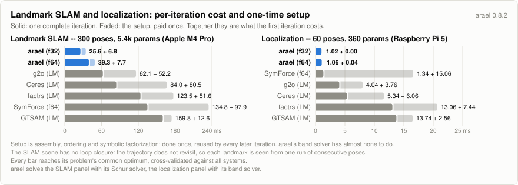
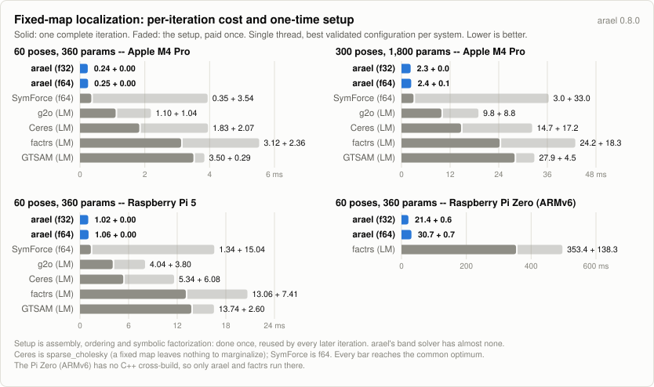

# Localization benchmark

A trajectory estimated against a **known, fixed** landmark map from bearing
observations, wheel/visual odometry, and pose priors -- the localization
problem, as distinct from SLAM. It is ported from `examples/loc_demo.rs`, and
it runs on the shared [`benchmarks/harness`](../harness) -- the same probes,
timing rules, table and core pin as [`benchmarks/pgo`](../pgo) and
[`benchmarks/slam`](../slam). What is local to this benchmark is its problem:
one scene generator, one reference cost function every system is validated
against, and a cross-checked initial cost.

## Why localization is its own benchmark

In SLAM the landmarks are optimized, so the Hessian fills in (each landmark
couples every pose that sees it) -- a bundle-adjustment structure. In
**localization the landmarks are constants**: the bearing factors hit fixed
points, so they contribute no pose-to-pose coupling, and the only thing that
couples poses is the **consecutive odometry**. The Hessian is therefore
**block-tridiagonal** -- a band. With 6-DOF poses laid out consecutively the
half-bandwidth is `kd = 2*6 - 1 = 11`, and arael solves it with its band
Cholesky (`solve_band`), matching `loc_demo`. A fixed map also removes the
gauge freedom, so absolute pose errors are meaningful and no GPS is needed.

The factor graph is deliberately heterogeneous -- bearings (atan2), euler
odometry (rotation composition + euler extraction), and pose drift + tilt
priors -- which stresses per-factor code generation, not just a pose chain.

## The systems

Every system optimizes the identical problem (the exported scene) and is
scored by the one `scene::reference_cost`. The bearing residuals are plain
Gaussian: this is the outlier-free scenario, so `loc_demo`'s robust
`gamma*atan` kernel is omitted (with no outliers it has no benefit, and its
saturation manufactures spurious minima different solvers fall into).

- **arael** (f64 + f32) -- band Cholesky (`kd=11`); `LOC_ARAEL_SOLVER=faer`
  switches to the general sparse solver for comparison. Both roots use
  `#[arael(root, fast_atan)]`: the bearing residuals go through the fast
  polynomial atan2 (max error < 1e-6 rad), which is why the shared
  initial-cost cross-check tolerance is 1e-5 (arael measures ~4e-7
  relative, the exact systems ~1e-16). The validation gates (cost
  within 1%, pose RMSE < 5 cm) are orders of magnitude above the
  approximation.
- **factrs** -- Rust, dual-number autodiff, its own LM.
- **tiny-solver** -- Rust, dual-number autodiff. Excluded from the default
  output for being an order of magnitude slower than the field; `RUN_TINY=1`
  brings it back, and the harness runs and validates it exactly as it does
  the others.
- **Ceres** (3 linear solvers), **g2o**, **GTSAM**, **SymForce** (f64 + f32) --
  C++: analytic Jacobians (g2o/GTSAM), autodiff (Ceres), or code-generated
  linearization (SymForce, from `symforce_gen.py`). Each is cross-checked to
  the reference cost; g2o/GTSAM are additionally Jacobian-verified against
  finite differences (`G2O_VERIFY_JAC=1`, `GTSAM_VERIFY_JAC=1`).

The bearing factor is **single-variable** (the fixed landmark carries no
derivatives): a remote block on the pose in arael, a unary edge/factor in
g2o/GTSAM.

## What is measured

**One iteration.** Linearize, assemble, factorize, solve -- the pipeline every
system runs on every step, over the identical validated cost function. It is
measured as t(2 iterations) - t(1 iteration), so the one-time setup (first
assembly, ordering, symbolic factorization) cancels out, and it is reported
only when the first iteration was one accepted step, so a rejected step's
wasted factorization cannot leak into it.

This is the number that compares across systems.\* **Total time and iteration
count do not**, and reading them as a ranking will mislead you: they are set by
each system's damping schedule.


\* Ceres's `iterative_schur` uses a different algorithm, so its iterations
cannot be compared one on one.

<picture>
  <source media="(prefers-color-scheme: dark)" srcset="https://raw.githubusercontent.com/harakas/arael/master/benchmarks/charts/v0.8.2/slam-loc-setup-dark.svg">
  
</picture>

The same two panels as the chart on the front page, with the setup drawn
alongside the iteration it is paid in: solid is one complete iteration, faded is
the setup. Together they are the first iteration. Setup is what a system does
once and reuses -- assembly structure, fill-reducing ordering, symbolic
factorization -- so on a solve of three iterations it is a third of the bill, and
on a long-running estimator it rounds to nothing. Neither the front-page chart
nor this one is the whole story on its own.

## Results (2026-07-26, Apple M4 Pro, single core enforced by the harness, min of 32 interleaved rounds)

What each column means:

| column | meaning |
|--------|---------|
| **total ms** | the whole solve: setup plus every iteration, retries included. |
| **iters** | `accepted(attempts)`. An attempt is one linear solve; a rejected step raises the damping and costs a factorization. |
| **ms/iter** | total ms divided by attempts -- an average, and it carries the one-time setup amortized over however many iterations the solver took. |
| **full-iter** | one complete iteration: linearize, assemble, factorize, solve. Measured as t(2 iterations) - t(1 iteration), so the setup cancels. The durable cross-system number. |
| **full-norm** | the same full-iter normalized to the arael f64 row on that dataset (= 1.000) -- the row's per-iteration cost in units of an arael-f64 iteration. |
| **1st-iter ms** | one iteration plus the setup the others do not pay again (first assembly, ordering, symbolic factorization). |
| **peak MB** | process high-water mark (`VmHWM`), each solver measured in a process of its own. |
| **final cost** | evaluated by the one reference cost function for every system, so the values are directly comparable. |

full-iter, full-norm and 1st-iter are dropped ("-") for any system whose first iteration
was not a single accepted step: such an iteration is mostly wasted
factorizations, and every number derived from it inherits that.

full-iter and full-norm are dropped for Ceres's `iterative_schur` as well.
Conjugate gradients does a variable amount of work per outer step, because the
inner solve gets harder as the outer one converges, so one iteration does not
stand for the rest and differencing two of them measures neither. That row is
read on total ms and ms/iter.

`LOC_POSES=N` sets the pose count (landmarks scale as `4N`). The arael rows use
`fast_atan` (above).

### 60 poses (240 landmarks, 5,357 frines, 360 parameters; `ARAEL_LAMBDA0=1e-5`)

| system                | total ms |  iters | ms/iter | full-iter | full-norm | 1st-iter ms | peak MB | final cost |
|-----------------------|---------:|-------:|--------:|----------:|----------:|------------:|--------:|-----------:|
| arael LM f64 (band)   |     0.71 |   3(3) |    0.24 |      0.25 |     1.000 |        0.23 |     4.9 |  3274.6025 |
| arael LM f32 (band)   |     0.70 |   3(3) |    0.23 |      0.24 |     0.960 |        0.24 |     4.3 |  3274.6025 |
| symforce LM f64       |     4.74 |   3(3) |    1.58 |      0.35 |     1.400 |        3.89 |    20.6 |  3274.6025 |
| symforce LM f32       |     4.50 |   3(3) |    1.50 |      0.30 |     1.200 |        3.75 |    18.2 |  3274.6025 |
| g2o LM                |     4.61 |   3(3) |    1.54 |      1.10 |     4.400 |        2.14 |    11.2 |  3274.6025 |
| ceres sparse_cholesky |     6.24 |   3(3) |    2.08 |      1.83 |     7.320 |        3.90 |    12.9 |  3274.6025 |
| ceres sparse_schur    |     6.33 |   3(3) |    2.11 |      2.11 |     8.440 |        3.86 |    12.9 |  3274.6025 |
| ceres iterative_schur\* |   6.73 |   3(3) |    2.24 |         - |         - |        3.90 |    12.0 |  3274.6025 |
| gtsam LM              |    10.54 |   3(3) |    3.51 |      3.50 |    14.000 |        3.79 |    14.6 |  3274.6025 |
| factrs LM             |    12.42 |   3(3) |    4.14 |      3.12 |    12.480 |        5.48 |    11.9 |  3274.6025 |

### 300 poses (1,200 landmarks, 41,323 frines, 1,800 parameters; `ARAEL_LAMBDA0=1e-5`)

| system                | total ms |  iters | ms/iter | full-iter | full-norm | 1st-iter ms | peak MB | final cost |
|-----------------------|---------:|-------:|--------:|----------:|----------:|------------:|--------:|-----------:|
| arael LM f64 (band)   |     7.33 |   3(3) |    2.44 |      2.40 |     1.000 |        2.46 |    13.6 | 25269.0409 |
| arael LM f32 (band)   |     6.74 |   3(3) |    2.25 |      2.26 |     0.942 |        2.26 |    10.0 | 25269.0410 |
| symforce LM f32       |    40.95 |   2(3) |   13.65 |      3.02 |     1.258 |       34.23 |   100.2 | 25269.0410 |
| symforce LM f64       |    45.01 |   3(3) |   15.00 |      2.97 |     1.238 |       35.94 |   112.5 | 25269.0409 |
| g2o LM                |    38.80 |   3(3) |   12.93 |      9.85 |     4.104 |       18.60 |    37.7 | 25269.0409 |
| ceres sparse_cholesky |    51.06 |   3(3) |   17.02 |     14.70 |     6.125 |       31.86 |    42.2 | 25269.0409 |
| ceres sparse_schur    |    51.46 |   3(3) |   17.15 |     15.12 |     6.300 |       31.02 |    37.1 | 25269.0409 |
| ceres iterative_schur\* |  52.44 |   3(3) |   17.48 |         - |         - |       30.48 |    37.2 | 25269.0409 |
| gtsam LM              |    86.38 |   3(3) |   28.79 |     27.92 |    11.633 |       32.41 |    58.9 | 25269.0409 |
| factrs LM             |    91.50 |   3(3) |   30.50 |     24.22 |    10.092 |       42.51 |    64.9 | 25269.0409 |

### Raspberry Pi 5 (Cortex-A76, single core, 60 poses; ROUNDS=32, ARAEL_LAMBDA0=1e-2, default damping)

| system                | total ms |  iters | ms/iter | full-iter | full-norm | 1st-iter ms | peak MB | final cost |
|-----------------------|---------:|-------:|--------:|----------:|----------:|------------:|--------:|-----------:|
| arael LM f32 (band)   |     3.06 |   3(3) |    1.02 |      1.02 |     0.962 |        1.02 |     4.3 |  3274.6025 |
| arael LM f64 (band)   |     3.16 |   3(3) |    1.05 |      1.06 |     1.000 |        1.06 |     4.9 |  3274.6025 |
| symforce LM f64       |    19.45 |   3(3) |    6.48 |      1.34 |     1.264 |       16.38 |    20.5 |  3274.6025 |
| symforce LM f32       |    18.03 |   3(3) |    6.01 |      1.35 |     1.274 |       14.87 |    18.2 |  3274.6025 |
| g2o LM                |    16.22 |   3(3) |    5.41 |      4.04 |     3.811 |        7.84 |    10.1 |  3274.6025 |
| ceres sparse_cholesky |    18.56 |   3(3) |    6.19 |      5.34 |     5.038 |       11.42 |    11.5 |  3274.6025 |
| ceres sparse_schur    |    19.78 |   3(3) |    6.59 |      5.73 |     5.406 |       11.82 |    11.3 |  3274.6025 |
| ceres iterative_schur\* |  19.64 |   3(3) |    6.55 |         - |         - |       11.34 |    11.0 |  3274.6025 |
| gtsam LM              |    44.29 |   3(3) |   14.76 |     13.74 |    12.962 |       16.34 |    15.4 |  3274.6025 |
| factrs LM             |    46.16 |   3(3) |   15.39 |     13.06 |    12.321 |       20.47 |    12.1 |  3274.6025 |

### Raspberry Pi Zero (ARM1176, ARMv6, single core, 60 poses; ROUNDS=10, ARAEL_LAMBDA0=1e-2)

The cross-compiled static-musl binary on a real Pi Zero (2026-07-26, on the
harness). The C++ solvers are not cross-built, so factrs is the only external
system here and the sole anchor for the validation; tiny-solver is off by
default. factrs matches the reference initial cost to 1.1e-16, so the ARMv6
build is bit-faithful; the arael rows go through `fast_atan` (4.4e-7, within
the shared tolerance).

| system                  | total ms |  iters | ms/iter | full-iter | full-norm | 1st-iter ms | peak MB | final cost |
|-------------------------|---------:|-------:|--------:|----------:|----------:|------------:|--------:|-----------:|
| **arael LM f32 (band)** |    64.66 |   3(3) |   21.55 |     21.39 |     0.696 |       22.02 |     2.3 |  3274.6021 |
| **arael LM f64 (band)** |    92.46 |   3(3) |   30.82 |     30.74 |     1.000 |       31.43 |     2.9 |  3274.6021 |
| factrs LM               |  1202.02 |   3(3) |  400.67 |    353.35 |    11.495 |      491.62 |     7.2 |  3274.6021 |

The four tables above, drawn as one iteration plus the setup it pays once, one
cell per machine:

<picture>
  <source media="(prefers-color-scheme: dark)" srcset="https://raw.githubusercontent.com/harakas/arael/master/benchmarks/charts/v0.8.0/loc-dark.svg">
  
</picture>

## The charts

`../make_slam_loc_chart.py` writes the two cross-benchmark charts into
`../charts/v<version>/`: `slam-loc-*.svg`, the per-iteration chart embedded in
the top-level README, and `slam-loc-setup-*.svg`, the one further up. Both read
the same `PANELS` table -- the localization panel from the Raspberry Pi 5 rows,
the SLAM panel from `benchmarks/slam`'s 300-pose rows. `slam-loc-*.svg` carries a
second row of panels for peak memory, from `MEM_PANELS` and the `peak MB` column
of those same two tables.

`../make_loc_chart.py` writes the localization-only 2x2 above (`loc-*.svg`),
one cell per results table. Both scripts are stdlib only; after re-running the
benchmark, update the `PANELS` data (full-iter and 1st-iter per system) in each
and re-run.

## Covariance recovery (2026-07-16, Apple M4 Pro, single core)

Pose covariance at the solution, `Sigma = 2 H^-1`. The map is fixed, so `H` is
block-tridiagonal over the pose chain, and three arael methods apply:

- **`TriDiagonal`** runs the band forward/backward Schur recursion, no
  factorization -- the last pose (the localization query) falls out of the
  forward pass the solve already computes.
- **`PerQuery`** factors `H` and solves per query; **`AllMarginals`** is one bulk
  selected inverse over the factor.
- **Ceres** (`SPARSE_QR`), **GTSAM** (`Marginals`) and **g2o** (`computeMarginals`)
  recover the same marginals for comparison; Ceres and GTSAM build cold, g2o reuses
  the factor from the solve it just ran (warm). All agree on the std devs to four
  figures.

Cost to recover N pose marginals from the solved state, 300 poses, median ms
(reps). `1 (last)` is the last pose (the localization query); the other columns
spread N poses over the trajectory.

| method | 1 (last) | 1 | 2 | 8 | 32 | all (300) |
|--------|--:|--:|--:|--:|--:|--:|
| arael TriDiagonal | 2.2 (2000) | 2.4 (2000) | 2.3 (2000) | 2.3 (2000) | 2.3 (2000) | 2.4 (2000) |
| arael PerQuery | 2.8 (1744) | 2.8 (1793) | 2.8 (1750) | 3.2 (1570) | 4.5 (1090) | 19.6 (254) |
| arael AllMarginals | - | - | - | - | - | 2.8 (1773) |
| Ceres SPARSE_QR | 39.8 (124) | 39.8 (126) | 40.3 (122) | 42.7 (116) | 43.3 (115) | 74.0 (68) |
| GTSAM Marginals | 22.5 (215) | 23.5 (211) | 23.1 (214) | 22.9 (218) | 23.1 (216) | 24.2 (206) |
| g2o computeMarginals | 1.1 (2000) | 0.2 (2000) | 0.6 (2000) | 1.0 (2000) | 1.1 (2000) | 1.3 (2000) |

`LOC_COV=1 cargo run --release` reproduces this (`LOC_POSES` sets the size,
`COV_BUDGET_S` the per-cell budget).

## Running

```sh
cmake -B cpp/build cpp && cmake --build cpp/build   # Ceres, g2o, GTSAM
# g2o needs libg2o-dev + cholmod; GTSAM needs libgtsam-dev (+ libtbb-dev)
# add -DSYMFORCE_DIR=/path/to/symforce for the SymForce runner -- a checkout
#   that has been BUILT, since its libraries are read from build/temp.*
export OPENBLAS_NUM_THREADS=1 OMP_NUM_THREADS=1     # before load; see below
ROUNDS=10 cargo run --release                       # 60 poses (default)
LOC_POSES=300 ROUNDS=5 cargo run --release          # larger tier
LOC_COV=1 cargo run --release                       # covariance recovery (above)
RUN_TINY=1 cargo run --release                      # include tiny-solver (off by default)
VERBOSE=1 cargo run --release                       # arael per-iteration trace
G2O_VERIFY_JAC=1 cpp/build/g2o_loc scene.txt lm out.txt     # check g2o Jacobians
GTSAM_VERIFY_JAC=1 cpp/build/gtsam_loc scene.txt lm out.txt # check GTSAM Jacobians
```

The run prints all of its settings in a header, so a pasted result carries
what produced it.

| env | effect |
|-----|--------|
| `LOC_POSES` | scene size (60 default; landmarks scale as 4N) |
| `LOC_COV` | covariance-recovery benchmark instead of the solve (`COV_BUDGET_S`, `COV_CELL_CAP_S`) |
| `ROUNDS` | interleaved rounds; the reported time is the minimum over them |
| `RUN_TINY` | include tiny-solver (off by default: an order of magnitude slower than the field) |
| `LOC_SYSTEMS` | comma-separated substrings; runs only the matching rows (a filtered run cannot validate across systems) |
| `LOC_ARAEL_SOLVER` | `band` (default, `kd=11`) or `faer` (arael's general sparse solver) |
| `ARAEL_LAMBDA0`, `CERES_RADIUS0`, `G2O_LAMBDA_INIT`, `GTSAM_LAMBDA0`, `SYMFORCE_LAMBDA0`, `TINY_RADIUS0` | initial damping, per system |
| `DRIVER=nielsen` | arael's gain-ratio damping driver instead of the fixed ladder |
| `CERES_SOLVERS` | comma list of Ceres linear solvers (Ceres's own names; the table shows the short one) |
| `VERBOSE` | arael's per-iteration solver trace |
| `TIMING` | arael's per-solve phase breakdown (assembly, linear solve) |
| `LOC_PHASES` | arael f64-vs-f32 per-phase steady-state table, instead of the benchmark |
| `LOC_NO_MEM` | skip the peak-memory pass |

The thread caps must be exported **before** the process starts: OpenBLAS sizes
its pool when its shared library loads, ahead of any code that could set them,
and those early threads escape the single-core pin.

The C++ runners execute as subprocesses over an exported copy of the scene;
they are skipped with a warning if their binary is absent. `G2O_VERIFY_JAC=1`
and `GTSAM_VERIFY_JAC=1` check each analytic Jacobian against finite
differences (verification only, never in the timed solve).

### Cross-compiling for Raspberry Pi

`.cargo/config.toml` defines two dependency-free static-musl targets, linked by
the bundled `rust-lld` -- no external cross toolchain. The C++ solvers are not
built; on the device the harness detects they are missing and runs the Rust
solvers only (arael f64/f32 and factrs; tiny-solver with `RUN_TINY=1`).

```sh
# Pi Zero / Zero W / Pi 1 (BCM2835, ARM1176 = ARMv6)
rustup target add arm-unknown-linux-musleabihf
cargo build --release --target arm-unknown-linux-musleabihf

# Pi 5 / any aarch64 board
rustup target add aarch64-unknown-linux-musl
cargo build --release --target aarch64-unknown-linux-musl
```

Copy `target/<triple>/release/loc-bench` to the device and run it there.

### SymForce

The generated factor headers are committed under `cpp/symforce_gen/`, so the
runner builds directly against a SymForce source checkout:

```sh
cmake -B cpp/build cpp -DSYMFORCE_DIR=<checkout> && cmake --build cpp/build
```

To regenerate the headers after changing a residual, run `symforce_gen.py` with
the SymForce Python toolchain on its path -- the sympy backend suffices, no
symengine build needed:

```sh
SYMFORCE_SYMBOLIC_API=sympy PYTHONPATH=<checkout>:<checkout>/gen/python \
    python symforce_gen.py cpp/symforce_gen
```
