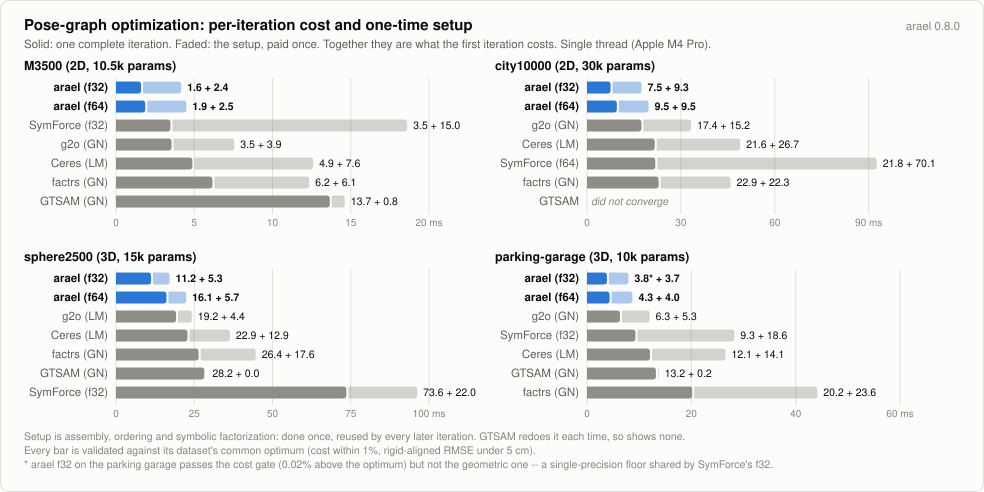

# Pose-graph benchmark: arael vs the field

Batch pose-graph optimization on the canonical 2D SLAM benchmark
datasets (M3500, city10000) and the canonical 3D ones (sphere2500,
parking-garage). arael is compared against:

- **[GTSAM](https://gtsam.org)** -- C++, analytic factors, driven through
  the official Python wheel; the timing wraps only the C++ `optimize()`
  call.
- **[Ceres](http://ceres-solver.org)** -- C++, template autodiff,
  SPARSE_NORMAL_CHOLESKY, modeled on its own pose_graph_2d example.
- **[g2o](https://github.com/RainerKuemmerle/g2o)** -- C++, analytic
  Jacobians, CHOLMOD backend.
- **[factrs](https://github.com/rpl-cmu/factrs)** -- Rust, dual-number
  autodiff over Lie types, faer Cholesky. Both f64 and, as a separate
  crate-global build, f32.
- **[SymForce](https://symforce.org)** (Skydio) -- the other
  symbolic-codegen system. The shared residual is defined symbolically in
  `symforce_gen.py`, code-generated by SymForce itself into flattened C++
  linearization functions (committed under `cpp/symforce_gen/`), and
  executed by its C++ `sym::Optimizer`, templated over f64 and f32.
- **[tiny-solver](https://crates.io/crates/tiny-solver)** -- Rust,
  dual-number autodiff, faer sparse Cholesky. Excluded from the default
  output: an order of magnitude slower than the rest, so it only
  compresses the scale the other systems are read on. `RUN_TINY=1` brings
  its rows back -- the harness runs and validates it exactly as it does
  the others.

## Datasets

Vendored in `datasets/` (see `datasets/README.md` for provenance and
citations; `./fetch_datasets.sh` re-downloads from the original sources):

- **M3500** -- Olson's Manhattan world: 3500 poses, 5453 edges. The file
  shipped by tiny-solver-rs (Carlone's `input_M3500_g2o` revision), with
  odometry initialization and diagonal information matrices.
- **city10000** -- the iSAM city dataset: 10000 poses, 20687 edges. From
  the SE-Sync data collection, odometry initialization, diagonal
  information (50, 50, 100).
- **sphere2500** (3D) -- the synthetic sphere released with iSAM: 2500
  SE3 poses, 4949 edges. SE-Sync data collection; full (near-diagonal
  but coupled) 6x6 information matrices.
- **parking-garage** (3D) -- real-world multi-level parking garage: 1661
  SE3 poses, 6275 edges. SE-Sync data collection; full 6x6 information
  matrices, weak absolute weights (the optimum cost is only 1.27),
  which gives the cost surface pronounced near-flat directions.

The 3D datasets run every system: arael f64/f32, factrs GN/LM (f64 and
f32), Ceres, g2o LM/GN, SymForce f64/f32 (generated-code path, same as
2D), and GTSAM LM/GN (native BetweenFactorPose3 via the wheel).

Every system is fed the files' information matrices, on every dataset.

## What is measured

**One iteration.** Linearize, assemble, factorize, solve -- the pipeline
every system runs on every step, over the identical validated cost
function. It is measured as t(2 iterations) - t(1 iteration), so the
one-time setup (first assembly, ordering, symbolic factorization) cancels
out, and it is reported only when the first iteration was one accepted
step, so a rejected step's wasted factorization cannot leak into it.

This is the number the chart shows, and it is the one that compares
across systems. **Total time and iteration count do not**, and reading
them as a ranking will mislead you: they are set by each system's damping
schedule and its rotation retraction -- which decides how much of a large
correction a single step actually lands. Damping in particular is per-problem and its
effect is close to arbitrary; the tables report totals and iterations
because they are facts about the run, not because they are comparable.

<picture>
  <source media="(prefers-color-scheme: dark)" srcset="https://raw.githubusercontent.com/harakas/arael/master/benchmarks/charts/v0.8.0/pgo-setup-dark.svg">
  
</picture>

The same four datasets with the setup drawn alongside the iteration it
is paid in. SymForce's setup is several times its iteration; GTSAM has
none to speak of, because it rebuilds the elimination every iteration
rather than reusing a symbolic factorization. The front-page chart plots
the solid segment only.

## Versions

arael is built from this tree; every other system is the version the
distribution ships, except SymForce, which has no package and is built
from a source checkout.

| system | version |
|--------|---------|
| arael | 0.8.0 (this tree) |
| Ceres | 2.2.0 (libceres-dev) |
| g2o | 2023-08-06 snapshot (libg2o-dev) |
| GTSAM | 4.2.0 (libgtsam-dev, python3-gtsam) |
| SymForce | v0.11.0 (source build) |
| factrs | 0.3.0 (crates.io) |
| tiny-solver | 0.18.0 (crates.io, off by default) |

Supporting: Eigen 3.4.0, SuiteSparse 7.6.1 (CHOLMOD, used by Ceres and
g2o), faer 0.24 (arael) and 0.23 (factrs). Built with rustc 1.94.0 and
gcc 13.3.0 on Ubuntu 24.04 aarch64.

## Fairness rules

- **One cost function.** Every system optimizes the identical weighted
  least-squares problem: standard SE2 between factors with the file's
  sqrt-information row weights, plus a unit-weight prior on pose 0 fixing
  the gauge. tiny-solver's shipped g2o reader drops the information
  matrices, so the problem is assembled through its public `Factor` API
  with a weighted clone of its own `BetweenFactorSE2` -- solver, autodiff
  and linear algebra remain tiny-solver's. GTSAM's `readG2o` honors the
  information matrices natively. One documented exception: GTSAM's
  native 2D between factor is the SE2 log map, which differs from the
  canonical rotation-frame residual beyond first order; at noise-level
  residuals the two objectives coincide to second order, and GTSAM's
  solutions are held to the same validation gates as everyone else's.
  (Its Python `CustomFactor` would make it exact but is
  timing-ineligible -- per-residual Python callbacks.)
- **One validation.** A single reference cost function (in `src/g2o.rs`)
  evaluates every system's final poses. A row counts as converged only
  when BOTH its cost is within 1% of the best AND its solution is within
  5 cm rigid-aligned RMSE of the best solution -- the cost surface has
  near-flat directions where a plateau under 1% above the optimum can
  sit meters away geometrically (g2o LM lands on exactly such a plateau
  on the weighted M3500). Hard asserts: arael rows must converge and at
  least one external system must agree (independent-implementation
  anchor).
- **One 3D residual convention.** In 3D the systems' native between
  factors disagree: factrs, tiny-solver and GTSAM use the full SE3 log
  map (rotation log with the theta-dependent V-matrix coupling into
  translation), Ceres's own pose_graph_3d example and g2o's EdgeSE3 use
  a decoupled quaternion form, and SymForce's Pose3 tangent is a third
  variant (decoupled translation + rotation log). The benchmark
  standardizes on the Ceres/g2o convention:

      r = U * [ R_a^T (t_b - t_a) - t_meas ; 2 * vec(q_meas^-1 q_a^-1 q_b) ]

  with U the upper Cholesky factor of the edge's full 6x6 information
  matrix and the rotation part on its qw >= 0 branch (equivalently
  vee(R - R^T)/sqrt(1 + trace R) on rotation matrices). It equals the
  rotation log to first order, and unlike the log it is algebraically
  smooth at zero error -- no acos, no 0/0 axis -- which is also what
  makes it expressible in arael's branch-free symbolic codegen without
  epsilon guards. factrs and tiny-solver therefore get this residual
  through their public custom-residual/Factor APIs (their autodiff,
  optimizers, and linear algebra untouched), and unit tests pin all
  three Rust implementations to the reference cost function to 1e-12
  relative. The full 6x6 sqrt-information (both 3D files carry coupled
  rotation blocks) is folded into every residual identically. Ceres
  runs its own pose_graph_3d example structure (quaternion blocks on
  EigenQuaternionManifold, autodiff) with the canonical error-
  quaternion composition order. g2o runs its native EdgeSE3 completely
  unmodified: its error [t(delta); vec(q(delta))] differs from the
  canonical residual only by a constant per-edge linear transform
  B = blockdiag(R_meas^T, I/2), so each edge is fed the conjugated
  information B^-T info B^-1 and g2o's chi2 then equals the canonical
  cost bit-for-bit -- the harness ASSERTS this by comparing g2o's own
  chi2 (and Ceres's and SymForce's own initial costs) at the initial
  estimate against the reference cost function on every run. GTSAM
  keeps its native SE3 log-map BetweenFactorPose3, the same documented
  second-order deviation as its 2D rows (no linear information
  transform can bridge a nonlinear residual difference), judged by the
  same validation gates.
- **One termination class.** All systems stop when a step improves the
  cost by less than 1e-5 absolute or 1e-5 relative -- the shipped
  defaults of both tiny-solver and GTSAM; arael is configured to the same
  thresholds (`patience = 1`).
- **Problem-appropriate initial damping for every LM.** Damping-schedule
  strategy is a per-problem tuning knob, not an intrinsic property of a
  solver -- so each LM implementation gets an initial damping suited to
  these well-initialized pose graphs instead of its shipped default:
  arael `initial_lambda = 1e-8` (its own docs recommend small values
  here), Ceres and tiny-solver `initial_trust_region_radius = 1e12`,
  g2o `setUserLambdaInit(1e-12)`, GTSAM its default `1e-5` (insensitive:
  its inner lambda search adapts within an iteration), factrs its
  default (lambda starts at 1e-10 -- already problem-appropriate),
  SymForce `initial_lambda = 1e-10` (ships 1.0; env `SYMFORCE_LAMBDA0`). All are
  env-overridable (`ARAEL_LAMBDA0`, `CERES_RADIUS0`, `TINY_RADIUS0`,
  `G2O_LAMBDA_INIT`, `GTSAM_LAMBDA0`; also `G2O_GAIN`). With this policy
  every LM converges in 6-7 steps on M3500 and the durable cross-system
  comparison becomes the metric: time per step (linearize + assemble +
  factorize + solve). Shipped-default behavior is documented under
  "known solver behaviors" below. On the 3D datasets arael's default is
  `1e-10`: the parking garage's weak information matrices leave `1e-8`
  with damping rejections and a tolerance stop 6.5 cm short of the
  optimum along the near-flat directions, while `1e-10` converges
  cleanly in 5 steps; sphere2500 is insensitive to the choice.
- **Threads: verified, not assumed.** Watching `/proc/<pid>/status`
  during a solve showed the official GTSAM wheel spawns 8 TBB threads;
  tiny-solver parallelizes assembly and its faer factorization through
  rayon; arael is single-threaded by construction (`faer::Par::Seq`).
  The harness therefore enforces single-core itself: it sets every
  threading env var to 1 (OMP_NUM_THREADS, OPENBLAS/MKL/TBB/VECLIB/
  NUMEXPR, RAYON_NUM_THREADS) before any pool spawns, pins itself to
  CPU 0 with sched_setaffinity (inherited by the GTSAM subprocess), and
  ASSERTS the GTSAM subprocess's reported Cpus_allowed_list is "0".
  Measured effect on GTSAM was small (~3%) -- its TBB threads contribute
  little on these problems -- and tiny-solver's default multi-threaded
  numbers are listed separately.
- **Timing.** Total time is the minimum over N interleaved rounds
  (contention only ever slows a run down). First-iteration time is a
  fresh optimize capped at one iteration -- setup + first linearization +
  symbolic + numeric factorization + solve, identically defined for all
  systems.
- **Iteration semantics differ**, so the harness recovers the attempt
  count wherever the system does not report it: g2o's damping retries
  live inside one call to its algorithm and are summed from its own
  per-round trial counter; factrs's live inside `step()` and are counted
  by wrapping its linear solver. Ceres and SymForce each record an
  initial entry (the cost evaluation before any step) that is discounted.
  GTSAM alone cannot be counted -- its retries are unreachable from its
  API -- and its rows are marked. Attempts are the denominator of
  ms/iter; the cross-system number is full-iter (see What is measured).

## Precision

arael solves the same models in f64 and f32 (`solve_sparse_faer` /
`solve_sparse_faer_f32`), selected per model, both precisions in one
binary; both rows are validated against the common optimum. Among the
competitors only factrs offers single precision, as a crate-global
`f32` feature (one precision per build -- hence the separate
`factrs32/` subprocess crate). Its f32 solves M3500 and parking-garage
but crashes on city10000 and sphere2500: the f32 normal equations lose
positive definiteness at that size and its Cholesky panics on a
non-positive pivot (reported as a table note). arael's f32 solves every
dataset. SymForce's sym::Optimizer is templated over the scalar type, so
it too runs both precisions natively; its f32 converges everywhere, with
extra damping retries (15 attempts for 7 accepted steps on city10000).
The rest are f64-only: GTSAM and Ceres bake double into their public
APIs, g2o's number_t alias is hardcoded to double with no build option,
and tiny-solver's problem/optimizer layer is hardwired f64 (its Factor
trait alone is generic).

On the parking garage both f32 builds stop short of the f64 solution
(0.21-0.25 m) while well inside the cost gate -- a single-precision
floor on that dataset, not a solver defect; see the table note.

## Known solver behaviors (reported, not hidden)

### Damping pathologies, tuned away

Observed with the systems' SHIPPED initial damping; all three disappear
under the problem-appropriate policy above.

- **tiny-solver LM** (default trust region 1e4) checks its
  error-decrease thresholds even on a *rejected* damping step; a
  rejection reads as "no improvement" and terminates the solve -- on the
  weighted M3500 it stopped at cost 208 (optimum 138). With a
  problem-appropriate initial trust region it takes no rejected steps
  and converges everywhere.

- **g2o LM** auto-computes lambda0 = 1e-5 * max Hessian diagonal
  (additive lambda-I damping), which over-damps heavily weighted graphs;
  the resulting slow descent then trips the 1e-5 gain-threshold stop
  meters short of the optimum (cost 139.11, 1.9 m off, on weighted
  M3500) -- not a local minimum: with patience (gain 1e-9) or a small
  lambda0 it reaches the exact optimum.

- **Ceres LM** (default trust region 1e4) converged everywhere but
  ground ~30 near-identical iterations on M3500; with a large initial
  region it takes 6-7.

### Behaviors that persist, and shape the numbers you are reading

- **gtsam's ms/iter** counts accepted steps only: it keeps its damping
  retries inside `iterate()` and its API exposes no way to count them.
  Every other row divides by attempts.

- **g2o PCG** (`RUN_PCG=1`) swaps the CHOLMOD factorization for block-Jacobi
  preconditioned conjugate gradient. Off by default: it takes 3-5x more
  iterations, and on three of the four datasets it lands inside the 1% cost
  gate but outside the 5 cm geometric one. It pays on the reduced camera
  system of a bundle problem instead -- see [bal](../bal/README.md).

- **g2o GN on sphere2500** stalls at cost 3053.9 (2.3x the optimum): the
  translations reach the optimum (0.5 mm aligned RMSE to the best
  solution), the rotations do not. Relaxing the gain stop to 1e-12 lets
  it run 35 iterations without improving. The problem is not at fault --
  g2o's own LM on the bit-identical problem reaches the optimum, and
  factrs's GN converges in 6 iterations. Why g2o's GN stalls here is not
  established. It converges on the parking garage.
- **GTSAM on city10000 (batch, odometry init)**: LM stops at cost 2.39M
  (optimum 512) and GN diverges, at any damping. Two changes each make it
  converge, neither table-eligible:
  - Its native log-map BetweenFactorPose2 replaced by the rotation-frame
    residual the other systems use (as a CustomFactor): LM reaches the
    optimum from the same odometry init in 7 iterations. Python-callback
    factor, so the timing is not comparable.
  - Its native factor kept, chordal initialization first (InitializePose2
    -- not wrapped by the 4.2 wheel, so two GaussianFactorGraph solves,
    195 ms): the error drops from 6.5e8 to 607 and LM/GN then converge in
    3 iterations (160-210 ms). Every other row starts from the file's
    odometry initialization.

## Running

```sh
./fetch_datasets.sh
ROUNDS=32 cargo run --release     # single-core pinning is built in
```

Knobs (the run prints all of them in a header, so a pasted result
carries the settings that produced it):

| env | effect |
|-----|--------|
| `ROUNDS` | interleaved rounds; the reported time is the minimum over them (default 5) |
| `PGO_ONLY` | run only datasets whose name contains this substring (case-sensitive) |
| `GTSAM_PYTHON` | python with GTSAM; `sudo apt install python3-gtsam` and point it at `/usr/bin/python3` |
| `RUN_TINY` | include tiny-solver (off by default: an order of magnitude slower than the field) |
| `RUN_ISAM` | include the GTSAM ISAM2 row (off by default: incremental, so not comparable to the batch rows) |
| `RUN_PCG` | include g2o's iterative PCG rows (off by default; see below) |
| `PGO_SYSTEMS` | comma-separated substrings; runs only the matching rows (a filtered run cannot validate across systems) |
| `BENCH_MAX_ITERS` | cap the solve below the 100-iteration ceiling. C++ runners only, so a capped run is a diagnostic, not a table |
| `G2O_PCG_TOL`, `G2O_PCG_ABSTOL`, `G2O_PCG_MAXITER` | PCG's inner-solve termination; defaults are g2o's shipped ones |
| `G2O_PCG_STATS` | print PCG's CG iterations per solve; costs time inside the timed region, so never for a measurement |
| `VERBOSE` | arael's per-iteration solver trace |
| `TIMING` | arael's per-solve breakdown (assembly / linear solve) |
| `ARAEL_LAMBDA0`, `CERES_RADIUS0`, `G2O_LAMBDA_INIT`, `TINY_RADIUS0`, `GTSAM_LAMBDA0`, `SYMFORCE_LAMBDA0` | initial damping, per system |
| `PGO_DRIVER=nielsen` | arael's gain-ratio damping driver instead of the fixed ladder |
| `PGO_ORDERING=nd` | arael factorizes under nested dissection instead of AMD |
| `PGO_SCHUR` | arael's marginalization policy: `auto` (default), `never`, `force` |

`make_chart.py` (stdlib only) generates both charts into
`../charts/v<version>/`: `pgo-*.svg`, the per-iteration chart embedded in
the top-level README, and `pgo-setup-*.svg`, the one above. Both read the
same `PANELS` table -- one bar per system, its best validated
configuration -- so they cannot disagree. After re-running the benchmark,
update that table from the results below and re-run it.

## Results (2026-07-26, aarch64 VM, single core enforced by the harness, min of 32 interleaved rounds)

What each column means:

| column | meaning |
|--------|---------|
| **total ms** | the whole solve: setup plus every iteration, retries included. |
| **iters** | `accepted(attempts)`. An attempt is one linear solve; a rejected step raises the damping and costs a factorization. A single number where the system reports no attempt count. |
| **ms/iter** | total ms divided by attempts -- an average, and it carries the one-time setup amortized over however many iterations the solver happened to take. |
| **full-iter** | one complete iteration: linearize, assemble, factorize, solve. Measured as t(2 iterations) - t(1 iteration), so the setup cancels. The durable cross-system number. |
| **full-norm** | the same full-iter normalized to arael LM f64 on that dataset (arael LM f64 = 1.000) -- the row's per-iteration cost in units of an arael-f64 iteration. |
| **1st-iter ms** | one iteration plus the setup the others do not pay again (first assembly, ordering, symbolic factorization). |
| **peak MB** | process high-water mark (`VmHWM`), each solver measured in a process of its own. |
| **final cost** | evaluated by the one reference cost function for every system, so the values are directly comparable. |

full-iter, full-norm and 1st-iter are dropped ("-") for any system whose
first iteration was not a single accepted step: such an iteration is mostly
wasted factorizations, and every number derived from it inherits that.

Each dataset carries its own notes below.

### M3500 (10500 parameters)
| system          | total ms |  iters | ms/iter | full-iter | full-norm | 1st-iter ms | peak MB | final cost |
|-----------------|---------:|-------:|--------:|----------:|----------:|------------:|--------:|-----------:|
| arael LM f64    |    13.73 |   6(6) |    2.29 |      1.87 |     1.000 |        4.37 |    15.0 |   137.9130 |
| arael LM f32    |    13.64 |   7(7) |    1.95 |      1.60 |     0.856 |        4.04 |    13.2 |   137.9219 |
| factrs GN       |    42.15 |   6(6) |    7.02 |      6.16 |     3.294 |       12.22 |    20.4 |   137.9130 |
| factrs LM       |    53.42 |   6(6) |    8.90 |      6.98 |     3.733 |       14.68 |    22.9 |   137.9130 |
| factrs GN f32   |    61.03 |   9(9) |    6.78 |      5.95 |     3.182 |       12.47 |    17.4 |   137.9194 |
| factrs LM f32   |    76.04 |   9(9) |    8.45 |      7.34 |     3.925 |       14.57 |    18.2 |   137.9194 |
| ceres LM        |    36.22 |   6(6) |    6.04 |      4.88 |     2.610 |       12.47 |    22.1 |   137.9136 |
| g2o LM          |    26.66 |   6(6) |    4.44 |      3.61 |     1.930 |        7.93 |    21.1 |   137.9136 |
| g2o GN          |    25.20 |   6(6) |    4.20 |      3.55 |     1.898 |        7.43 |    20.8 |   137.9136 |
| symforce LM     |    36.78 |   6(6) |    6.13 |      3.48 |     1.861 |       18.66 |    30.9 |   137.9136 |
| symforce LM f32 |    36.01 |   6(6) |    6.00 |      3.48 |     1.861 |       18.48 |    28.0 |   137.9157 |
| gtsam LM        |   100.48 |      6 |   16.75 |     16.76 |     8.963 |       17.48 |    86.8 |   137.9273 |
| gtsam GN        |    82.18 |      6 |   13.70 |     13.66 |     7.305 |       14.49 |    85.3 |   137.9273 |

All 13 rows reach the common optimum, both precisions included.

### city10000 (30000 parameters)
| system          | total ms |  iters | ms/iter | full-iter | full-norm | 1st-iter ms | peak MB | final cost |
|-----------------|---------:|-------:|--------:|----------:|----------:|------------:|--------:|-----------:|
| arael LM f64    |    77.28 |   7(7) |   11.04 |      9.54 |     1.000 |       19.05 |    43.5 |   511.9852 |
| arael LM f32    |   104.14 |  7(13) |    8.01 |      7.53 |     0.789 |       16.82 |    38.0 |   511.9860 |
| factrs GN       |   181.30 |   7(7) |   25.90 |     22.90 |     2.400 |       45.23 |    76.2 |   511.9852 |
| factrs LM       |   223.01 |   7(7) |   31.86 |     28.41 |     2.978 |       51.12 |    70.7 |   511.9852 |
| ceres LM        |   176.50 |   7(7) |   25.21 |     21.64 |     2.268 |       48.30 |    57.9 |   511.9880 |
| g2o LM          |   144.69 |   7(7) |   20.67 |     18.00 |     1.887 |       33.93 |    55.4 |   511.9880 |
| g2o GN          |   138.08 |   7(7) |   19.73 |     17.39 |     1.823 |       32.61 |    54.5 |   511.9880 |
| symforce LM     |   220.90 |   7(7) |   31.56 |     21.82 |     2.287 |       91.95 |    98.8 |   511.9881 |
| symforce LM f32 |   379.50 |  7(15) |   25.30 |         - |         - |           - |    87.3 |   511.9941 |
| gtsam LM\*\*     |  4340.31 |     30 |  144.68 |     66.31 |     6.951 |       67.68 |   125.7 | 2386736.14 |
| gtsam GN\*\*     |   223.73 |      4 |   55.93 |     55.85 |     5.854 |       57.36 |   119.9 |  247510639 |

symforce f32 rejects a step inside its first iteration, so that iteration
is not one iteration: neither it nor the full-iter derived from it is
reported. factrs f32 does not run this dataset -- its Cholesky hits a
non-positive pivot at 30000 parameters in single precision.

\*\* gtsam (batch) does not converge here.

### sphere2500 (3D, 15000 parameters)
| system          | total ms |  iters | ms/iter | full-iter | full-norm | 1st-iter ms | peak MB | final cost |
|-----------------|---------:|-------:|--------:|----------:|----------:|------------:|--------:|-----------:|
| arael LM f64    |   103.35 |   6(6) |   17.23 |     16.12 |     1.000 |       21.80 |    48.1 |  1351.2157 |
| arael LM f32    |    84.14 |   7(7) |   12.02 |     11.18 |     0.694 |       16.50 |    34.6 |  1351.3874 |
| factrs GN       |   177.75 |   6(6) |   29.62 |     26.41 |     1.638 |       44.01 |    72.1 |  1351.2157 |
| factrs LM       |   188.29 |   6(6) |   31.38 |     28.79 |     1.786 |       45.43 |    73.5 |  1351.2157 |
| ceres LM        |   148.38 |   6(6) |   24.73 |     22.85 |     1.417 |       35.75 |    45.2 |  1351.2182 |
| g2o LM          |   158.36 |   8(8) |   19.80 |     19.19 |     1.190 |       23.58 |    45.3 |  1351.2162 |
| g2o GN\*\*       |   266.02 | 14(14) |   19.00 |     18.49 |     1.147 |       23.26 |    44.8 |  3053.9288 |
| symforce LM     |   485.66 |   6(6) |   80.94 |     77.28 |     4.794 |       98.55 |    64.3 |  1351.2158 |
| symforce LM f32 |   462.03 |   6(6) |   77.01 |     73.60 |     4.566 |       95.56 |    48.3 |  1351.3300 |
| gtsam LM        |   184.65 |      6 |   30.78 |     30.41 |     1.886 |       30.55 |   109.5 |  1351.2988 |
| gtsam GN        |   168.46 |      6 |   28.08 |     28.21 |     1.750 |       28.24 |   106.8 |  1351.2988 |

factrs f32 does not run this dataset: its Cholesky hits a non-positive
pivot (single precision loses positive definiteness at 15000 parameters,
and its lambda floor of 1e-10 cannot regularize it).

\*\* g2o GN converges geometrically (aligned RMSE 0.5 mm) but lands at
2.3x the optimum cost -- its rotations are off where its positions are
not, and Gauss-Newton has no damping to recover.

g2o is damped at 1e-6 here, not the 1e-12 the other datasets use: at
1e-12 its first Levenberg iteration burns six trials before it finds a
step and the solve retries all the way down (12 accepted of 17 attempts,
310 ms). See the initial-damping policy.

### parking-garage (3D, 9966 parameters)
| system          | total ms |  iters | ms/iter | full-iter | full-norm | 1st-iter ms | peak MB | final cost |
|-----------------|---------:|-------:|--------:|----------:|----------:|------------:|--------:|-----------:|
| arael LM f64    |    21.59 |   4(4) |    5.40 |      4.33 |     1.000 |        8.33 |    36.4 |     1.2684 |
| arael LM f32\*  |    25.98 |   6(6) |    4.33 |      3.82 |     0.882 |        7.56 |    31.4 |     1.2687 |
| factrs GN       |   104.57 |   4(4) |   26.14 |     20.17 |     4.658 |       43.76 |    57.4 |     1.2684 |
| factrs LM       |   114.64 |   4(4) |   28.66 |     23.55 |     5.439 |       43.99 |    63.3 |     1.2684 |
| factrs GN f32\* |   173.92 |   6(6) |   28.99 |     25.96 |     5.995 |       48.28 |    44.7 |     1.2690 |
| factrs LM f32\* |   221.40 |  5(12) |   18.45 |     27.89 |     6.441 |       51.40 |    51.2 |     1.2687 |
| ceres LM        |    55.17 |   4(4) |   13.79 |     12.08 |     2.790 |       26.17 |    33.5 |     1.2696 |
| g2o LM          |    32.40 |   4(4) |    8.10 |      6.48 |     1.497 |       12.33 |    34.3 |     1.2696 |
| g2o GN          |    30.86 |   4(4) |    7.72 |      6.32 |     1.460 |       11.62 |    33.9 |     1.2696 |
| symforce LM     |    57.52 |   4(4) |   14.38 |      9.73 |     2.247 |       28.24 |    52.6 |     1.2696 |
| symforce LM f32\* |  55.59 |   4(4) |   13.90 |      9.29 |     2.145 |       27.86 |    40.3 |     1.2699 |
| gtsam LM        |    91.35 |      6 |   15.22 |     15.35 |     3.545 |       15.50 |    91.4 |     1.2684 |
| gtsam GN        |    52.14 |      4 |   13.04 |     13.21 |     3.051 |       13.37 |    90.0 |     1.2684 |

\* the f32 rows reach the optimum cost to within 0.02-0.12% (well inside
the cost gate) but sit 0.21-0.25 m from the f64 solution along the
near-flat directions, outside the 5 cm geometric gate -- the expected
single-precision floor on this dataset.

Rebuilding the SymForce rows: build symforce from a source checkout
(`pip install .` in its repo produces `build/temp.*/libsymforce_opt`),
then configure with `-DSYMFORCE_DIR=<checkout>`. The generated factor
headers under `cpp/symforce_gen/` are committed; regenerate with
`symforce_gen.py <output_dir>` after changing the residual.
