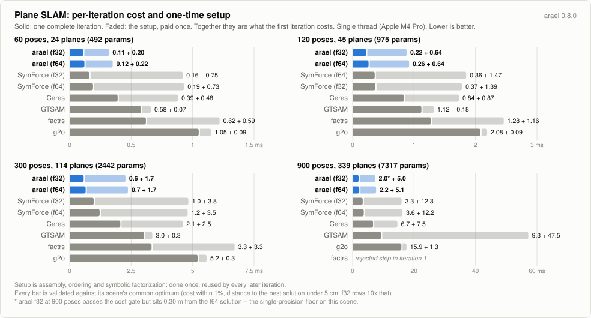

# Plane SLAM benchmark

Poses on a closed loop, plane landmarks (unit normal + distance) placed along
it, noisy odometry between consecutive poses, and per-pose plane observations.
The plane representation and the observation residual follow g2o's
`slam3d_addons` plane types, and the g2o runner uses the shipped vertex and
edge; the scene is generated here. It runs on the shared
[`benchmarks/harness`](../harness) -- the same probes, timing rules, table and
core pin as [`benchmarks/pgo`](../pgo), [`benchmarks/loc`](../loc) and
[`benchmarks/slam`](../slam). What is local to this benchmark is its problem:
one scene generator, one reference cost function every system is validated
against, and a cross-checked initial cost.

## Why plane landmarks are their own benchmark

A plane landmark is **a direction on S^2 plus a scalar** -- 3 numbers carrying
2 rotational degrees of freedom and one distance. Every system has to pick a
chart for the direction, and they pick different ones, which is the point of
the benchmark: the same problem exercises six parameterizations of the same
manifold.

The scene keeps landmark visibility local. One anchor every 8 poses carries a
triplet of planes with spanning normals -- an inward wall 3 m outside the path,
a tilted ground patch under it, a tilted side wall 3 m inside and 1.5 m up --
each seen from a 6-pose window, so every pose sees at least three independent
orientations and no plane is global. Consecutive poses are a fixed 0.6 m apart
at every scene size, so the loop radius grows with the pose count and an index
window is also a fixed spatial window.

Poses run at 1 m height with yaw along the path, plus a small roll/pitch
wobble. That wobble is deliberate: with yaw-only poses a near-vertical normal
lands exactly on the azimuth chart's pole in the sensor frame, where the
observation Jacobian is undefined for every implementation alike.

The initial estimate is the noisy odometry chained from the first pose, so the
error accumulates around the loop and the closure is what the observations have
to pull shut. Each plane starts from the first observation of it.

Planes are mutually uncoupled, so the Hessian admits a Schur reduction. On this
scene arael's auto gate prices both routes and **declines** it -- the reduced
system is denser than the whole one. `PLANE_SHARED=1` switches to a degenerate
6-plane room where every pose sees every plane; there the reduced system is
fully dense, and it exists as the gate's stress case.

## The systems

Every system optimizes the identical problem (the exported scene) and is scored
by the one `scene::scene_cost`.

| system | plane direction | pose |
|---|---|---|
| arael (f64 + f32) | `UnitVecParam` -- 2-DOF body delta on a re-centred reference chart | `TransformParam` (translation + rotation, twist delta) |
| g2o | shipped `VertexPlane` (azimuth / elevation / distance oplus) | shipped `VertexSE3` |
| Ceres | `SphereManifold<3>` + scalar block | translation + `EigenQuaternionManifold` |
| GTSAM | `Vector3` (dy, dz, c), fixed tangent chart at the initial normal | `Pose3` |
| SymForce (f64 + f32) | `V3` (dy, dz, c), same fixed chart | `Pose3` |
| factrs | `VectorVar<3>`, same fixed chart | `SE3` |

arael and factrs are Rust; the rest are C++ subprocesses over an exported copy
of the scene, skipped with a warning if their binary is absent. SymForce's
linearization is code-generated from `symforce_gen.py` and committed under
`cpp/symforce_gen/`.

## Shared cost

Every runner minimizes the same whitened residuals, so the initial costs must
agree (the parity gate; `scene_cost` in `src/scene.rs` is the independent
evaluator):

- **plane observation** -- g2o `Plane3D::ominus` of the predicted local plane
  against the measurement: azimuth and elevation of the measured normal in the
  frame aligning the predicted normal with e1, plus the distance difference.
  The g2o runner uses the shipped `EdgeSE3PlaneSensorCalib` for this.
- **odometry** -- `err_t = R_a^T (t_b - t_a) - t_m`,
  `err_r = vee((R_m^T R_a^T R_b - transpose)/2)`. A custom edge in each runner:
  the shipped g2o `EdgeSE3` uses the error-quaternion vector part instead, a
  slightly different objective.

Gauge: pose 0 fixed. factrs has no fixed variables and uses a 1e6-weight prior
instead, zero at the start point.

## Methodology

- **One termination class.** Every system stops when a step improves the cost
  by less than 1e-7, absolute or relative (`PLANE_TOL`). Tighter than the
  sibling benchmarks because these costs are large: 1e-5 relative at a cost of
  12000 stops once a step gains less than 0.12, short of the 5 cm agreement
  gate.
- **A separate class for single precision**, 1e-5 (`PLANE_TOL_F32`). f32
  epsilon is 1.2e-7, so the f64 class sits below the noise floor and a solver
  asked to chase it spends its iterations on steps that cannot register.
- **Problem-appropriate initial damping for every LM**, as on the sibling
  benchmarks: arael 1e-8, Ceres trust region 1e7, g2o 2e-3, SymForce 3e-3. Each
  is the value that clears the first iteration on the long loops and changes
  nothing below 300 poses. factrs keeps its default -- its `LevenMarquardt`
  hard-codes the initial lambda with no parameter to set.

## What is measured

**One iteration.** Linearize, assemble, factorize, solve -- the pipeline every
system runs on every step, over the identical validated cost function. It is
measured as t(2 iterations) - t(1 iteration), so the one-time setup (first
assembly, ordering, symbolic factorization) cancels out, and it is reported
only when the first iteration was one accepted step, so a rejected step's
wasted factorization cannot leak into it.

This is the number that compares across systems. **Total time and iteration
count do not**, and reading them as a ranking will mislead you: they are set by
each system's damping schedule.

<picture>
  <source media="(prefers-color-scheme: dark)" srcset="https://raw.githubusercontent.com/harakas/arael/master/benchmarks/charts/v0.8.0/plane-setup-dark.svg">
  
</picture>

Setup drawn alongside the iteration it is paid in: solid is one complete
iteration, faded is the setup, and together they are the first iteration. Setup
is what a system does once and reuses -- assembly structure, fill-reducing
ordering, symbolic factorization -- so on a solve of five iterations it is a
fifth of the bill, and on a long-running estimator it rounds to nothing.

## Results (2026-07-26, Apple M4 Pro, single core enforced by the harness, min of 128 interleaved rounds; 64 at 900 poses)

What each column means:

| column | meaning |
|--------|---------|
| **total ms** | the whole solve: setup plus every iteration, retries included. |
| **iters** | `accepted(attempts)`. An attempt is one linear solve; a rejected step raises the damping and costs a factorization. |
| **ms/iter** | total ms divided by attempts -- an average, carrying the one-time setup amortized over however many iterations the solver took. |
| **full-iter** | one complete iteration, setup cancelled. The durable cross-system number. |
| **full-norm** | the same full-iter normalized to the arael f64 row on that dataset (= 1.000) -- the row's per-iteration cost in units of an arael-f64 iteration. |
| **1st-iter ms** | one iteration plus the setup the others do not pay again. |
| **peak MB** | process high-water mark (`VmHWM`), each solver measured in a process of its own. |
| **final cost** | evaluated by the one reference cost function for every system, so the values are directly comparable. |

full-iter, full-norm and 1st-iter are dropped ("-") for any system whose first iteration
was not a single accepted step.

All eight rows reach the common optimum at all four sizes.

### 60 poses (24 planes, 59 odometry pairs, 312 observations, 492 parameters)

| system          | total ms |  iters | ms/iter | full-iter | full-norm | 1st-iter ms | peak MB | final cost |
|-----------------|---------:|-------:|--------:|----------:|----------:|------------:|--------:|-----------:|
| arael LM f32    |     0.64 |   4(4) |    0.16 |      0.11 |     0.917 |        0.31 |     4.5 |   866.5574 |
| arael LM f64    |     0.96 |   6(6) |    0.16 |      0.12 |     1.000 |        0.34 |     4.1 |   866.5573 |
| symforce LM f32 |     1.47 |   4(4) |    0.37 |      0.16 |     1.333 |        0.91 |     7.8 |   866.5574 |
| symforce LM f64 |     1.99 |   6(6) |    0.33 |      0.19 |     1.583 |        0.92 |     8.1 |   866.5573 |
| ceres LM        |     2.72 |   6(6) |    0.45 |      0.39 |     3.250 |        0.87 |     9.5 |   866.5573 |
| gtsam LM        |     3.58 |   6(6) |    0.60 |      0.58 |     4.833 |        0.65 |     8.6 |   866.5573 |
| factrs LM       |     4.58 |   6(6) |    0.76 |      0.62 |     5.167 |        1.21 |     5.0 |   866.5573 |
| g2o LM          |     6.38 |   6(6) |    1.06 |      1.05 |     8.750 |        1.14 |     6.0 |   866.5573 |

### 120 poses (45 planes, 119 odometry pairs, 585 observations, 975 parameters)

| system          | total ms |  iters | ms/iter | full-iter | full-norm | 1st-iter ms | peak MB | final cost |
|-----------------|---------:|-------:|--------:|----------:|----------:|------------:|--------:|-----------:|
| arael LM f32    |     1.54 |   4(4) |    0.38 |      0.22 |     0.846 |        0.86 |     4.9 |  1630.3924 |
| arael LM f64    |     1.93 |   5(5) |    0.39 |      0.26 |     1.000 |        0.90 |     5.1 |  1630.3923 |
| symforce LM f64 |     3.50 |   5(5) |    0.70 |      0.36 |     1.385 |        1.83 |     9.9 |  1630.3923 |
| symforce LM f32 |     2.98 |   4(4) |    0.75 |      0.37 |     1.423 |        1.76 |     9.7 |  1630.3924 |
| ceres LM        |     4.74 |   5(5) |    0.95 |      0.84 |     3.231 |        1.71 |    10.5 |  1630.3924 |
| gtsam LM        |     5.99 |   5(5) |    1.20 |      1.12 |     4.308 |        1.30 |     9.4 |  1630.3923 |
| factrs LM       |     7.57 |   5(5) |    1.51 |      1.28 |     4.923 |        2.44 |     7.1 |  1630.3923 |
| g2o LM          |    10.20 |   5(5) |    2.04 |      2.08 |     8.000 |        2.17 |     6.9 |  1630.3923 |

### 300 poses (114 planes, 299 odometry pairs, 1482 observations, 2442 parameters)

| system          | total ms |  iters | ms/iter | full-iter | full-norm | 1st-iter ms | peak MB | final cost |
|-----------------|---------:|-------:|--------:|----------:|----------:|------------:|--------:|-----------:|
| arael LM f32    |     3.92 |   4(4) |    0.98 |      0.57 |     0.877 |        2.22 |     7.5 |  4046.0552 |
| arael LM f64    |     4.97 |   5(5) |    0.99 |      0.65 |     1.000 |        2.32 |     8.0 |  4046.0548 |
| symforce LM f32 |     7.86 |   4(4) |    1.97 |      0.98 |     1.508 |        4.78 |    15.5 |  4046.0552 |
| symforce LM f64 |     9.30 |   5(5) |    1.86 |      1.22 |     1.877 |        4.75 |    16.7 |  4046.0548 |
| ceres LM        |    12.38 |   5(5) |    2.48 |      2.06 |     3.169 |        4.55 |    13.3 |  4046.0551 |
| gtsam LM        |    15.54 |   5(5) |    3.11 |      3.03 |     4.662 |        3.31 |    11.8 |  4046.0548 |
| factrs LM       |    20.35 |   5(5) |    4.07 |      3.33 |     5.123 |        6.66 |    13.3 |  4046.0548 |
| g2o LM          |    26.55 |   5(5) |    5.31 |      5.21 |     8.015 |        5.52 |     9.7 |  4046.0548 |

### 900 poses (339 planes, 899 odometry pairs, 4407 observations, 7317 parameters)

| system          | total ms |  iters | ms/iter | full-iter | full-norm | 1st-iter ms | peak MB | final cost |
|-----------------|---------:|-------:|--------:|----------:|----------:|------------:|--------:|-----------:|
| arael LM f32\*  |    19.84 |   8(8) |    2.48 |      1.97 |     0.904 |        6.95 |    17.0 | 12202.9128 |
| arael LM f64    |    17.98 |   6(6) |    3.00 |      2.18 |     1.000 |        7.26 |    18.1 | 12202.8496 |
| symforce LM f32 |    36.38 |   7(7) |    5.20 |      3.30 |     1.514 |       15.57 |    31.2 | 12202.8497 |
| symforce LM f64 |    38.20 |   7(7) |    5.46 |      3.64 |     1.670 |       15.85 |    39.2 | 12202.8495 |
| ceres LM        |    82.44 | 11(12) |    6.87 |      6.66 |     3.055 |       14.19 |    22.6 | 12202.8497 |
| gtsam LM        |   104.95 |   6(6) |   17.49 |      9.27 |     4.252 |       56.79 |    20.3 | 12202.8496 |
| g2o LM          |   141.69 |  8(12) |   11.81 |     15.89 |     7.289 |       17.16 |    18.8 | 12202.8496 |
| factrs LM       |    82.27 |   6(8) |   10.28 |         - |         - |           - |    32.8 | 12202.8496 |

\* arael f32 passes the cost gate but sits 0.30 m from the f64 solution,
outside the 5 cm geometric gate -- the single-precision floor on this scene.
The harness marks the row and counts it against the looser f32 gate.

Two things at this size that the smaller scenes do not show. factrs rejects a
step inside its first iteration, so neither that iteration nor a full-iter from
it is reported, and its hard-coded initial lambda leaves no way to tune it away.
GTSAM's first iteration is 48 ms above its iteration cost, against 0.3 ms at 300
poses.

## The chart

`make_chart.py` (stdlib only) writes `plane-setup-{light,dark}.svg` into
`../charts/v<version>/`. Its `PANELS` table holds full-iter and 1st-iter per
system; after re-running the benchmark, update it from the results above and
re-run the script.

## Running

```sh
cmake -B cpp/build cpp && cmake --build cpp/build   # Ceres, g2o, GTSAM
# g2o needs libg2o-dev + cholmod; GTSAM needs libgtsam-dev (+ libtbb-dev)
# add -DSYMFORCE_DIR=/path/to/symforce for the SymForce runner
export OPENBLAS_NUM_THREADS=1 OMP_NUM_THREADS=1     # before load, see below
ROUNDS=10 cargo run --release                       # 64 poses (default)
PLANE_POSES=900 ROUNDS=64 cargo run --release       # largest tier
PLANE_SHARED=1 cargo run --release                  # degenerate 6-plane room
VERBOSE=1 cargo run --release                       # arael per-iteration trace
```

The run prints all of its settings in a header, so a pasted result carries what
produced it.

| env | effect |
|-----|--------|
| `PLANE_POSES` | scene size (64 default; planes and observations scale with it) |
| `PLANE_SHARED` | the degenerate 6-plane room instead of local landmarks |
| `ROUNDS` | interleaved rounds; the reported time is the minimum over them |
| `PLANE_SYSTEMS` | comma-separated substrings; runs only the matching rows (a filtered run cannot validate across systems) |
| `PLANE_TOL`, `PLANE_TOL_F32` | the termination class, f64 and f32 |
| `ARAEL_LAMBDA0`, `CERES_RADIUS0`, `G2O_LAMBDA_INIT`, `SYMFORCE_LAMBDA0` | initial damping, per system |
| `DRIVER` | `nielsen` (default) or `fixed` -- arael's damping driver |
| `VERBOSE` | arael's per-iteration solver trace |
| `TIMING` | arael's per-solve phase breakdown (assembly, linear solve) |
| `PLANE_NO_MEM` | skip the peak-memory pass |

The thread caps must be exported **before** the process starts: OpenBLAS sizes
its pool when its shared library loads, ahead of any code that could set them,
and those early threads escape the single-core pin.

### SymForce

The generated factor headers are committed under `cpp/symforce_gen/`, so the
runner builds directly against a SymForce source checkout. To regenerate them
after changing a residual:

```sh
SYMFORCE_SYMBOLIC_API=sympy PYTHONPATH=<checkout>:<checkout>/gen/python \
    python symforce_gen.py cpp/symforce_gen
```
