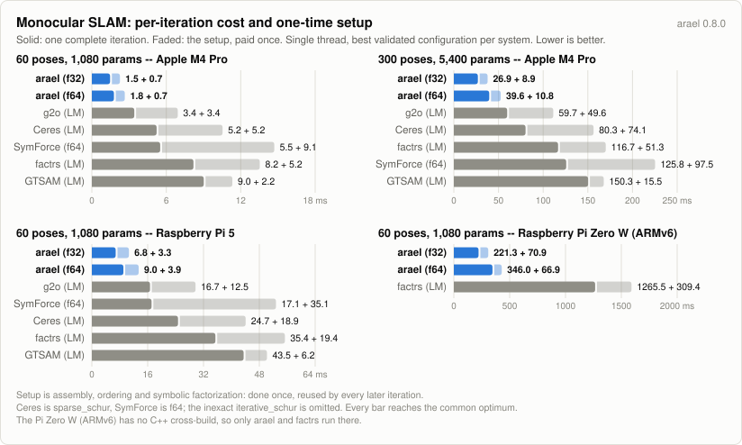
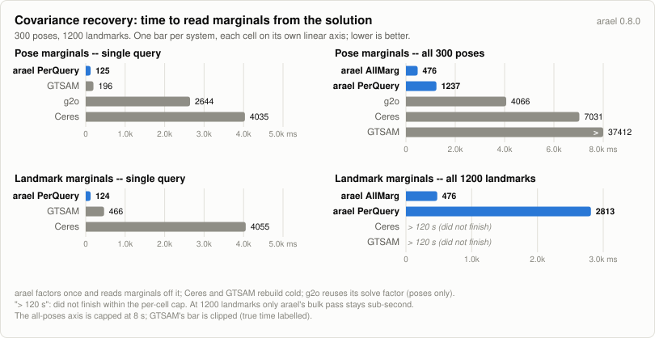

# Heterogeneous monocular SLAM benchmark

Batch optimization of a synthetic monocular SLAM problem. Unlike the
pose-graph ([benchmarks/pgo](../pgo)) and bundle-adjustment
([benchmarks/bal](../bal)) benchmarks -- each a single factor type -- this
problem is heterogeneous: six factor types, several nonlinear.

arael is compared against:

- **[Ceres](http://ceres-solver.org)** -- C++, template autodiff. Three
  linear-solver configurations: two exact factorizations
  (`sparse_normal_cholesky`, `sparse_schur`) and the inexact
  `iterative_schur` (preconditioned CG).
- **[g2o](https://github.com/RainerKuemmerle/g2o)** -- C++, custom vertices
  and six custom edges with hand-derived analytic Jacobians, CHOLMOD,
  landmarks marginalized via Schur.
- **[GTSAM](https://gtsam.org)** -- C++, six custom `NoiseModelFactorN`
  factors with hand-derived analytic Jacobians, multifrontal Cholesky.
- **[SymForce](https://symforce.org)** (Skydio) -- the other symbolic
  code-generation path. The residuals are generated by SymForce itself
  (`symforce_gen.py`, flattened C++ under `cpp/symforce_gen/`) and solved
  by its own `sym::Optimizer`, templated over f64 and f32.
- **[factrs](https://crates.io/crates/factrs)** -- Rust, dual-number
  ForwardProp autodiff, faer Cholesky.
- **[tiny-solver](https://crates.io/crates/tiny-solver)** -- Rust,
  dual-number autodiff, faer sparse Cholesky. Excluded from the default
  output: an order of magnitude slower than the rest, so it only compresses
  the scale the other systems are read on. `RUN_TINY=1` brings its rows back
  -- the harness runs and validates it exactly as it does the others.

## Problem

A robot drives an S-curve (60/120/300 poses); 3D landmarks are observed
by 5 cameras giving 360-degree coverage. The factor graph:

| factor | arity | residuals | content |
|--------|-------|----------:|---------|
| GPS | pose | 3 | position vs a biased GPS reading, whitened |
| pose drift | pose | 6 | soft prior to the initialization |
| tilt | pose | 2 | roll/pitch from an accelerometer |
| landmark drift | landmark | 3 | soft prior to the initialization |
| bearing | landmark + pose | 2 | `atan2` bearing residual in the feature frame |
| odometry | pose + pose | 6 | full 6-DOF relative motion (rotation composition + euler extraction) |

Poses are `(x, y, z, roll, pitch, yaw)` -- 6 raw parameters, rotation
built from the euler angles inside each residual (arael's
`SimpleEulerAngleParam`; matched by plain 6-vectors in the other four
systems). Landmarks are 3 parameters. The scene is generated from a
fixed seed; `SLAM_POSES=N` sets the pose count (landmarks scale as `4N`).
"Wide" landmarks (15%) span up to half the trajectory -- they are observed
from up to `N/2` consecutive poses, capped at 150 -- so the observation
count grows faster than linearly (5.4k / 12.2k / 41.4k at 60 / 120 / 300
poses). The widest landmark at 300 poses is seen from 150 poses and carries
127 observations, against a median of 26. That heavy tail is the point: it
is what fills in the Hessian and what makes the marginalized (Schur)
system dense, so it is where the solvers actually differ. Below ~120 poses
the mechanism is inert -- a quarter of a short trajectory is no wider than
an ordinary landmark's 31-pose window -- so the small scenes have no heavy
tail at all.

This is the **outlier-free** scenario: the bearing and GPS residuals are
plain Gaussian (max-likelihood when there are no outliers). The
`slam_demo` example this is ported from adds wrong feature associations
and suppresses them with a robust `gamma*atan(r/gamma)` kernel plus
graduated optimization; that machinery is omitted here because it only
earns its place with outliers present -- and the kernel's saturation
otherwise manufactures a spurious landmark-depth minimum that different
solvers fall into, which would make "final cost" a basin lottery rather
than a clean comparison. The bearing factors carry an information scale
(`frine_isigma_scale`, fixed at 1.0) that is the hook for reintroducing
graduation with outliers. The drift regularizers pull toward an explicit
stored prior (the init), so every system computes the same residual.

The problem is optimized as a single least-squares solve from a good
initialization; all five systems reach one unambiguous optimum.

## What is measured

**One iteration.** Linearize, assemble, factorize, solve -- the pipeline
every system runs on every step, over the identical validated cost
function. It is measured as t(2 iterations) - t(1 iteration), so the
one-time setup (first assembly, ordering, symbolic factorization) cancels
out, and it is reported only when the first iteration was one accepted
step, so a rejected step's wasted factorization cannot leak into it.

This is the number that compares across systems.\* **Total time and
iteration count do not**, and reading them as a ranking will mislead you:
they are set by each system's damping schedule.

\* Ceres's `iterative_schur` uses a different algorithm, so its iterations
cannot be compared one on one.

## Versions

arael is built from this tree; every other system is the version the
distribution ships, except SymForce, which has no package and is built
from a source checkout.

| system | version |
|--------|---------|
| arael | 0.8.0 (this tree) |
| Ceres | 2.2.0 (libceres-dev) |
| g2o | 2023-08-06 snapshot (libg2o-dev) |
| GTSAM | 4.2.0 (libgtsam-dev) |
| SymForce | v0.11.0 (source build) |
| factrs | 0.3.0 (crates.io) |
| tiny-solver | 0.18.0 (crates.io, off by default) |

Supporting: Eigen 3.4.0, SuiteSparse 7.6.1 (CHOLMOD, used by Ceres and
g2o), faer 0.24 (arael) and 0.23 (factrs). Built with rustc 1.94.0 and
gcc 13.3.0 on Ubuntu 24.04 aarch64.

## Methodology

Same as the pgo/bal benchmarks:

- **One cost function.** `src/scene.rs::reference_cost` evaluates every
  system's final parameters. Each system's own residual code is
  cross-checked against it at the initial estimate to 1e-9 relative --
  all seven implementations (arael, tiny-solver, factrs, Ceres, SymForce,
  g2o, GTSAM) and the reference agree bit-for-bit.
- **One validation.** A row is "at the common optimum" when its cost is
  within 1% of the best AND its per-pose translation RMSE to the best
  solution is under 5 cm (the gauge is fixed by GPS + priors, so
  absolute positions are comparable without alignment).
- **Full performance, no shortcuts.** Every system runs at parity: its
  own autodiff/codegen/analytic Jacobians, no numeric differentiation
  anywhere. g2o's six custom edges carry hand-derived analytic
  `linearizeOplus` Jacobians, checked against finite differences
  (`G2O_VERIFY_JAC=1`; verification only, never in the timed solve).
- **Timing.** Every probe runs a discarded warmup first (the first solve
  in a process pays cold allocator and cache costs the rest do not), then
  the fastest of two sub-rounds. Total time is the min over N interleaved
  rounds. The shared harness (`benchmarks/harness`, `benchmarks/cpp/bench.h`)
  drives this for every system, Rust and C++ alike, so no system is timed
  by its own code.
- **Attempts, not just steps.** `iters` is `accepted(attempts)`: an
  attempt is one linear solve, and a rejected step raises the damping and
  costs a factorization. g2o's retries live inside its algorithm's
  `solve()` and are summed from its own trial counter; factrs's live
  inside `step()` and are counted by wrapping its linear solver. Ceres
  records iteration 0 -- the initial cost evaluation, before any step --
  as a successful step, and SymForce records the initial error state as
  an `iteration = -1` entry; both are discounted. GTSAM's retries are
  unreachable from its API, so its row reports accepted steps only.
- **Peak memory** (peak MB) is the process high-water mark (`VmHWM`),
  each solver measured in a fresh process: arael, tiny-solver, and
  factrs via a single-solver subprocess of this binary; Ceres, SymForce,
  and g2o as their own subprocesses.
- **Single core**, verified: threading env vars exported to 1 before the
  process starts -- openblas-pthread sizes its pool at library load,
  before `main()` can set the vars, and those early threads escape the
  main-thread CPU pin (Ceres's SPARSE_NORMAL_CHOLESKY BLAS runs at 757%
  CPU without the caps; its `num_threads=1` option does not cover its
  BLAS). The process is pinned to a fixed core and each subprocess's
  `Cpus_allowed_list` is asserted equal to that core.

**Problem-appropriate initial damping for every LM.** Damping-schedule
strategy is a per-problem tuning knob, not an intrinsic property of a
solver, so each LM gets an initial damping suited to this well-initialized
graph rather than its shipped default (the same policy as
[benchmarks/pgo](../pgo)):

| system | initial damping | note |
|--------|-----------------|------|
| arael | `initial_lambda = 1e-8` | plain fixed schedule. No step is rejected here, so a gain-ratio driver would only over-damp and inflate the step count; `DRIVER=nielsen` opts into it. f32 uses `1e-7` at 60 poses, where a hair more damping stops it cleanly at the f32 precision floor instead of grinding. |
| Ceres | `initial_trust_region_radius = 1e12` | |
| tiny-solver | `initial_trust_region_radius = 1e12` | |
| SymForce | `initial_lambda = 1e-10` | ships 1.0 |
| factrs | its default | `lambda` starts at 1e-10 -- already near-Gauss-Newton |
| g2o | `setUserLambdaInit(1e-9)` | |
| GTSAM | `lambdaInitial = 1e-9` | |

Each is env-overridable (`ARAEL_LAMBDA0`, `CERES_RADIUS0`, `TINY_RADIUS0`,
`SYMFORCE_LAMBDA0`, `G2O_LAMBDA_INIT`, `GTSAM_LAMBDA0`), and all stop at a
shared termination class (1e-5 absolute or relative).

With this policy every exact-factorization solver converges in 2-3 steps,
so **full-iter -- one complete iteration, with the setup cancelled out --
is the durable cross-system comparison** (see What is measured); total
time and iteration count reflect the damping strategy and the termination
rule, which are tuning, not implementation.

arael runs f64 and f32; its residuals and SymForce's are code-generated
(SymForce from `symforce_gen.py`, flattened C++ under `cpp/symforce_gen/`).
The arael rows marginalize the landmarks on every damped solve and
factorize only the reduced pose system. Nothing marks them: the solver
finds them in the model's coupling graph and decides for itself that
marginalizing them pays (`SLAM_ARAEL_SOLVER` selects the alternatives --
`faer` factorizes the whole system instead).
Ceres runs three linear solvers: the two exact factorizations
(`sparse_normal_cholesky`, `sparse_schur`) are the like-for-like per-step
rows; `iterative_schur` is matrix-free preconditioned CG -- cheaper per
step but inexact, and at near-Gauss-Newton damping it does not reach the
validation gate here. g2o factorizes with CHOLMOD (GPL); arael ships the
permissive pure-Rust faer stack (CHOLMOD backends remain selectable via
`SLAM_ARAEL_SOLVER` for the sparse-backend comparison below).

## Results (2026-07-26, Apple M4 Pro, single core enforced by the harness, min of 32 interleaved rounds)

What each column means:

| column | meaning |
|--------|---------|
| **total ms** | the whole solve: setup plus every iteration, retries included. |
| **iters** | `accepted(attempts)`. An attempt is one linear solve; a rejected step raises the damping and costs a factorization. |
| **ms/iter** | total ms divided by attempts -- an average, and it carries the one-time setup amortized over however many iterations the solver took. |
| **full-iter** | one complete iteration: linearize, assemble, factorize, solve. Measured as t(2 iterations) - t(1 iteration), so the setup cancels. The durable cross-system number. |
| **1st-iter ms** | one iteration plus the setup the others do not pay again (first assembly, ordering, symbolic factorization). |
| **peak MB** | process high-water mark (`VmHWM`), each solver measured in a process of its own. |
| **final cost** | evaluated by the one reference cost function for every system, so the values are directly comparable. |

full-iter and 1st-iter are dropped ("-") for any system whose first
iteration was not a single accepted step: such an iteration is mostly
wasted factorizations, and every number derived from it inherits that.

tiny-solver is off by default (`RUN_TINY=1` brings it back): it is an
order of magnitude slower than the field and only compresses the scale
the other systems are read on. The harness runs and validates it exactly
as it does the others.

### 60 poses (240 landmarks, 5,370 observations, 1,080 parameters)

| system                | total ms |  iters | ms/iter | full-iter | 1st-iter ms | peak MB | final cost |
|-----------------------|---------:|-------:|--------:|----------:|------------:|--------:|-----------:|
| arael LM f64          |     6.99 |   3(3) |    2.33 |      2.12 |        2.80 |    12.3 |  3062.0482 |
| arael LM f32          |     5.83 |   3(3) |    1.94 |      1.73 |        2.41 |     9.8 |  3062.0482 |
| factrs LM             |    33.19 |   3(3) |   11.06 |      8.79 |       14.38 |    26.3 |  3062.0482 |
| ceres sparse_cholesky |    18.84 |   3(3) |    6.28 |      5.08 |       10.03 |    16.9 |  3062.0482 |
| ceres sparse_schur    |    19.29 |   3(3) |    6.43 |      5.13 |       10.73 |    16.4 |  3062.0482 |
| ceres iterative_schur\* |  26.68 |   6(6) |    4.45 |      3.80 |        6.50 |    12.8 |  3067.3849 |
| symforce LM f64       |    26.63 |   3(3) |    8.88 |      5.96 |       15.03 |    29.1 |  3062.0482 |
| symforce LM f32       |    31.40 |   4(4) |    7.85 |      5.19 |       14.90 |    24.9 |  3062.0500 |
| g2o LM                |    13.85 |   3(3) |    4.62 |      3.35 |        7.12 |    16.4 |  3062.0482 |
| gtsam LM              |    31.05 |   3(3) |   10.35 |      9.80 |       11.60 |    47.5 |  3062.0482 |

9/10 at the common optimum.

### 120 poses (480 landmarks, 12,229 observations, 2,160 parameters)

| system                | total ms |  iters | ms/iter | full-iter | 1st-iter ms | peak MB | final cost |
|-----------------------|---------:|-------:|--------:|----------:|------------:|--------:|-----------:|
| arael LM f64          |    19.79 |   3(3) |    6.60 |      5.88 |        7.84 |    25.0 |  7065.8807 |
| arael LM f32          |    15.93 |   3(3) |    5.31 |      4.76 |        6.34 |    18.8 |  7065.8829 |
| factrs LM             |    77.16 |   3(3) |   25.72 |     21.67 |       33.71 |    50.8 |  7065.8806 |
| ceres sparse_cholesky |    47.88 |   3(3) |   15.96 |     13.97 |       24.18 |    28.4 |  7065.8809 |
| ceres sparse_schur    |    53.86 |   3(3) |   17.95 |     14.69 |       29.32 |    27.9 |  7065.8809 |
| ceres iterative_schur\* | 241.15 | 15(15) |   16.08 |      7.41 |       15.14 |    18.3 |  7066.3200 |
| symforce LM f64       |    80.31 |   3(3) |   26.77 |     18.92 |       42.88 |    61.2 |  7065.8806 |
| symforce LM f32       |   115.92 |   5(5) |   23.18 |     18.54 |       41.58 |    53.5 |  7065.8881 |
| g2o LM                |    37.00 |   3(3) |   12.33 |      9.83 |       18.25 |    30.4 |  7065.8806 |
| gtsam LM              |    82.37 |   3(3) |   27.46 |     26.02 |       29.73 |   107.3 |  7065.8806 |

9/10 at the common optimum.

### 300 poses (1,200 landmarks, 41,433 observations, 5,400 parameters; 16 rounds)

| system                | total ms |  iters | ms/iter | full-iter | 1st-iter ms | peak MB | final cost |
|-----------------------|---------:|-------:|--------:|----------:|------------:|--------:|-----------:|
| arael LM f64          |   140.95 |   3(3) |   46.98 |     44.16 |       53.55 |   104.6 | 24243.9094 |
| arael LM f32          |   102.37 |   3(3) |   34.12 |     31.04 |       39.29 |    73.7 | 24243.9102 |
| factrs LM             |   419.00 |   3(3) |  139.67 |    120.73 |      173.36 |   188.3 | 24243.9094 |
| ceres sparse_cholesky |   309.66 |   3(3) |  103.22 |     95.22 |      135.62 |   101.8 | 24243.9095 |
| ceres sparse_schur    |   305.93 |   3(3) |  101.98 |     81.87 |      157.95 |    87.1 | 24243.9095 |
| ceres iterative_schur\* | 525.30 |   9(9) |   58.37 |     30.96 |       57.54 |    41.1 | 24244.9863 |
| symforce LM f64       |   483.73 |   3(3) |  161.24 |    132.51 |      224.34 |   177.1 | 24243.9094 |
| symforce LM f32       |   825.79 |   6(6) |  137.63 |    120.79 |      212.86 |   139.4 | 24244.0803 |
| g2o LM                |   235.26 |   3(3) |   78.42 |     60.29 |      111.83 |   114.2 | 24243.9094 |
| gtsam LM              |   469.89 |   3(3) |  156.63 |    153.17 |      167.10 |   607.8 | 24243.9094 |

9/10 at the common optimum.

\* **ceres iterative_schur** is an inexact solver: conjugate gradients on
the reduced system, not a factorization. Its iteration is a different unit
of work, so its full-iter is not comparable to the other rows, and it does
not reach the validation gate at any size (0.7 m out at 60 poses, 0.14 m
at 300).

**symforce f32** at 300 poses sits at the single-precision floor: 0.06 m
from the f64 optimum (cost 24244.08 vs 24243.91), just inside the relaxed
f32 gate on the largest scene. Its f64 build is exact.

### SLAM on the edge: Raspberry Pi

**Raspberry Pi 5** -- Cortex-A76 @ 2.4 GHz, aarch64, Debian Bookworm --
runs the 60-pose problem (240 landmarks, 5,370 observations, 1,080
parameters) with the full field, C++ systems included:
`SLAM_POSES=60 ROUNDS=32 cargo run --release`.

| system                | total ms |  iters | ms/iter | full-iter | 1st-iter ms | peak MB | final cost |
|-----------------------|---------:|-------:|--------:|----------:|------------:|--------:|-----------:|
| arael LM f64          |    33.54 |   3(3) |   11.18 |      9.86 |       13.68 |    11.5 |  3062.0482 |
| arael LM f32          |    25.61 |   3(3) |    8.54 |      7.56 |       10.50 |     9.5 |  3062.0482 |
| factrs LM             |   125.81 |   3(3) |   41.94 |     35.11 |       55.67 |    23.9 |  3062.0482 |
| ceres sparse_cholesky |    93.38 |   3(3) |   31.13 |     28.56 |       42.08 |    15.3 |  3062.0482 |
| ceres sparse_schur    |    86.01 |   3(3) |   28.67 |     24.72 |       43.58 |    15.4 |  3062.0482 |
| ceres iterative_schur\* |  90.41 |   6(6) |   15.07 |     12.71 |       23.01 |    11.6 |  3067.3849 |
| symforce LM f64       |    88.43 |   3(3) |   29.48 |     17.61 |       53.09 |    29.1 |  3062.0482 |
| symforce LM f32       |    97.29 |   4(4) |   24.32 |     16.80 |       47.43 |    26.0 |  3062.0500 |
| g2o LM                |    62.82 |   3(3) |   20.94 |     16.40 |       29.63 |    15.7 |  3062.0482 |
| gtsam LM              |   143.42 |   3(3) |   47.81 |     44.43 |       50.66 |    47.8 |  3062.0482 |

9/10 at the common optimum (\* the inexact `iterative_schur`, as on the
desktop).

**Raspberry Pi Zero W** -- ARM1176JZF-S @ ~1 GHz, ARMv6, no NEON,
in-order, 512 MB -- is too small to compile natively, so it runs a
cross-compiled, dependency-free static musl binary (flags in
`.cargo/config.toml`). Only the Rust solvers run here -- the C++ stack
(Ceres/g2o/GTSAM) is not cross-compiled for ARMv6:

```sh
rustup target add arm-unknown-linux-musleabihf
cargo build --release --target arm-unknown-linux-musleabihf
```

| system       | total ms |  iters | ms/iter | full-iter | 1st-iter ms | peak MB | final cost |
|--------------|---------:|-------:|--------:|----------:|------------:|--------:|-----------:|
| arael LM f64 |  1150.76 |   3(3) |  383.59 |    368.06 |      427.77 |     9.1 |  3062.0484 |
| arael LM f32 |   794.22 |   3(3) |  264.74 |    242.45 |      305.99 |     6.4 |  3062.0484 |
| factrs LM    |  4063.63 |   3(3) | 1354.54 |   1258.46 |     1554.32 |    14.9 |  3062.0483 |

3/3 at the common optimum, anchored by one external system (factrs): the
C++ stack is not cross-compiled for ARMv6, so it is the only non-arael row
here.

The Zero was measured with the static-musl binary; the Pi 5 and the
desktop are native glibc.

The desktop and edge tables above, drawn as one iteration plus the setup
it pays once, one cell per machine:

<picture>
  <source media="(prefers-color-scheme: dark)" srcset="https://raw.githubusercontent.com/harakas/arael/master/benchmarks/charts/v0.8.0/slam-dark.svg">
  
</picture>

`../make_slam_chart.py` (stdlib only) writes this 2x2 (`slam-*.svg`), one
cell per results table; the desktop panels use the 60- and 300-pose
tables, the edge panels the Pi 5 and Pi Zero W tables. After re-running
the benchmark, update the `PANELS` data (full-iter and 1st-iter per
system) and re-run it. The front-page cross-benchmark chart is
`../make_slam_loc_chart.py` (its SLAM panel is the 300-pose table).

## Rotation parameterization: simple vs euler vs quaternion

_Measured on arael 0.7.1; the numbers are arael-internal and the ranking is stable across versions._


A standalone binary, `rot_compare`, isolates the cost of arael's three
SO(3) parameterizations on this scene and solver: `SimpleEulerAngleParam`
(Euler angles optimized directly), `EulerAngleParam` (an Euler-angle delta
re-centered onto a matrix reference each step), and `QuaternionParam` (a
rotation-vector / exp-map delta re-centered onto a unit-quaternion
reference). Only the pose rotation parameter differs -- all three feed the
identical GPS / drift / tilt / bearing / odometry factors (the cross-solver
tables above use `SimpleEulerAngleParam`). Each solve reports where its time
goes via `LmConfig::gather_timing`; the three run interleaved, median of 1000
rounds.

All three reach the same optimum in the same 3 steps. The breakdown (Apple
M4 Pro, 60 poses / 240 landmarks, per-iteration mean with the first iteration
excluded):

| parameterization        | assembly | linear solve | cost eval | advance | total ms | vs simple |
|-------------------------|---------:|-------------:|----------:|--------:|---------:|----------:|
| `SimpleEulerAngleParam` |    0.395 |         3.53 |      0.13 |   0.000 |    15.56 |        -- |
| `EulerAngleParam`       |    0.399 |         3.53 |      0.14 |   0.001 |    15.60 |     +0.3% |
| `QuaternionParam`       |    0.408 |         3.53 |      0.14 |   0.001 |    15.61 |     +0.3% |

(ms/iter, except the last two columns: whole median solve, and total slowdown
vs simple.) The linear solve -- factorize + back-substitute the damped normal
equations -- is ~3.53 ms/iter for all three: they produce identical sparsity,
and it dominates the solve. The parameterization shows up only in **assembly**
(residual + Jacobian + Hessian). Each pose computes its rotation matrix and its
rotation Jacobian (dR/dparam) once, when its parameters update, and the
per-bearing assembly reads both rather than rebuilding them; with ~90 bearings
per pose that spreads the parameterization-specific cost -- the naive variant's
cached-sincos polynomial, `EulerAngleParam`'s reference composition,
`QuaternionParam`'s rational rotation-vector Jacobian -- across all of a pose's
observations. Assembly is then only **+1% (euler) and +3% (quaternion)** slower
per iteration than simple, and the shared linear solve shrinks that to **+0.3%**
on total solve time, at the run-to-run noise floor. Re-centering (`advance`) is
free for the naive variant (nothing to re-center) and a rounding sliver for the
other two.

The first iteration is far heavier and identical across all three: it
establishes the structure -- the first assembly runs ~2.2 ms (one-time
sparsity-pattern discovery over the ~0.4 ms steady state) and the first solve
runs ~5.1 ms (the one-time symbolic factorization over the ~3.5 ms steady
numeric solve) -- neither of which a warm re-solve pays.

**Net: the three parameterizations sit within ~3% per iteration on assembly and
~0.3% on total solve time.** The per-pose rotation-Jacobian precompute keeps the
exact SO(3) parameterizations (euler delta, quaternion) essentially as cheap per
step as the naive angles, so per-iteration cost is not a reason to prefer one
over another. Because the linear solve scales worse than assembly, at
larger scenes it dominates total time even more completely and the small
assembly gap disappears into it. Choose the parameterization for its geometry
(gimbal behaviour, large-step isotropy), not for these milliseconds. The flip
side -- how that geometry drives the *iteration count* when rotations are large
and the initialization is bad -- is measured in
[benchmarks/aerobatics](../aerobatics/README.md), where the ranking inverts
(quaternion fewest iterations, naive euler the most).

Run it (a separate binary from the cross-solver `cargo run`):

```sh
ROUNDS=1000 cargo run --release --bin rot_compare           # 60 poses, median of 1000 rounds (table above)
POSES=300 ROUNDS=10 cargo run --release --bin rot_compare   # larger scene, fewer rounds
```

## arael sparse-backend comparison

The arael rows run the Schur backend by default. `SLAM_ARAEL_SOLVER`
swaps the f64 row's backend (the C++ ones need their cargo feature).
Measured at 300 poses (5,400 parameters, 770k Hessian nonzeros) on arael
0.7.1, same optimum and iteration count on every backend:

| backend (`SLAM_ARAEL_SOLVER=`)        | feature        | ms/iter |
|---------------------------------------|----------------|--------:|
| Schur complement (`schur`, default)   | --             |     ~51 |
| faer, landmarks-first (`faer`)        | --             |     ~73 |
| CHOLMOD supernodal (`cholmod_gpl`)    | `cholmod-gpl`  |     ~90 |
| Eigen SimplicialLLT (`eigen`)         | `eigen`        |    ~411 |
| CHOLMOD simplicial (`cholmod`)        | `cholmod`      |    ~420 |

The `faer` row factorizes the whole 5,400-parameter system with the
landmarks ordered first, and that ordering is most of its lead over the
C++ backends: with plain AMD the same solve measures ~101 ms/iter -- AMD
interleaves poses and landmarks and its factor carries 3.05M nonzeros
against landmarks-first's 2.25M. The Schur backend never forms that
factor at all: it marginalizes the landmarks into a 1,800-parameter
reduced system and factorizes only that one.

**License warning:** CHOLMOD's Supernodal module is GPL -- building with
`cholmod-gpl` makes the binary subject to the GPL (the `cholmod` feature
binds only the LGPL Simplicial module). That is why it is a separate,
explicit opt-in and not the default.

A feature build (`eigen`, `cholmod`, `cholmod-gpl`) links a C dependency
stack (OpenBLAS, LAPACK, gfortran, gomp, AMD) into the benchmark binary,
inflating every Rust row's VmHWM by a few MB of shared-library baseline a
pure-Rust deployment would not carry. The tables come from a default
build, which links none of it; `BENCH_MEM_EXE=<default-build binary>`
sources those rows cleanly when running a feature build.

`G2O_STATS=1` prints g2o's own per-iteration timing breakdown (assembly,
Schur complement, factorization) for comparison.

The SLAM panel of the bar chart embedded in the top-level README
(`../charts/v<version>/slam-loc-light.svg` / `-dark.svg`) is generated by
`../make_slam_loc_chart.py` (stdlib only) from the 300-pose full-iter
column above; after re-running the benchmark, update its `PANELS`
table from the results and re-run it.

## Covariance recovery (2026-07-26, Apple M4 Pro, single core)

Parameter covariance at the solution, `Sigma = 2 H^-1`, for poses (6-DOF) and
landmarks (3-DOF):

- **`PerQuery`** factors `H` once, then solves for each queried block.
- **`AllMarginals`** runs one bulk selected inverse over the factor: every pose
  AND landmark marginal at once, at a cost independent of how many you read.
- **Ceres** (`SPARSE_QR`), **GTSAM** (`Marginals`) and **g2o** (`computeMarginals`)
  recover the same marginals for comparison; Ceres and GTSAM build cold, g2o reuses
  the factor from the solve it just ran (warm). g2o marginalizes the landmarks, so
  it recovers poses only. All agree on the std devs to four figures.

Time to recover N marginals from the solved state, 300 poses / 1200 landmarks,
median ms (reps). `-` a count a method does not cover; `*` a cell past the 120 s
cap (`COV_CELL_CAP_S`).

Pose (6-DOF):

| method | 1 | 2 | 8 | 32 | all (300) |
|--------|--:|--:|--:|--:|--:|
| arael PerQuery | 124.6 (41) | 128.7 (39) | 151.4 (34) | 240.5 (21) | 1236.8 (5) |
| arael AllMarginals | - | - | - | - | 476.3 (11) |
| Ceres SPARSE_QR | 4035.0 (2) | 4043.1 (2) | 4122.4 (2) | 4371.7 (2) | 7031.4 (1) |
| GTSAM Marginals | 195.9 (26) | 1324.0 (4) | 2033.9 (3) | 4908.1 (2) | 37411.5 (1) |
| g2o computeMarginals | 2644.1 (2) | 2609.4 (2) | 3372.0 (2) | 4156.8 (2) | 4066.1 (2) |

Landmark (3-DOF). `AllMarginals` is the same bulk pass (poses and landmarks together):

| method | 1 | 2 | 8 | 32 | all (1200) |
|--------|--:|--:|--:|--:|--:|
| arael PerQuery | 124.4 (41) | 125.9 (40) | 139.8 (36) | 193.5 (26) | 2812.9 (2) |
| arael AllMarginals | - | - | - | - | 476.3 (11) |
| Ceres SPARSE_QR | 4054.7 (2) | 4051.4 (2) | 4109.0 (2) | 4272.1 (2) | * |
| GTSAM Marginals | 465.9 (11) | 658.1 (8) | 2093.0 (3) | 4948.9 (2) | * |

A single marginal and the whole set, poses and landmarks, one bar per
system (each cell on its own axis):

<picture>
  <source media="(prefers-color-scheme: dark)" srcset="https://raw.githubusercontent.com/harakas/arael/master/benchmarks/charts/v0.8.0/cov-dark.svg">
  
</picture>

`SLAM_COV=1 cargo run --release --bin slam-bench` reproduces this
(`SLAM_POSES` sets the size, `COV_BUDGET_S` the per-cell budget).
`../make_cov_chart.py` (stdlib only) draws the chart from the two tables;
update its `PANELS` and re-run after re-measuring.

## Running

```sh
cmake -B cpp/build cpp && cmake --build cpp/build   # Ceres, g2o, GTSAM
# g2o needs libg2o-dev + cholmod; GTSAM needs libgtsam-dev (plus its
#   undeclared deps libboost-all-dev and libtbb-dev)
# add -DSYMFORCE_DIR=/path/to/symforce for the SymForce runner
# (regenerate its factor headers with:
#  symforce-venv/bin/python3 symforce_gen.py cpp/symforce_gen)
export OPENBLAS_NUM_THREADS=1 OMP_NUM_THREADS=1     # before load; see Methodology
ROUNDS=32 cargo run --release --bin slam-bench                       # 60 poses (default)
SLAM_POSES=300 ROUNDS=32 cargo run --release --bin slam-bench
SLAM_POSES=300 SLAM_COV=1 cargo run --release --bin slam-bench       # covariance recovery (above)
RUN_TINY=1 cargo run --release --bin slam-bench                      # include tiny-solver (off by default)
VERBOSE=1 cargo run --release --bin slam-bench                       # arael per-iteration trace
G2O_VERIFY_JAC=1 cpp/build/g2o_slam scene.txt lm out.txt     # check g2o Jacobians
GTSAM_VERIFY_JAC=1 cpp/build/gtsam_slam scene.txt lm out.txt # check GTSAM Jacobians
```

The run prints all of its settings in a header, so a pasted result carries
what produced it.

| env | effect |
|-----|--------|
| `SLAM_POSES` | scene size (60 default; 120, 300) |
| `SLAM_COV` | covariance-recovery benchmark instead of the solve (`COV_BUDGET_S`, `COV_CELL_CAP_S`) |
| `ROUNDS` | interleaved rounds; the reported time is the minimum over them |
| `RUN_TINY` | include tiny-solver (off by default: an order of magnitude slower than the field) |
| `SLAM_SYSTEMS` | comma-separated substrings; runs only the matching rows (a filtered run cannot validate across systems) |
| `SLAM_ARAEL_SOLVER` | `schur` (default), `faer`, `eigen`, `cholmod`, `cholmod_gpl` |
| `ARAEL_LAMBDA0`, `CERES_RADIUS0`, `G2O_LAMBDA_INIT`, `GTSAM_LAMBDA0`, `SYMFORCE_LAMBDA0`, `TINY_RADIUS0` | initial damping, per system |
| `DRIVER=nielsen` | arael's gain-ratio damping driver instead of the fixed ladder |
| `CERES_SOLVERS` | comma list of Ceres linear solvers (Ceres's own names; the table shows the short one) |
| `VERBOSE` | arael's per-iteration solver trace |
| `SLAM_NO_MEM` | skip the peak-memory pass |
